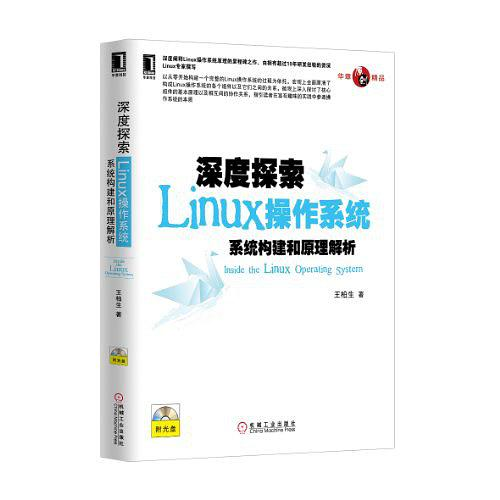
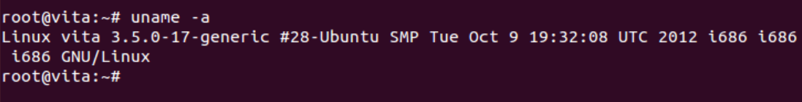
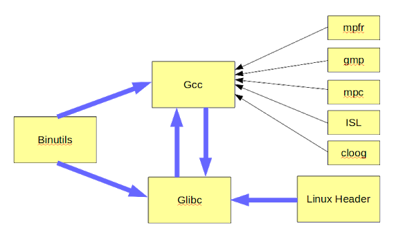
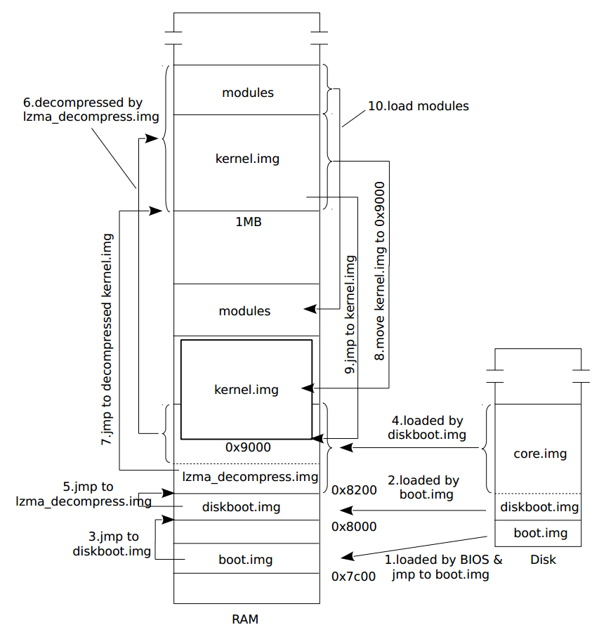
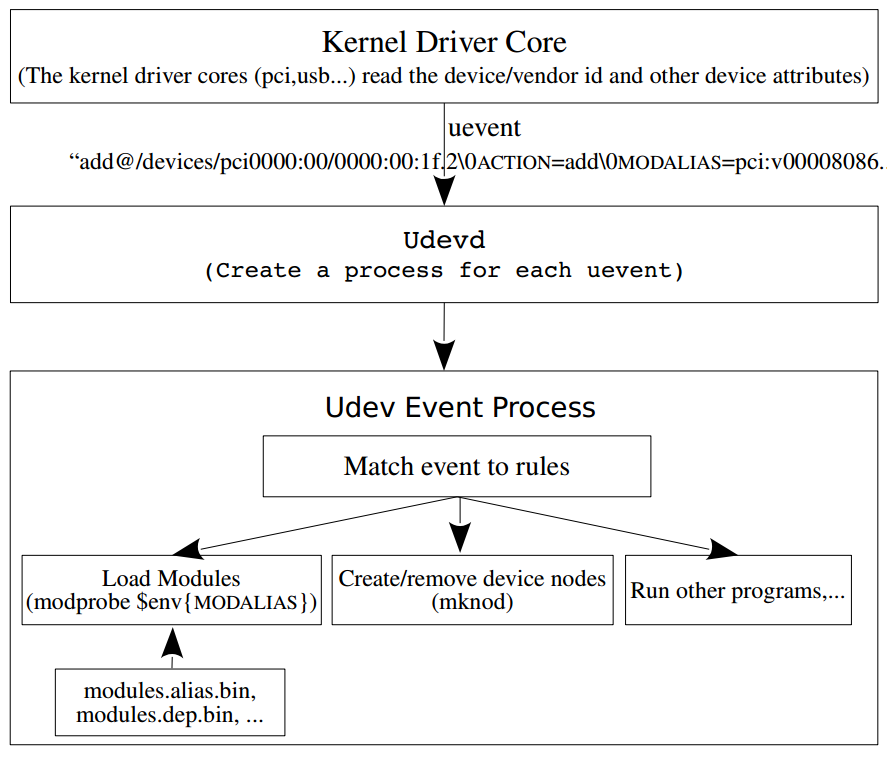

# 《深度探索linux操作系统:系统构建和原理解析》学习笔记



《**深度探索linux操作系统:系统构建和原理解析**》是探索linux操作系统原理的里程碑之作，在众多的同类书中独树一帜。

* 它颠覆和摒弃了传统的从阅读linux内核源代码着手学习linux操作系统原理的方式，而是基于实践，以从零开始构建一个完整的linux操作系统的过程为依托，指引读者在实践中去探索操作系统的本质。
* 这种方式的妙处在于，让读者先从宏观上全面认清一个完整的操作系统中都包含哪些组件，各个组件的作用，以及各个组件间的关系，从微观上深入理解系统各个组件的原理，帮助读者达到事半功倍的学习效果，这是作者潜心研究linux操作系统10几年的心得和经验，能避免后来者在学习中再走弯路。
* 此外，本书还对编译链接技术（尤其是动态加载和链接技术）和图形系统进行了原理性的探讨，这部分内容非常珍贵。
* 豆瓣书评[《一本俯瞰Linux系统全局的书籍》](https://book.douban.com/review/6581603/)

## 本仓库内容

1.  vita 实验系统构建过程
2. 《深度探索linux操作系统:系统构建和原理解析》学习笔记

```
Something I hope you know before go into the coding~
First, please watch or star this repo, I'll be more happy if you follow me.
Bug report, questions and discussion are welcome, you can post an issue or pull a request.
```

## 相关站点

* GitBook 地址 : <https://yifengyou.gitbooks.io/learn-vita/content/> **[废弃:仓库超 256 MB]**
* GitHub 地址 : <https://github.com/yifengyou/vita>
* GitPage 地址 : <https://yifengyou.github.io/vita/>

## 目录

* [快速入门](docs/快速入门.md)
* [准备基本环境](docs/准备基本环境.md)
* [工具链](docs/工具链.md)
    * [编译过程](docs/工具链/编译过程.md)
    * [构建工具链](docs/工具链/构建工具链.md)
    * [实验](docs/工具链/实验.md)
        * [1. bintuils编译](docs/工具链/实验/bintuils编译.md)
        * [2. gcc-freestanding编译](docs/工具链/实验/gcc-freestanding编译.md)
        * [3. kernelheader编译](docs/工具链/实验/kernelheader编译.md)
        * [4. glibc编译](docs/工具链/实验/glibc编译.md)
        * [5. 完整gcc编译](docs/工具链/实验/完整gcc编译.md)
        * [6. pkg-config配置](docs/工具链/实验/pkg-config配置.md)
* [构建内核](docs/构建内核.md)
    * [内核映像组成](docs/构建内核/内核映像组成.md)
    * [内核映像构建过程](docs/构建内核/内核映像构建过程.md)
    * [配置内核](docs/构建内核/配置内核.md)
    * [构建基本根文件系统](docs/构建内核/构建基本根文件系统.md)
    * [kbuild工作原理及分析](docs/构建内核/kbuild工作原理及分析.md)
    * [实验](docs/构建内核/实验.md)
        * [7. 编译并配置内核支持SATA硬盘](docs/构建内核/实验/编译并配置内核支持SATA硬盘.md)
        * [8. 编译并配置内核支持EXT4和ELF](docs/构建内核/实验/编译并配置内核支持EXT4和ELF.md)
        * [9. 构建基本根文件系统](docs/构建内核/实验/构建基本根文件系统.md)
* [构建initramfs](docs/构建initramfs.md)
    * [initramfs原理探讨](docs/构建initramfs/initramfs原理探讨.md)
    * [配置内核支持initramfs](docs/构建initramfs/配置内核支持initramfs.md)
    * [构建基本initramfs](docs/构建initramfs/构建基本initramfs.md)
    * [将硬盘驱动编译为模块](docs/构建initramfs/将硬盘驱动编译为模块.md)
    * [自动加载硬盘控制器驱动](docs/构建initramfs/自动加载硬盘控制器驱动.md)
    * [挂载并切换到根文件系统](docs/构建initramfs/挂载并切换到根文件系统.md)
* [从内核空间到用户空间](docs/从内核空间到用户空间.md)
    * [加载Linux操作系统](docs/从内核空间到用户空间/加载Linux操作系统.md)
    * [解压内核](docs/从内核空间到用户空间/解压内核.md)
    * [内核初始化](docs/从内核空间到用户空间/内核初始化.md)
    * [进程加载](docs/从内核空间到用户空间/进程加载.md)
* [构建根文件系统](docs/构建根文件系统.md)
* [构建桌面环境](docs/构建桌面环境.md)
* [linux图形原理探讨](docs/linux图形原理探讨.md)
* [附录-书籍目录](docs/书籍目录.md)
* [附录-书籍勘误](docs/书籍勘误.md)

## vita实验环境

**Win 10(1909) + VMware 15 Pro + ubuntu-12.10-desktop-i386.iso**



## 经典图示








## 参考博客

* <https://blog.csdn.net/RichardYSteven/article/details/52930533>
