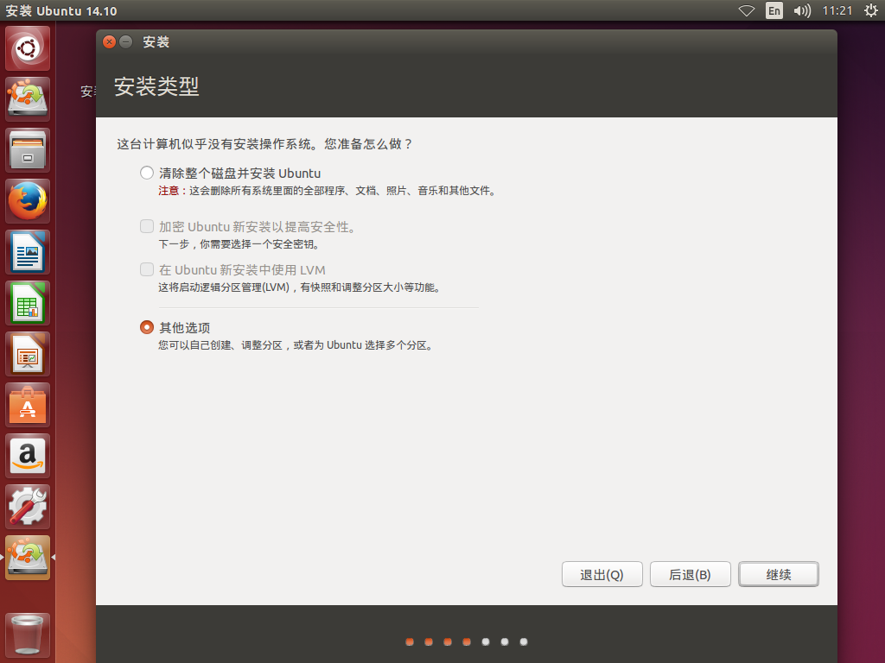

<!-- TOC depthFrom:1 depthTo:6 withLinks:1 updateOnSave:1 orderedList:0 -->

- [准备基本环境](#准备基本环境)
	- [ubuntu 12.04 x86安装](#ubuntu-1204-x86安装)
	- [其他Ubuntu碰到的问题](#其他ubuntu碰到的问题)
	- [apt源](#apt源)
	- [软件安装](#软件安装)
	- [参考博客](#参考博客)

<!-- /TOC -->
# 准备基本环境

## ubuntu 12.04 x86安装

强烈建议使用 ubuntu-12.04-desktop-i386.iso 系统镜像，其他镜像容易造成编译出错等问题。
所使用的源码其实也不完善，但是高版本编译器容易检测出问题。




一定要选择*其它选项**，也就是手动分区。


* 建议三个分区，一个根分区，一个swap分区，一个无挂载点ext类型分区。
* swap分区如果给内存足够没多大必要，但是有些程序就只会死皮赖脸要swap分区才行，为了省麻烦
* 不需要开启逻辑卷，lvm毕竟需要驱动支持，后期可以玩玩，新手稳妥点弄点基础的

## 其他Ubuntu碰到的问题

* 不建议使用其他Ubuntu发行版，尤其那种非长期支持TLS，首先源不一定有，然后编译通不过，尴尬至极
* 这个版本gcc还是存在许多漏洞，但是刚好这个特定发行版妥妥支持，不会报错。如果你想采坑，去吧~


## apt源

* 不建议阿里云，慢的一批不说，不支持old ubuntu
* 你需要信赖老品牌163开源镜像，毕竟不知道比阿里云镜像早了多少年

```
  vita@lfs:/etc/apt$ cat sources.list
  #deb cdrom:[Ubuntu 12.04 LTS _Precise Pangolin_ - Release i386 (20120423)]/ precise main restricted

  # See http://help.ubuntu.com/community/UpgradeNotes for how to upgrade to
  # newer versions of the distribution.
  deb http://mirrors.163.com/ubuntu/ precise main restricted
  deb-src http://mirrors.163.com/ubuntu/ precise main restricted

  ## Major bug fix updates produced after the final release of the
  ## distribution.
  deb http://mirrors.163.com/ubuntu/ precise-updates main restricted
  deb-src http://mirrors.163.com/ubuntu/ precise-updates main restricted

  ## N.B. software from this repository is ENTIRELY UNSUPPORTED by the Ubuntu
  ## team. Also, please note that software in universe WILL NOT receive any
  ## review or updates from the Ubuntu security team.
  deb http://mirrors.163.com/ubuntu/ precise universe
  deb-src http://mirrors.163.com/ubuntu/ precise universe
  deb http://mirrors.163.com/ubuntu/ precise-updates universe
  deb-src http://mirrors.163.com/ubuntu/ precise-updates universe

  ## N.B. software from this repository is ENTIRELY UNSUPPORTED by the Ubuntu
  ## team, and may not be under a free licence. Please satisfy yourself as to
  ## your rights to use the software. Also, please note that software in
  ## multiverse WILL NOT receive any review or updates from the Ubuntu
  ## security team.
  deb http://mirrors.163.com/ubuntu/ precise multiverse
  deb-src http://mirrors.163.com/ubuntu/ precise multiverse
  deb http://mirrors.163.com/ubuntu/ precise-updates multiverse
  deb-src http://mirrors.163.com/ubuntu/ precise-updates multiverse

  ## N.B. software from this repository may not have been tested as
  ## extensively as that contained in the main release, although it includes
  ## newer versions of some applications which may provide useful features.
  ## Also, please note that software in backports WILL NOT receive any review
  ## or updates from the Ubuntu security team.
  deb http://mirrors.163.com/ubuntu/ precise-backports main restricted universe multiverse
  deb-src http://mirrors.163.com/ubuntu/ precise-backports main restricted universe multiverse

  deb http://mirrors.163.com/ubuntu precise-security main restricted
  deb-src http://mirrors.163.com/ubuntu precise-security main restricted
  deb http://mirrors.163.com/ubuntu precise-security universe
  deb-src http://mirrors.163.com/ubuntu precise-security universe
  deb http://mirrors.163.com/ubuntu precise-security multiverse
  deb-src http://mirrors.163.com/ubuntu precise-security multiverse

  ## Uncomment the following two lines to add software from Canonical's
  ## 'partner' repository.
  ## This software is not part of Ubuntu, but is offered by Canonical and the
  ## respective vendors as a service to Ubuntu users.
  # deb http://archive.canonical.com/ubuntu precise partner
  # deb-src http://archive.canonical.com/ubuntu precise partner

  ## This software is not part of Ubuntu, but is offered by third-party
  ## developers who want to ship their latest software.
  #deb http://mirrors.163.com/ubuntu precise main
  #deb-src http://mirrors.163.com/ubuntu precise main
```

## 软件安装


```
 apt-get install xserver-xephyr libgtk-3-dev libgmp-dev libmpc-dev libmpfr-dev lrzsz screen gawk libtool screen ccache -y
```

## 参考博客

<https://blog.csdn.net/jiangwei0512/article/details/52824708>
<http://blog.163.com/wflk_wangwei/blog/static/2788833720144352959686/>
