<!-- TOC -->

- [构建工具链](#%E6%9E%84%E5%BB%BA%E5%B7%A5%E5%85%B7%E9%93%BE)
  - [工具链](#%E5%B7%A5%E5%85%B7%E9%93%BE)
  - [独立(free—standing)环境和宿主(hosted)环境](#%E7%8B%AC%E7%AB%8Bfreestanding%E7%8E%AF%E5%A2%83%E5%92%8C%E5%AE%BF%E4%B8%BBhosted%E7%8E%AF%E5%A2%83)
  - [准备工作](#%E5%87%86%E5%A4%87%E5%B7%A5%E4%BD%9C)
  - [构建二进制工具binutils](#%E6%9E%84%E5%BB%BA%E4%BA%8C%E8%BF%9B%E5%88%B6%E5%B7%A5%E5%85%B7binutils)
    - [链接脚本](#%E9%93%BE%E6%8E%A5%E8%84%9A%E6%9C%AC)
  - [编译freestanding的交叉编译器](#%E7%BC%96%E8%AF%91freestanding%E7%9A%84%E4%BA%A4%E5%8F%89%E7%BC%96%E8%AF%91%E5%99%A8)
  - [安装内核头文件linux-3.7.4](#%E5%AE%89%E8%A3%85%E5%86%85%E6%A0%B8%E5%A4%B4%E6%96%87%E4%BB%B6linux-374)
  - [开启多线程编译](#%E5%BC%80%E5%90%AF%E5%A4%9A%E7%BA%BF%E7%A8%8B%E7%BC%96%E8%AF%91)
  - [编译目标系统的C库](#%E7%BC%96%E8%AF%91%E7%9B%AE%E6%A0%87%E7%B3%BB%E7%BB%9F%E7%9A%84c%E5%BA%93)
    - [安装Glibc适配的awk版本](#%E5%AE%89%E8%A3%85glibc%E9%80%82%E9%85%8D%E7%9A%84awk%E7%89%88%E6%9C%AC)
    - [glibc编译](#glibc%E7%BC%96%E8%AF%91)
    - [Glibc主要安装文件](#glibc%E4%B8%BB%E8%A6%81%E5%AE%89%E8%A3%85%E6%96%87%E4%BB%B6)
  - [构建完整的交叉编译器](#%E6%9E%84%E5%BB%BA%E5%AE%8C%E6%95%B4%E7%9A%84%E4%BA%A4%E5%8F%89%E7%BC%96%E8%AF%91%E5%99%A8)
    - [完整编译器的组成部分](#%E5%AE%8C%E6%95%B4%E7%BC%96%E8%AF%91%E5%99%A8%E7%9A%84%E7%BB%84%E6%88%90%E9%83%A8%E5%88%86)
  - [定义工具链相关的环境变量](#%E5%AE%9A%E4%B9%89%E5%B7%A5%E5%85%B7%E9%93%BE%E7%9B%B8%E5%85%B3%E7%9A%84%E7%8E%AF%E5%A2%83%E5%8F%98%E9%87%8F)

<!-- /TOC -->
# 构建工具链


* 我们要构建的vita系统属于32位OS

## 工具链


* 工具链是包括上节中，编译过程，超集。编译用GNU GCC就够了
* C库的重要性，没有C库就没有其他应用程序了。可以说100%的应用程序都链接C库，C库包含了常用的函数，POSIX标准


* 交叉编译，无非就是宿主系统和目标系统（开发机）架构不同，例如x86编译arm的程序


* GNU将编译器和C库分开。但编译器又依赖C库，C库又是由编译器编译产生


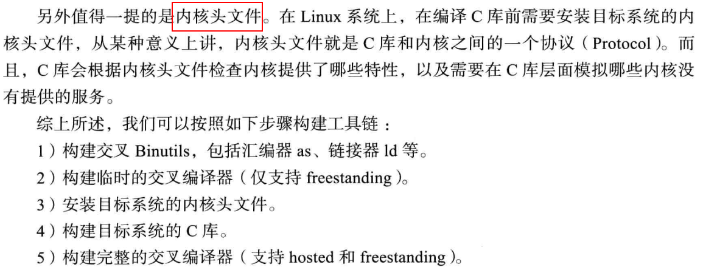


图示解释清楚这几者之间的关系

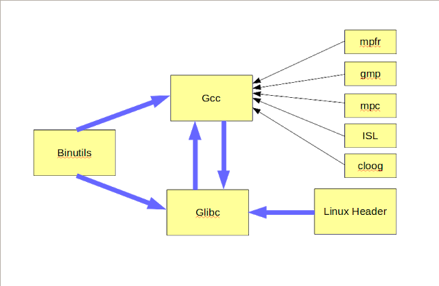

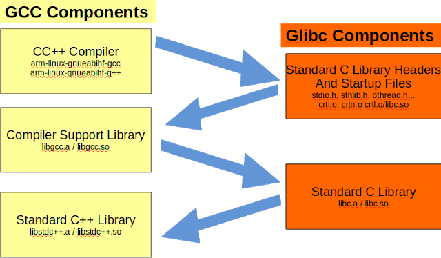


## 独立(free—standing)环境和宿主(hosted)环境

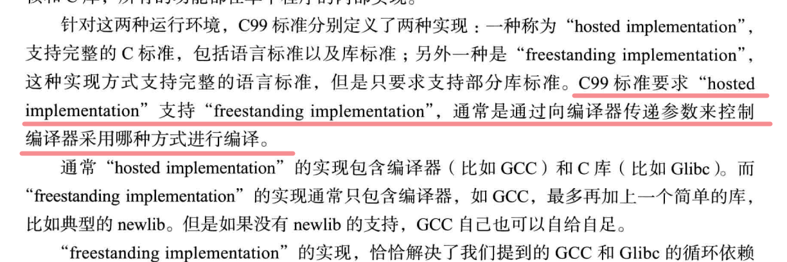

## 准备工作

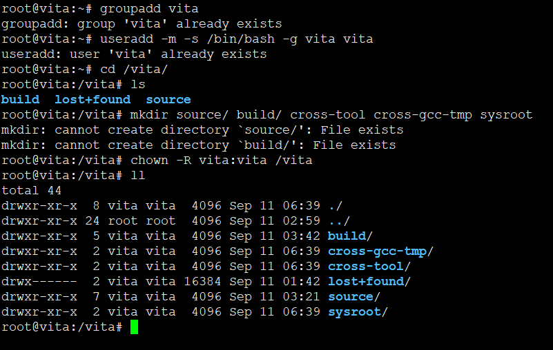

* 添加vita用户，新建目录，修改权限，切换到vita搞事情

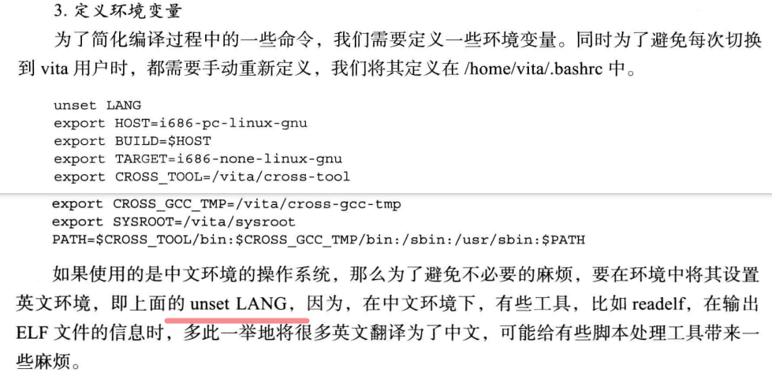

* 定义环境变量

```
root@vita:/vita# vi /home/vita/.bashrc

...

#添加内容
unset LANG
export HOST=i686-pc-linux-gnu
export BUILD=$HOST
export TARGET=i686-none-linux-gnu
export CROSS_TOOL=/vita/cross-tool
export CROSS_GCC_TMP=/vita/cross-gcc-tmp
export SYSROOT=/vita/sysroot
PATH=$CROSS_TOOL/bin:$CROSS_GCC_TMP/bin:/sbin/:/usr/sbin:$PATH

CORES=$((`grep processor /proc/cpuinfo |wc -l`))
SPEEDUP=" -j ${CORES}"
```

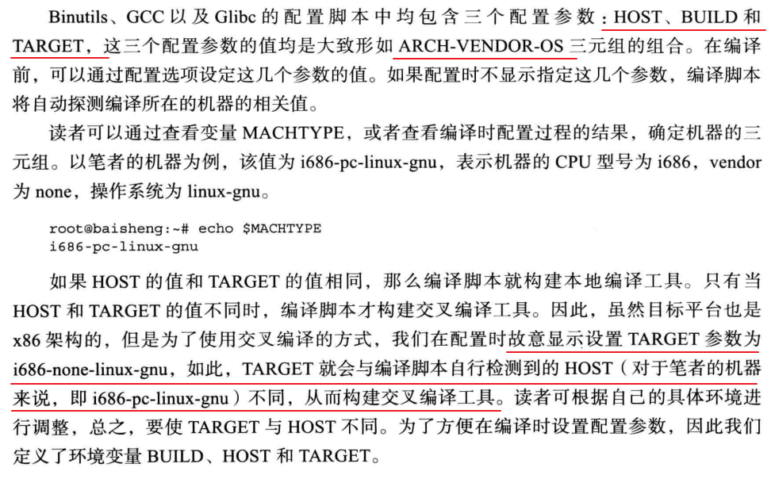

* 故意搞事情

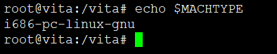

## 构建二进制工具binutils

```
function binutils(){
	cd /vita/build

	test -d /vita/build/binutils-2.23.1 && /bin/rm -rf binutils-2.23.1
	tar -xf ../source/binutils-2.23.1.tar.bz2
	checkout log.xf.binutils

	test -d binutils-build && /bin/rm -rf binutils-build
	mkdir binutils-build && cd binutils-build


	../binutils-2.23.1/configure --prefix=$CROSS_TOOL --target=$TARGET --with-sysroot=$SYSROOT  2>&1 | tee log.configure.binutils
	checkout log.configure.binutils

	make ${SPEEDUP}  2>&1 | tee log.make.binutils
	checkout log.make.binutils

	make ${SPEEDUP} install 2>&1 | tee log.makeinstall.binutils
	checkout log.makeinstall.binutils

	echo  -e "\e[32m\e[1m ========== finish binutils build =================================  \e[0m"
}

```


* ../binutils-2.23.1/configure 这种编译方式可以把生成文件单独放到另一个文件夹下，当前PWD是binutils-build
* 把binutils-build删除就相当于删除了中间文件，对原来的工程目录没有任何改动

```
vita@vita:/vita/build/binutils-build$ make
vita@vita:/vita/build/binutils-build$ make install
```

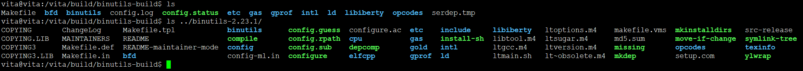

### 链接脚本


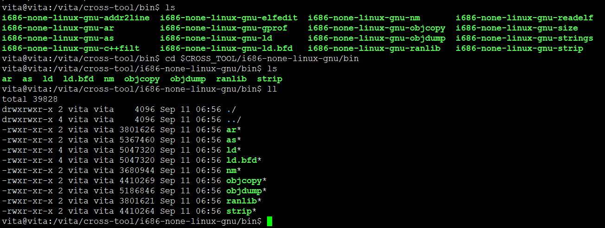

```
vita@vita:/vita/cross-tool/i686-none-linux-gnu/bin$ ll
total 39828
drwxrwxr-x 2 vita vita    4096 Sep 11 06:56 ./
drwxrwxr-x 4 vita vita    4096 Sep 11 06:56 ../
-rwxr-xr-x 2 vita vita 3801626 Sep 11 06:56 ar*
-rwxr-xr-x 2 vita vita 5367460 Sep 11 06:56 as*
-rwxr-xr-x 4 vita vita 5047320 Sep 11 06:56 ld*
-rwxr-xr-x 4 vita vita 5047320 Sep 11 06:56 ld.bfd*
-rwxr-xr-x 2 vita vita 3680944 Sep 11 06:56 nm*
-rwxr-xr-x 2 vita vita 4410269 Sep 11 06:56 objcopy*
-rwxr-xr-x 2 vita vita 5186846 Sep 11 06:56 objdump*
-rwxr-xr-x 2 vita vita 3801621 Sep 11 06:56 ranlib*
-rwxr-xr-x 2 vita vita 4410264 Sep 11 06:56 strip*
vita@vita:/vita/cross-tool/i686-none-linux-gnu/bin$ cd -
/vita/cross-tool/bin
vita@vita:/vita/cross-tool/bin$ ll
total 59192
drwxrwxr-x 2 vita vita    4096 Sep 11 06:56 ./
drwxr-xr-x 6 vita vita    4096 Sep 11 06:56 ../
-rwxr-xr-x 1 vita vita 3648867 Sep 11 06:56 i686-none-linux-gnu-addr2line*
-rwxr-xr-x 2 vita vita 3801626 Sep 11 06:56 i686-none-linux-gnu-ar*
-rwxr-xr-x 2 vita vita 5367460 Sep 11 06:56 i686-none-linux-gnu-as*
-rwxr-xr-x 1 vita vita 3607641 Sep 11 06:56 i686-none-linux-gnu-c++filt*
-rwxr-xr-x 1 vita vita   88603 Sep 11 06:56 i686-none-linux-gnu-elfedit*
-rwxr-xr-x 1 vita vita 4146567 Sep 11 06:56 i686-none-linux-gnu-gprof*
-rwxr-xr-x 4 vita vita 5047320 Sep 11 06:56 i686-none-linux-gnu-ld*
-rwxr-xr-x 4 vita vita 5047320 Sep 11 06:56 i686-none-linux-gnu-ld.bfd*
-rwxr-xr-x 2 vita vita 3680944 Sep 11 06:56 i686-none-linux-gnu-nm*
-rwxr-xr-x 2 vita vita 4410269 Sep 11 06:56 i686-none-linux-gnu-objcopy*
-rwxr-xr-x 2 vita vita 5186846 Sep 11 06:56 i686-none-linux-gnu-objdump*
-rwxr-xr-x 2 vita vita 3801621 Sep 11 06:56 i686-none-linux-gnu-ranlib*
-rwxr-xr-x 1 vita vita 1021581 Sep 11 06:56 i686-none-linux-gnu-readelf*
-rwxr-xr-x 1 vita vita 3668341 Sep 11 06:56 i686-none-linux-gnu-size*
-rwxr-xr-x 1 vita vita 3635183 Sep 11 06:56 i686-none-linux-gnu-strings*
-rwxr-xr-x 2 vita vita 4410264 Sep 11 06:56 i686-none-linux-gnu-strip*
```

* 这。。文件大小都不一样。书上说没区别

## 编译freestanding的交叉编译器

* 一个理解freestanding和hostd形象例子，其实很简单，就现在啃老现象来说。一个娃，成年后，如果能够自给自足，有份稳定工作，经济独立，他这一辈子能够做到 生存 + 独立
* 如果连经济都独立不了，只能靠父母 == 啃老，也还是能活的好好地。他就只完成了 生存
* 说到底其实就是个依赖关系
* freestanding其实就是独立 + 生存。我不依赖于本地C库，那么我就独立，就这么简单
* 所谓鸡生蛋蛋生鸡的问题，其实这里并没有解释清楚。无非就是，新工具链由旧工具链生成。。说那么复杂，郁闷


---

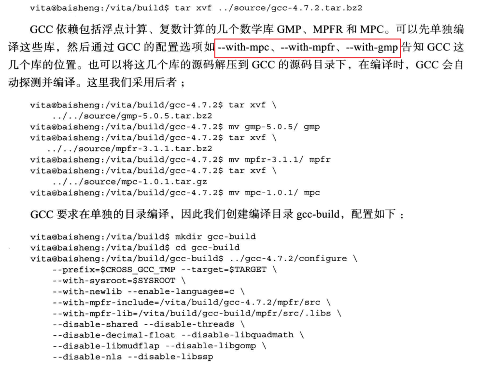

编译过程，例行公事

```
function gcc(){

	cd /vita/build/

	test -d  gcc-4.7.2 && /bin/rm -rf gcc-4.7.2
	tar -xf ../source/gcc-4.7.2.tar.bz2
	checkout log.xf.gcc

	cd gcc-4.7.2/
	tar -xf ../../source/gmp-5.0.5.tar.bz2
	checkout log.xf.gmp
	test -d gmp &&  /bin/rm -rf gmp
	/bin/mv -f  gmp-5.0.5 gmp

	tar -xf ../../source/mpfr-3.1.1.tar.bz2  
	checkout log.xf.mpfr
	test -d mpfr && /bin/rm -rf mpfr
	/bin/mv -f  mpfr-3.1.1 mpfr

	tar -xf ../../source/mpc-1.0.1.tar.gz
	checkout log.xf.mpc
	test -d mpc && /bin/rm -rf mpc
	/bin/mv -f  mpc-1.0.1 mpc

	test -d /vita/build/gcc-build && /bin/rm -rf /vita/build/gcc-build
	mkdir /vita/build/gcc-build  && cd /vita/build/gcc-build

	../gcc-4.7.2/configure  --prefix=$CROSS_GCC_TMP \
				--target=$TARGET \
				--with-sysroot=$SYSROOT \
				--with-newlib \
				--enable-languages=c \
				--with-mpfr-include=/vita/build/gcc-4.7.2/mpfr/src \
				--with-mpfr-lib=/vita/build/gcc-build/mpfr/src/.libs \
				--disable-shared --disable-threads \
				--disable-decimal-float --disable-libquadmath \
				--disable-libmudflap --disable-libgomp \
				--disable-nls --disable-libssp 2>&1 | tee log.configure.gcc
	checkout log.configure.gcc

	make ${SPEEDUP} 2>&1 | tee log.make.gcc
	checkout log.make.gcc

	make ${SPEEDUP} install 2>&1 | tee log.makeinstall.gcc
	checkout log.makeinstall.gcc


	cd /vita/cross-gcc-tmp
	ln -sfv libgcc.a lib/gcc/i686-none-linux-gnu/4.7.2/libgcc_eh.a  2>&1 | tee log.ln.libgcc
	checkout log.ln.libgcc

	echo  -e "\e[32m\e[1m =========== finish gcc build =====================================  \e[0m"
}
```

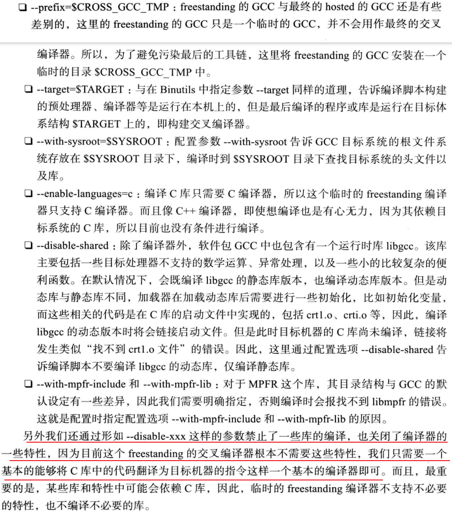

```
cd /vita/cross-gcc-tmp
ln -sv libgcc.a lib/gcc/i686-none-linux-gnu/4.7.2/libgcc_eh.a
```


## 安装内核头文件linux-3.7.4


内核头文件编译过程中会报错。没有找到.config文件

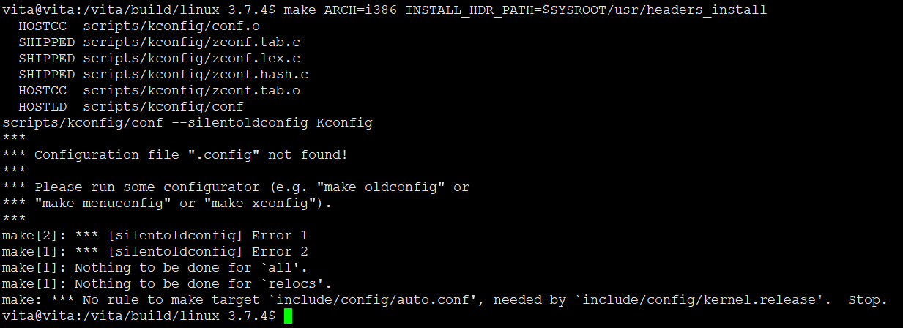


make menuconfig一个，但是又报错，缺少ncurse库，apt安装一下依赖


```
root@vita:/vita/cross-gcc-tmp# apt-get install libncurses5-dev -y
```


还可以生成默认配置文件

```
make defconfig
```

书上有个巨大的错误，作者也勘误了。


```
function kernelheaders(){

	cd /vita/build
	test -d linux-3.7.4 && /bin/rm -rf linux-3.7.4
	tar -xf ../source/linux-3.7.4.tar.xz
	checkout log.xf.linux

	cd /vita/build/linux-3.7.4
	make mrproper 2>&1 | tee log.mrproper
	checkout log.mrproper

	make ARCH=i386 headers_check 2>&1  | tee log.make.headers_check
	checkout log.make.headers_check

	make defconfig

	make ARCH=i386 INSTALL_HDR_PATH=$SYSROOT/usr/  headers_install ${SPEEDUP} 2>&1 | tee log.make.headers


	echo  -e "\e[32m\e[1m ========== finish kernel headers build ===========================  \e[0m"

}
```


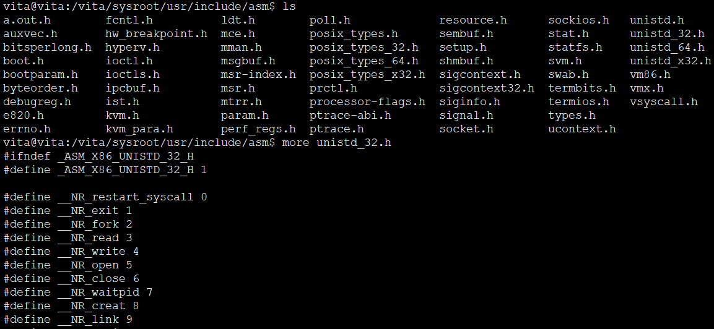

* 内核头文件定义了，用户态库函数调用系统调用的入口。
* 用户态程序如何跟内核打交道，通道就是系统调用，但是直接搞系统调用太麻烦，毕竟系统调用不超过512个，也就两三百个，所以一般都会封装，一层一层封装起来。一个库函数可能分装N多个系统调用。


## 开启多线程编译

```
make -j ${NUM_OF_CPU_CORE}
```


make指定参数可以开启多线程编译，一般指定CPU核心数目-1


## 编译目标系统的C库


* windows下有个概念叫运行时库，其实就是这个意思，要跑起来就必须要这个库
* 有没有不依赖库的程序，有，但是，啥事也干不了

### 安装Glibc适配的awk版本

```
sudo apt-get install gawk -y
```

PS:如果你开启上网代理的话，谨慎使用sudo哦~~


### glibc编译


* 例行公事，然而。。。

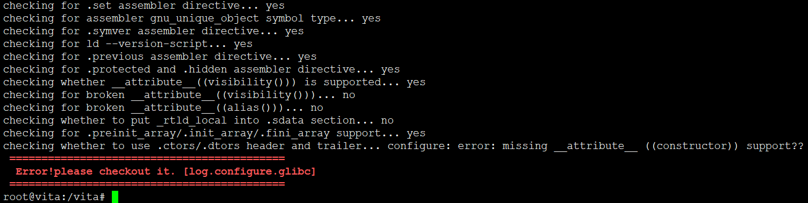


```
 ../glibc-2.15/configure --prefix=/usr --host=$TARGET    --enable-kernel=3.7.4 --enable-add-ons      --with-headers=$SYSROOT/headers_include/include   libc_cv_forced_unwind=yes libc_cv_c_cleanup=yes    libc_cv_ctors_headers=yes
```

这个错误很尴尬，应该是libc_cv_ctors_header 而不是 libc_cv_ctors_headers。失之毫厘谬以千里。在configure的时候不会处理未知的参数，也不会报错咋地，这很尴尬。所以要多检查几遍

```
function glibc(){

	cd /vita/build

	test -d glibc-2.15 && /bin/rm -rf glibc-2.15
	tar -xf ../source/glibc-2.15.tar.xz
	checkout log.xf.glibc

	cd glibc-2.15
	patch -p1 < ../../source/glibc-2.15-cpuid.patch 2>&1 | tee log.glibc.patch.cpuid
	checkout log.glibc.patch.cpuid
	patch -p1 < ../../source/glibc-2.15-s_frexp.patch 2>&1 | tee log.glibc.patch.frexp
	checkout log.glibc.patch.frexp


	mkdir -p /vita/build/glibc_build
	cd /vita/build/glibc_build
	echo $TARGET
	echo $SYSROOT
	../glibc-2.15/configure --prefix=/usr --host=$TARGET \
				--enable-kernel=3.7.4 --enable-add-ons \
				--with-headers=$SYSROOT/usr/include \
				libc_cv_forced_unwind=yes libc_cv_c_cleanup=yes \
				libc_cv_ctors_header=yes 2>&1 | tee log.configure.glibc
	checkout log.configure.glibc

	make ${SPEEDUP}  2>&1 | tee log.make.glibc
	checkout log.make.glibc

	make ${SPEEDUP} install_root=$SYSROOT install 2>&1 | tee log.makeinstall.glibc
	checkout log.makeinstall.glibc
}

```


这个glibc编译需要花蛮长时间，骚等。。。

### Glibc主要安装文件


## 构建完整的交叉编译器

因为依赖关系，先构建残缺的GCC编译器，然后构建C库，然后在已经构建的C库基础上重新构建GCC编译器

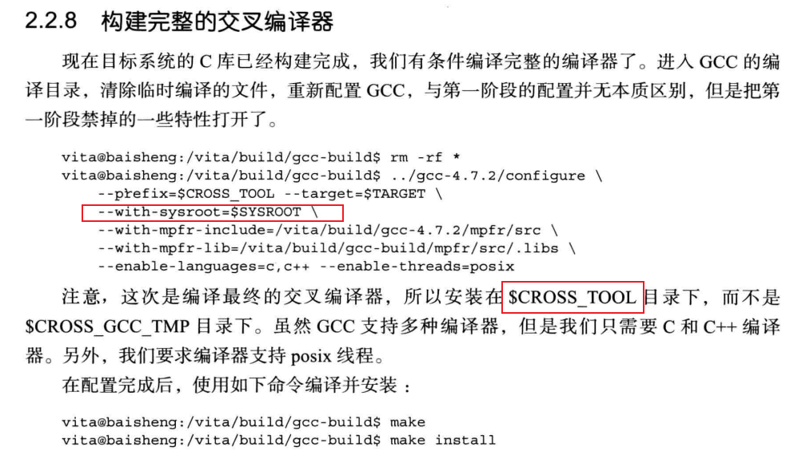

```
function fullcompiler(){
        cd /vita/build/gcc-build
        rm -rf /vita/build/gcc-build/*
        ../gcc-4.7.2/configure \
                --prefix=$CROSS_TOOL --target=$TARGET \
                --with-sysroot=$SYSROOT \
                --with-mpfr-include=/vita/build/gcc-4.7.2/mpfr/src \
                --with-mpfr-lib=/vita/build/gcc-build/mpfr/src/.libs \
                --enable-languages=c,c++ --enable-threads=posix 2>&1 | tee log.fullcompiler
        checkout log.fullcompiler

        make ${SPEEDUP} 2>&1 | tee log.make.fullcompiler
        checkout log.make.fullcompiler

        make ${SPEEDUP} install 2>&1 | tee log.makeinstall.fullcompiler
        checkout log.makeinstall.fullcompiler

        echo  -e "\e[32m\e[1m ========== finish fullcompiler build =============================  \e[0m"
}
```

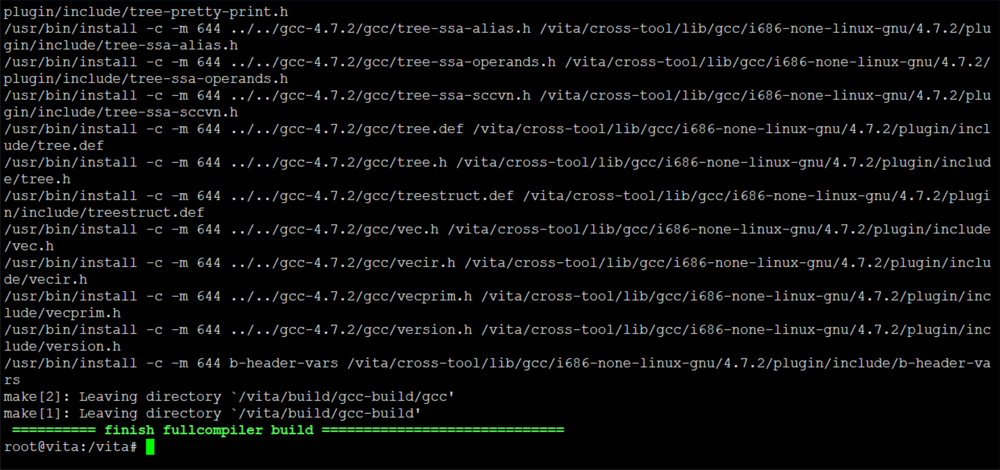

### 完整编译器的组成部分

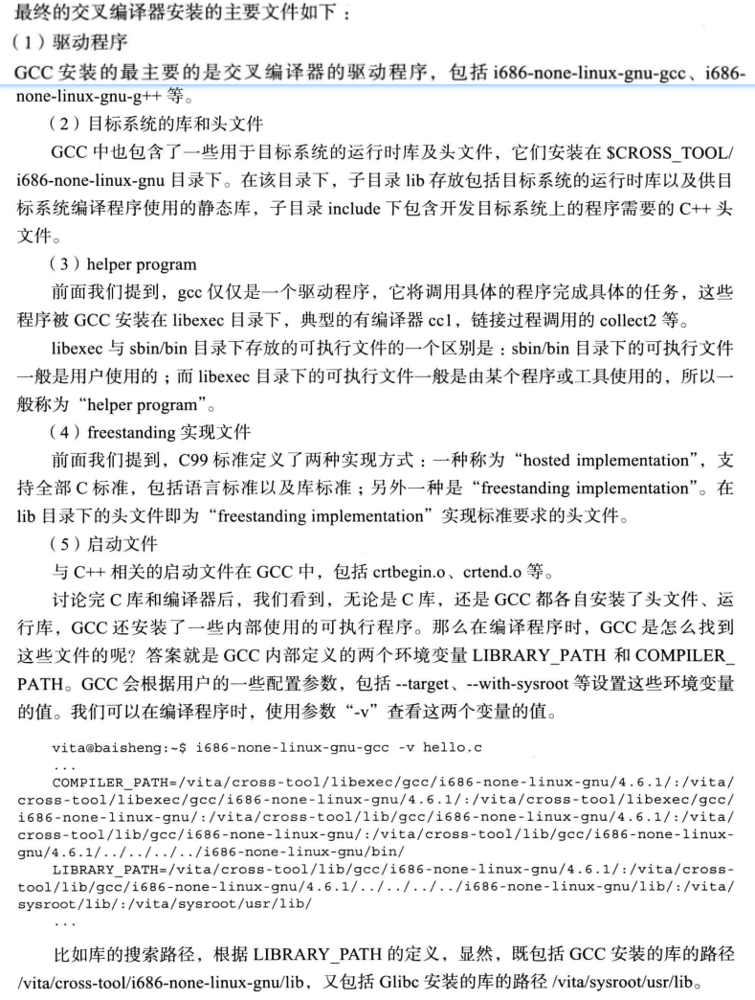

## 定义工具链相关的环境变量

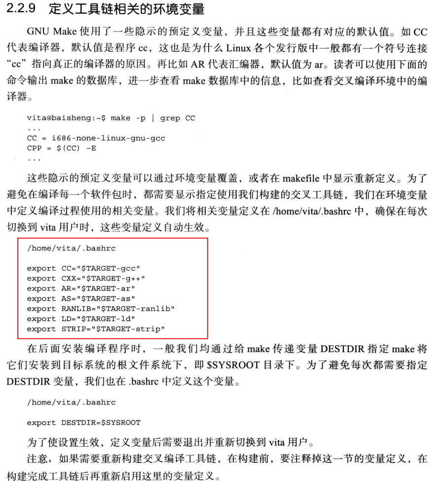

* 工具链中定义了很多变量，通过变量来获取相应的依赖路径
* 我们从无到有编译的交叉编译器，默认是不会使用的，但是如果修改了环境变量，那么编译的时候就能生效


```
function defineenv(){

	export CC="$TARGET-gcc"
	export CXX="$TARGET-g++"
	export AR="$TARGET-ar"
	export AS="$TARGET-as"
	export RANLIB="$TARGET-ranlib"
	export LD="$TARGET-ld"
	export STRIP="$TARGET-strip"

	export DESTDIR=$SYSROOT
	unset PKG_CONFIG_PATH
	export PKG_CONFIG_LIBDIR=$SYSROOT/usr/lib/pkgconfig:SYSROOT/usr/share/pkgconfig

	grep 'export CC="$TARGET-gcc"' ~/.bashrc || echo 'export CC="$TARGET-gcc"' >> ~/.bashrc
	grep 'export CXX="$TARGET-g++"' ~/.bashrc || echo 'export CXX="$TARGET-g++"' >> ~/.bashrc
	grep 'export AR="$TARGET-ar"' ~/.bashrc || echo 'export AR="$TARGET-ar"' >> ~/.bashrc
	grep 'export AS="$TARGET-as"' ~/.bashrc || echo 'export AS="$TARGET-as"' >> ~/.bashrc
	grep 'export RANLIB="$TARGET-ranlib"' ~/.bashrc || echo 'export RANLIB="$TARGET-ranlib"' >> ~/.bashrc
	grep 'export LD="$TARGET-ld"' ~/.bashrc || echo 'export LD="$TARGET-ld"' >> ~/.bashrc
	grep 'export STRIP="$TARGET-strip"' ~/.bashrc || echo 'export STRIP="$TARGET-strip"' >> ~/.bashrc
	grep 'export DESTDIR=$SYSROOT' ~/.bashrc || echo 'export DESTDIR=$SYSROOT' >> ~/.bashrc
	grep 'unset PKG_CONFIG_PATH' ~/.bashrc || echo 'unset PKG_CONFIG_PATH' >> ~/.bashrc
	grep 'export PKG_CONFIG_LIBDIR=$SYSROOT/usr/lib/pkgconfig:SYSROOT/usr/share/pkgconfig' ~/.bashrc || echo 'export PKG_CONFIG_LIBDIR=$SYSROOT/usr/lib/pkgconfig:SYSROOT/usr/share/pkgconfig' >> ~/.bashrc

}

```


* pkg-config其实就是搜查大使，编译器找不到的东西就问pkg-config找，有就继续编译，没有就歇菜

对于一个比较大第三方库，其头文件和库文件的数量是比较多的。如果我们一个个手动地写，那将是相当麻烦的。所以，pkg-config就应运而生了。pkg-config能够把这些头文件和库文件的位置指出来，给编译器使用。如果你的系统装有gtk，可以尝试一下下面的命令```$pkg-config --cflags gtk+-2.0```。可以看到其输出是gtk的头文件的路径。

我们平常都是这样用pkg-config的。

```$gcc main.c `pkg-config --cflags --libs gtk+-2.0` -o main```

上面的编译命令中，```pkg-config --cflags --libs gtk+-2.0```的作用就如前面所说的，把gtk的头文件路径和库文件列出来，让编译去获取。--cflags和--libs分别指定头文件和库文件。

```
root@vita:/vita/cross-tool/bin# cat pkg-config
#!/bin/bash
HOST_PKG_CFG=/usr/bin/pkg-config

if [ ! $SYSROOT ];then
	echo "Please make sure you are in cross-comile environment!"
	exit 1
fi

$HOST_PKG_CFG --exists $*
if [ $? -ne 0 ];then
	exit 1
fi

if $HOST_PKG_CFG $* | sed -e "s/-I/-I\/vita\/sysroot/g; \
	s/-L/-L\/vita\/sysroot/g"
then
	exit 0
else
	exit 1
fi
```


* 只有系统安装了的库才会被检索到，而且是根据环境变量```$PKG_CONFIG_LIBDIR```来的
* 其实这个命令指示帮你找到链接库的未知，然后以gcc可以识别的命令呈现


## libtool


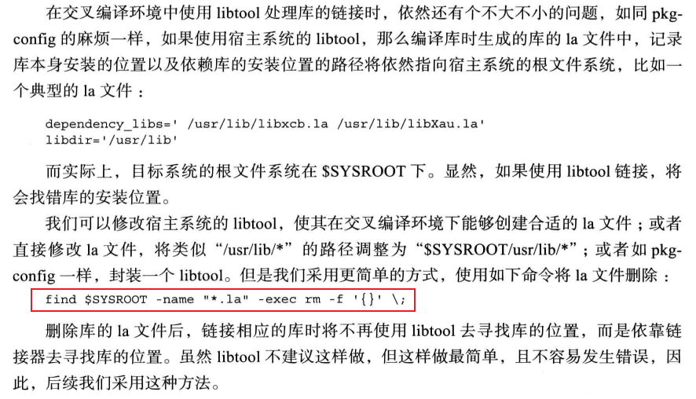


libtool 是一个通用库支持脚本(/usr/bin/libtool)，将使用动态库的复杂性隐藏在统一、可移植的接口中。

可以在不同平台上创建并调用动态库，我们可以认为libtool是gcc的一个抽象，也就是说，它包装了gcc或者其他的任何编译器，用户无需知道细节， 只要告诉libtool说我需要要编译哪些库即可，并且，它只与libtool文件打交道，例如lo、la为后缀的文件。

libtool生成一个抽象的后缀名为la高层库libxx.la（其实是个文本文件），并将该库对其它库的依赖关系，都写在该la的文 件中。该文件中的dependency_libs记录该库依赖的所有库（其中有些是以.la文件的形式加入的）；libdir则指出了库的安装位 置；library_names记录了共享库的名字；old_library记录了静态库的名字。

* libtool 用来辅助链接，但是并不包括工具链内，但是工具链有需要用到它，结果他是hosted环境下的，如果用libtool进行链接，就会找错库的位置。难道没有环境变量可以用来修改libtool？？书上说的可以直接修改la文件，或者直接删掉对应的辅助链接文件*.la 。之后真正链接就会根据环境变量去找。简单粗暴

```
find $SYSROOT -name "*.la" -exec rm -f '{}' \;
```

## 启动代码


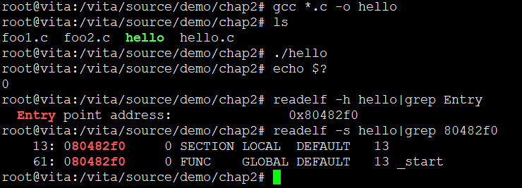

* 其实这块就是反汇编的知识，学逆向的基本都知道
* 程序执行之前，堆栈环境，函数本质入口探讨


## Glibc程序入口处理代码

* Glibc默认在编译程序的时候，main函数之前添加的代码
* <https://luomuxiaoxiao.com/?p=516>这篇文章间的很详细，学习一下哦


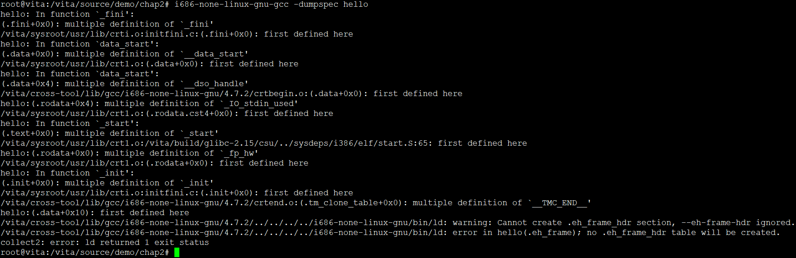


## 修改启动代码小实验

```
root@vita:/vita/source/demo/chap2# cat foo.c
#include <stdio.h>

void myinit(int argc, char **argv, char **envp) {
	printf("%s\n", __FUNCTION__);
}

__attribute__((section(".init_array"))) typeof(myinit) *__myinit = myinit;

void test()
{
	printf("%s\n",__FUNCTION__);
}

root@vita:/vita/source/demo/chap2# cat bar.c
#include <stdio.h>

void main()
{
	printf("Enter main.\n");
	test();
}
root@vita:/vita/source/demo/chap2# vim foo.c
root@vita:/vita/source/demo/chap2# vim bar.c
root@vita:/vita/source/demo/chap2# gcc bar.c -o bar -L./ -lfoo
root@vita:/vita/source/demo/chap2# LD_LIBRARY_PATH=./ ./bar
myinit
Enter main.
test
```


书上这里是在搞笑么？？

## 一键搞事情脚本

针对本书第二章的所有软件安装，搞了一个脚本，onekey执行

1.放到/vita目录下，chmod a+x 赋予执行权限
2.提前准备好source，github仓库目录下有，包括所有软件包

```
#!/bin/bash

unset LANG
export HOST=i686-pc-linux-gnu
export BUILD=$HOST
export TARGET=i686-none-linux-gnu
export CROSS_TOOL=/vita/cross-tool
export CROSS_GCC_TMP=/vita/cross-gcc-tmp
export SYSROOT=/vita/sysroot
PATH=$CROSS_TOOL/bin:$CROSS_GCC_TMP/bin:/sbin/:/usr/sbin:$PATH

CORES=$((`grep processor /proc/cpuinfo |wc -l`))
SPEEDUP=" -j ${CORES}"


function basicenv(){
	unset LANG
	export HOST=i686-pc-linux-gnu
	export BUILD=$HOST
	export TARGET=i686-none-linux-gnu
	export CROSS_TOOL=/vita/cross-tool
	export CROSS_GCC_TMP=/vita/cross-gcc-tmp
	export SYSROOT=/vita/sysroot
	PATH=$CROSS_TOOL/bin:$CROSS_GCC_TMP/bin:/sbin/:/usr/sbin:$PATH


	grep 'unset LANG' ~/.bashrc || echo 'unset LANG' >> ~/.bashrc
	grep 'export HOST=i686-pc-linux-gnu' ~/.bashrc || echo 'export HOST=i686-pc-linux-gnu' >> ~/.bashrc
	grep 'export BUILD=$HOST' ~/.bashrc || echo 'export BUILD=$HOST' >> ~/.bashrc
	grep 'export TARGET=i686-none-linux-gnu' ~/.bashrc || echo 'export TARGET=i686-none-linux-gnu' >> ~/.bashrc
	grep 'export CROSS_TOOL=/vita/cross-tool' ~/.bashrc || echo 'export CROSS_TOOL=/vita/cross-tool' >> ~/.bashrc
	grep 'export CROSS_GCC_TMP=/vita/cross-gcc-tmp' ~/.bashrc || echo 'export CROSS_GCC_TMP=/vita/cross-gcc-tmp' >> ~/.bashrc
	grep 'export SYSROOT=/vita/sysroot' ~/.bashrc || echo 'export SYSROOT=/vita/sysroot' >> ~/.bashrc
	grep 'PATH=$CROSS_TOOL/bin:$CROSS_GCC_TMP/bin:/sbin/:/usr/sbin:$PATH' ~/.bashrc || echo 'PATH=$CROSS_TOOL/bin:$CROSS_GCC_TMP/bin:/sbin/:/usr/sbin:$PATH' >> ~/.bashrc

	echo  -e "\e[32m\e[1m ========== finish basic environment build =================================  \e[0m"
}

function checkout(){
	if [ ${PIPESTATUS[0]} -ne 0 ];then
		echo  -e "\e[31m\e[1m ===========================================  \e[0m"
		echo  -e "\e[31m\e[1m  Error!please checkout it. [$1]  \e[0m"
		echo  -e "\e[31m\e[1m ===========================================  \e[0m"
		exit 1
	fi
}

function aptinstall(){
	apt-get update
#	apt-get upgrade -y
	apt-get install  xorg-dev xserver-xephyr lrzsz \
			 libgtk-3-dev 	openssh-server \
			 libncurses5-dev build-essential \
			 texinfo autoconf gawk tree g++ \
			 m4 gcc-multilib htop libtool  -y
	checkout apt-get
	echo  -e "\e[32m\e[1m ========== finish apt install  =================================  \e[0m"
}

function binutils(){
	cd /vita/build

	test -d /vita/build/binutils-2.23.1 && /bin/rm -rf binutils-2.23.1
	tar -xf ../source/binutils-2.23.1.tar.bz2
	checkout log.xf.binutils

	test -d binutils-build && /bin/rm -rf binutils-build
	mkdir binutils-build && cd binutils-build


	../binutils-2.23.1/configure --prefix=$CROSS_TOOL --target=$TARGET --with-sysroot=$SYSROOT  2>&1 | tee log.configure.binutils
	checkout log.configure.binutils

	make ${SPEEDUP}  2>&1 | tee log.make.binutils
	checkout log.make.binutils

	make ${SPEEDUP} install 2>&1 | tee log.makeinstall.binutils
	checkout log.makeinstall.binutils

	echo  -e "\e[32m\e[1m ========== finish binutils build =================================  \e[0m"
}

function gcc(){

	cd /vita/build/

	test -d  gcc-4.7.2 && /bin/rm -rf gcc-4.7.2
	tar -xf ../source/gcc-4.7.2.tar.bz2
	checkout log.xf.gcc

	cd gcc-4.7.2/
	tar -xf ../../source/gmp-5.0.5.tar.bz2
	checkout log.xf.gmp
	test -d gmp &&  /bin/rm -rf gmp
	/bin/mv -f  gmp-5.0.5 gmp

	tar -xf ../../source/mpfr-3.1.1.tar.bz2  
	checkout log.xf.mpfr
	test -d mpfr && /bin/rm -rf mpfr
	/bin/mv -f  mpfr-3.1.1 mpfr

	tar -xf ../../source/mpc-1.0.1.tar.gz
	checkout log.xf.mpc
	test -d mpc && /bin/rm -rf mpc
	/bin/mv -f  mpc-1.0.1 mpc

	test -d /vita/build/gcc-build && /bin/rm -rf /vita/build/gcc-build
	mkdir /vita/build/gcc-build  && cd /vita/build/gcc-build

	../gcc-4.7.2/configure  --prefix=$CROSS_GCC_TMP \
				--target=$TARGET \
				--with-sysroot=$SYSROOT \
				--with-newlib \
				--enable-languages=c \
				--with-mpfr-include=/vita/build/gcc-4.7.2/mpfr/src \
				--with-mpfr-lib=/vita/build/gcc-build/mpfr/src/.libs \
				--disable-shared --disable-threads \
				--disable-decimal-float --disable-libquadmath \
				--disable-libmudflap --disable-libgomp \
				--disable-nls --disable-libssp 2>&1 | tee log.configure.gcc
	checkout log.configure.gcc

	make ${SPEEDUP} 2>&1 | tee log.make.gcc
	checkout log.make.gcc

	make ${SPEEDUP} install 2>&1 | tee log.makeinstall.gcc
	checkout log.makeinstall.gcc


	cd /vita/cross-gcc-tmp
	ln -sfv libgcc.a lib/gcc/i686-none-linux-gnu/4.7.2/libgcc_eh.a  2>&1 | tee log.ln.libgcc
	checkout log.ln.libgcc

	echo  -e "\e[32m\e[1m =========== finish gcc build =====================================  \e[0m"
}

function kernelheaders(){

	cd /vita/build
	test -d linux-3.7.4 && /bin/rm -rf linux-3.7.4
	tar -xf ../source/linux-3.7.4.tar.xz
	checkout log.xf.linux

	cd /vita/build/linux-3.7.4
	make mrproper 2>&1 | tee log.mrproper
	checkout log.mrproper

	make ARCH=i386 headers_check 2>&1  | tee log.make.headers_check
	checkout log.make.headers_check

	make defconfig

	make ARCH=i386 INSTALL_HDR_PATH=$SYSROOT/usr/  headers_install ${SPEEDUP} 2>&1 | tee log.make.headers


	echo  -e "\e[32m\e[1m ========== finish kernel headers build ===========================  \e[0m"

}

function glibc(){

	cd /vita/build

	test -d glibc-2.15 && /bin/rm -rf glibc-2.15
	tar -xf ../source/glibc-2.15.tar.xz
	checkout log.xf.glibc

	cd glibc-2.15
	patch -p1 < ../../source/glibc-2.15-cpuid.patch 2>&1 | tee log.glibc.patch.cpuid
	checkout log.glibc.patch.cpuid
	patch -p1 < ../../source/glibc-2.15-s_frexp.patch 2>&1 | tee log.glibc.patch.frexp
	checkout log.glibc.patch.frexp


	mkdir -p /vita/build/glibc_build
	cd /vita/build/glibc_build
	echo $TARGET
	echo $SYSROOT
	../glibc-2.15/configure --prefix=/usr --host=$TARGET \
				--enable-kernel=3.7.4 --enable-add-ons \
				--with-headers=$SYSROOT/usr/include \
				libc_cv_forced_unwind=yes libc_cv_c_cleanup=yes \
				libc_cv_ctors_header=yes 2>&1 | tee log.configure.glibc
	checkout log.configure.glibc

	make ${SPEEDUP}  2>&1 | tee log.make.glibc
	checkout log.make.glibc

	make ${SPEEDUP} install_root=$SYSROOT install 2>&1 | tee log.makeinstall.glibc
	checkout log.makeinstall.glibc
	echo  -e "\e[32m\e[1m ========== finish glibc build =====================================  \e[0m"
}

function fullcompiler(){
	cd /vita/build/gcc-build
	/bin/rm -rf /vita/build/gcc-build/*
	../gcc-4.7.2/configure \
		--prefix=$CROSS_TOOL --target=$TARGET \
		--with-sysroot=$SYSROOT \
		--with-mpfr-include=/vita/build/gcc-4.7.2/mpfr/src \
		--with-mpfr-lib=/vita/build/gcc-build/mpfr/src/.libs \
		--enable-languages=c,c++ --enable-threads=posix 2>&1 | tee log.fullcompiler
	checkout log.fullcompiler

	make ${SPEEDUP} 2>&1 | tee log.make.fullcompiler
	checkout log.make.fullcompiler

	make ${SPEEDUP} install 2>&1 | tee log.makeinstall.fullcompiler
	checkout log.makeinstall.fullcompiler

	echo  -e "\e[32m\e[1m ========== finish fullcompiler build =============================  \e[0m"
}

function defineenv(){

	export CC="$TARGET-gcc"
	export CXX="$TARGET-g++"
	export AR="$TARGET-ar"
	export AS="$TARGET-as"
	export RANLIB="$TARGET-ranlib"
	export LD="$TARGET-ld"
	export STRIP="$TARGET-strip"

	export DESTDIR=$SYSROOT
	unset PKG_CONFIG_PATH
	export PKG_CONFIG_LIBDIR=$SYSROOT/usr/lib/pkgconfig:SYSROOT/usr/share/pkgconfig

	grep 'export CC="$TARGET-gcc"' ~/.bashrc || echo 'export CC="$TARGET-gcc"' >> ~/.bashrc
	grep 'export CXX="$TARGET-g++"' ~/.bashrc || echo 'export CXX="$TARGET-g++"' >> ~/.bashrc
	grep 'export AR="$TARGET-ar"' ~/.bashrc || echo 'export AR="$TARGET-ar"' >> ~/.bashrc
	grep 'export AS="$TARGET-as"' ~/.bashrc || echo 'export AS="$TARGET-as"' >> ~/.bashrc
	grep 'export RANLIB="$TARGET-ranlib"' ~/.bashrc || echo 'export RANLIB="$TARGET-ranlib"' >> ~/.bashrc
	grep 'export LD="$TARGET-ld"' ~/.bashrc || echo 'export LD="$TARGET-ld"' >> ~/.bashrc
	grep 'export STRIP="$TARGET-strip"' ~/.bashrc || echo 'export STRIP="$TARGET-strip"' >> ~/.bashrc
	grep 'export DESTDIR=$SYSROOT' ~/.bashrc || echo 'export DESTDIR=$SYSROOT' >> ~/.bashrc
	grep 'unset PKG_CONFIG_PATH' ~/.bashrc || echo 'unset PKG_CONFIG_PATH' >> ~/.bashrc
	grep 'export PKG_CONFIG_LIBDIR=$SYSROOT/usr/lib/pkgconfig:SYSROOT/usr/share/pkgconfig' ~/.bashrc || echo 'export PKG_CONFIG_LIBDIR=$SYSROOT/usr/lib/pkgconfig:SYSROOT/usr/share/pkgconfig' >> ~/.bashrc

	echo  -e "\e[32m\e[1m ========== finish define environment  =============================  \e[0m"
}

function pkgconfig(){

	FILE=/vita/cross-tool/bin/pkg-config
	/bin/cat << EOF > ${FILE}
#!/bin/bash
HOST_PKG_CFG=/usr/bin/pkg-config

if [ ! \$SYSROOT ];then
	echo "Please make sure you are in cross-comile environment!"
	exit 1
fi

\$HOST_PKG_CFG --exists \$*
if [ \$? -ne 0 ];then
	exit 1
fi

if \$HOST_PKG_CFG \$* | sed -e "s/-I/-I\/vita\/sysroot/g; \\
	s/-L/-L\/vita\/sysroot/g"
then
	exit 0
else
	exit 1
fi
EOF
	chmod a+x ${FILE}

	echo  -e "\e[32m\e[1m ========== finish pkg-config =============================  \e[0m"
}

function main(){
	basicenv
	aptinstall
	binutils
	gcc
	kernelheaders
	glibc
	fullcompiler
	defineenv
	pkgconfig
}

main

```

## 装逼截图


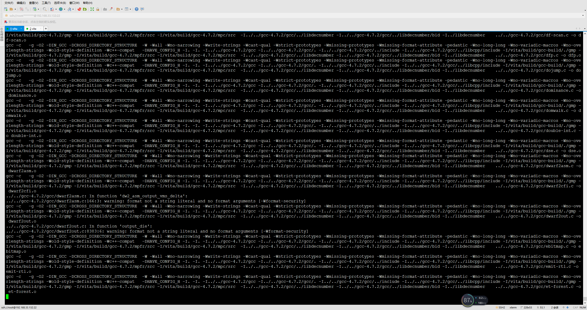

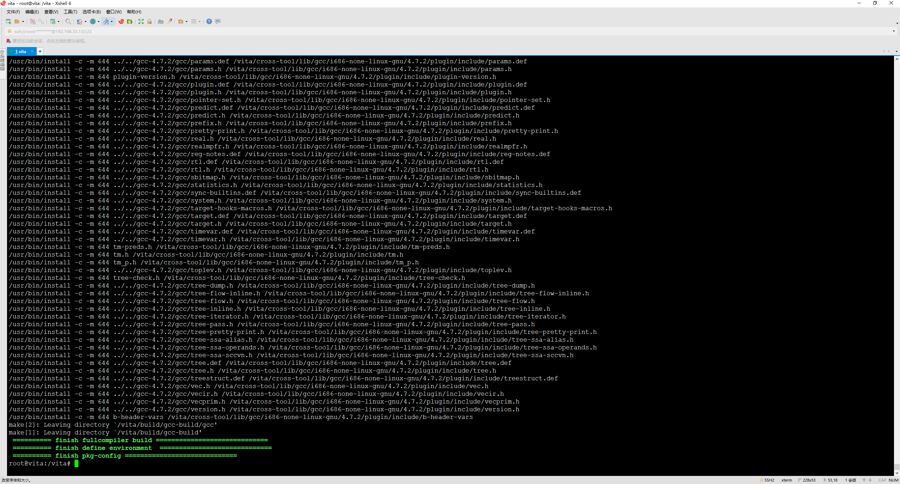

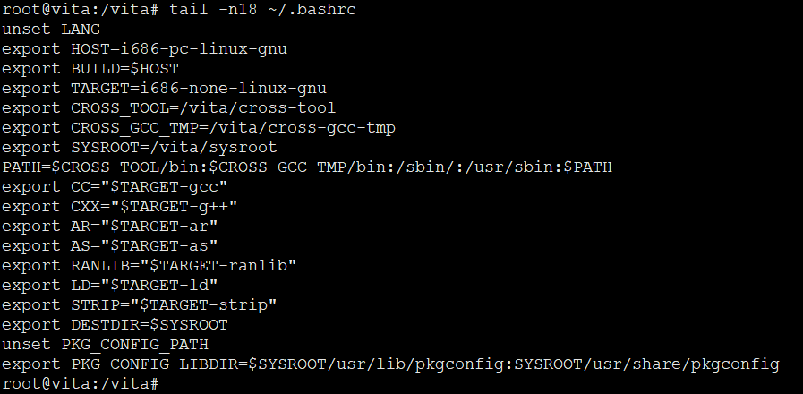

## 参考

* <https://blog.csdn.net/lixiang201101/article/details/37663087>
* <https://luomuxiaoxiao.com/?p=516>

## 小总结

1. 我算知道configure尿性。错误选项参数不会报错。
2. 如果有网络代理的话，sudo会有一定影响，有时候不用sudo反而靠谱


---
