# 配置内核

## 交叉编译内核设置


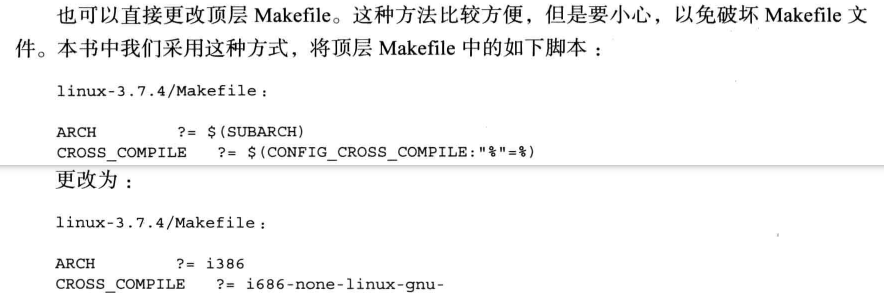

* 通过环境变量指定使用交叉编译
* 两种方式，一种是命令执行的时候显示指定交叉编译器，一种是直接修改顶层Makefile


## 基本内核配置

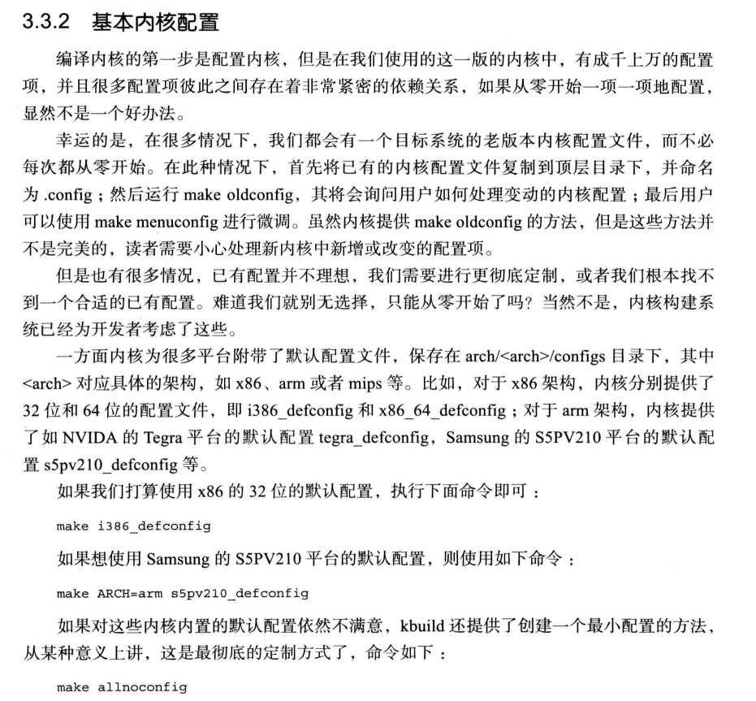

.config 配置文件一定要有，且必须在内核顶层目录

* make oldconfig，从/boot分区找内核配置，其实就是找hosted系统的内核配置
* make menuconfig，图形化界面配置
* make ${ARCH}_config，内核提供对应平台的默认配置
* make allnoconfig，最小化配置


LFS一般都必须基于最小化配置

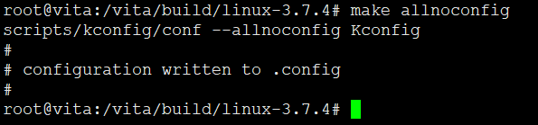

执行命令之后其实就在顶层目录生成一个.config配置文件，内容是酱紫的

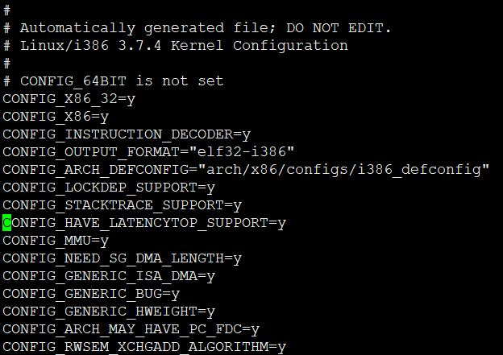

boolean类似，字符串类型。下面依次配置一些内容

## 配置处理器


* x86一向都兼容，但是鼻祖intel在64位上傻逼了，被AMD抢走了64位（兼容32位）鼻祖称号，因为它不想继续兼容32位了
* 兼容，纯粹就是为了支持更多设备，但是性能确实很尴尬


反正比较新的都选这个就对了

这一选项针对x86系列的CPU使用更多的常规优化。如果你在上面一项选的是i386、i586之类的才选这个通用x86支持,如果你的CPU能够在上述"Processor family"中找到就别选。除了对上面你选择的X86 CPU进行优化，它还对更多类型X86 CPU的进行优化。这将会使内核在其他的X86 CPU上运行得更好。这个选项提供了对X86系列CPU最大的兼容性，用来支持一些少见的x86构架的CPU。如果你的CPU能够在上面的列表中找到，就里就不用选了。


选中多核心支持


## 配置内核支持模块

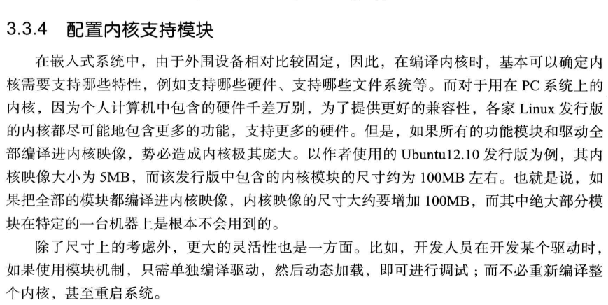


## 配置硬盘控制器驱动

硬盘驱动要考虑三方面

1.硬盘控制器接口
  * SATA使用PCI接口，挂在PCI总线
2. 与SCSI层关系
  * 在内河中SATA设备被实现为一个SCSI设备
3. 底层设备驱动


* 内核将SATA逻辑上分为两层

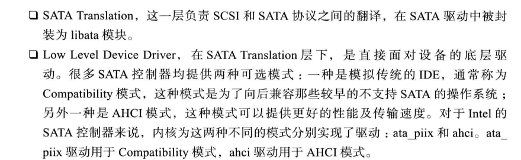


从内核配置选项上可以看出他们之间的依赖关系

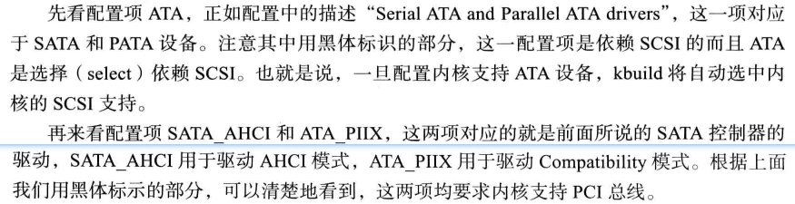


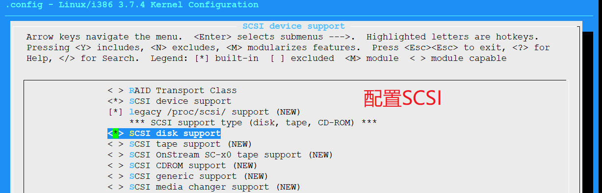

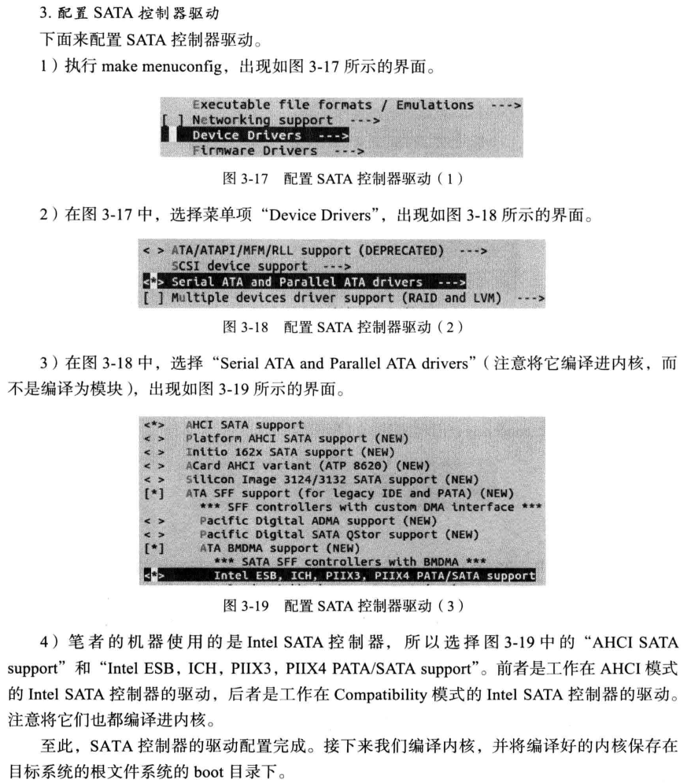


开启多线程编译

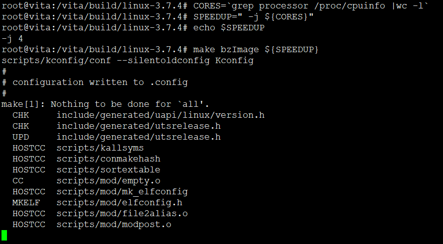

```
  LD      arch/x86/boot/compressed/vmlinux
  ZOFFSET arch/x86/boot/zoffset.h
  OBJCOPY arch/x86/boot/vmlinux.bin
  AS      arch/x86/boot/header.o
  LD      arch/x86/boot/setup.elf
  OBJCOPY arch/x86/boot/setup.bin
  BUILD   arch/x86/boot/bzImage
Setup is 15036 bytes (padded to 15360 bytes).
System is 1324 kB
CRC 6bfab967
Kernel: arch/x86/boot/bzImage is ready  (#1)
root@vita:/vita/build/linux-3.7.4# ls arch/x86/boot/b
bioscall.S  bioscall.o  bitops.h    boot.h      bzImage     
root@vita:/vita/build/linux-3.7.4# ls arch/x86/boot/bzImage -alh
-rw-r--r-- 1 root root 1.4M Sep 13 00:32 arch/x86/boot/bzImage
root@vita:/vita/build/linux-3.7.4# SPEEDUP=" -j ${CORES}"^C
root@vita:/vita/build/linux-3.7.4# file arch/x86/boot/bzImage
arch/x86/boot/bzImage: Linux kernel x86 boot executable bzImage, version 3.7.4 (root@vita) #1 SMP Fri Sep 13 00:32:37 CST 2019, RO-rootFS, swap_dev 0x1, Normal VGA
root@vita:/vita/build/linux-3.7.4#

```
### 测试新编译的内核


```
root@vita:/vita# cp /sysroot/boot/bzImage /boot/
```

拷贝到当前虚拟机的/boot分区下，修改启动项

首先让grub显示菜单项，修改/etc/default/grub注释掉GRUB_HIDDEN相关的条目


修改后保存，运行命令 update-grub即可更新/boot/grub/grub.conf

然后再修改/etc/grub/grub.conf，否则update-grub可能会删掉你添加的内容。

```
root@vita:/boot/grub# cat grub.cfg |grep vita -A4 -B2


menuentry "vita" {
	set root='(hd0,2)'
	linux /boot/bzImage root=/dev/sda2 ro
}

```

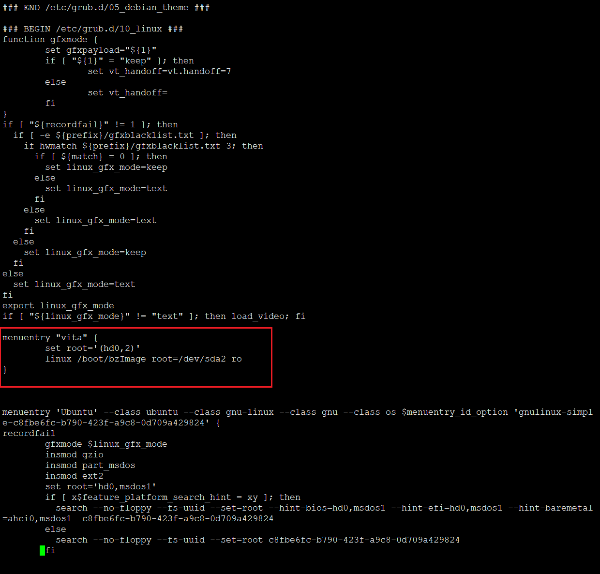

修改配置，重启之后就可以看到


然而


这种方式肯定不行滴。。书上骚操作老版本系统呢吧

正确做法


拷贝一份默认Ubuntu的启动项，修改一下，应为如果grub没有ext2驱动，boot分区都找不到，更别说引导

修改后重启，即可实现书上的效果。没有挂在rootfs


## 配置文件系统


让内核支持ext4文件系统


启用2T+大容量支持


## 配置内核支持ELF文件格式


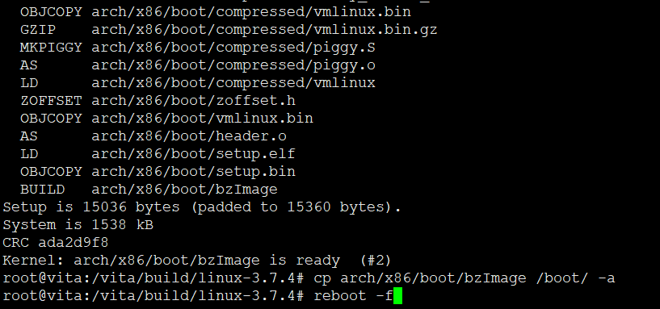

配置好后，重新编译内核，重新引导，还是老样子。因为没有解决根本原因。


为嘛我的还是显示不了？？因为漏了这个

 

现在显示是找到磁盘，但是没有root挂载点


---
