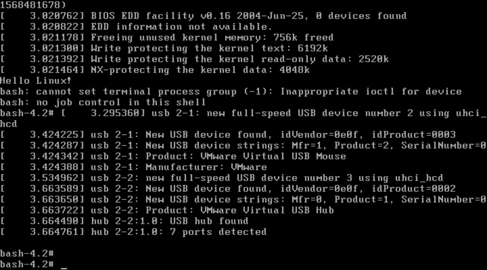

# 构建基本initramfs


* 现在init已经不再是shell脚本了，软链接到systemd，systemd是ELF格式
* 这节其实没啥，按规矩来，一步一步走。无非就是构建initramfs，固定的init入口，关键就是解决依赖，没了


```
mkdir initramfs

vi /vita/initramfs/initramfs

#!/bin/bash

echo "Hello Linux!"
exec /bin/bash

chmod a+x init

cd /vita/initramfs/

mkdir bin
cp ../sysroot/bin/bash bin/
ldd bin/bash

mkdir lib
cp -d /vita/sysroot/lib/libdl* lib/
cp /vita/sysroot/lib/libc-2.15.so lib/
cp -d /vita/sysroot/lib/libc.so.6 lib/
cp /vita/cross-tool/i686-none-linux-gnu/lib/libgcc_s.so.1 lib/
cp -d /vita/sysroot/lib/ld-* lib/

ldd lib/libdl.so.1
ldd lib/libc.so.6
ldd lib/ld-linux.so.2
ldd lib/libgcc_s.so.1

find . | cpio -o -H newc |gzip -9 > /vita/sysroot/boot/initrd.img
cp /vita/sysroot/boot/initrd.img /vita/boot

menuentry 'vita'{
  set root='hd0,msdos2'
  linux /boot/bzImage root=/dev/sda2 ro
  initrd /boot/initrd.img
}


```





---

PS:


这，我能咋办。。。
