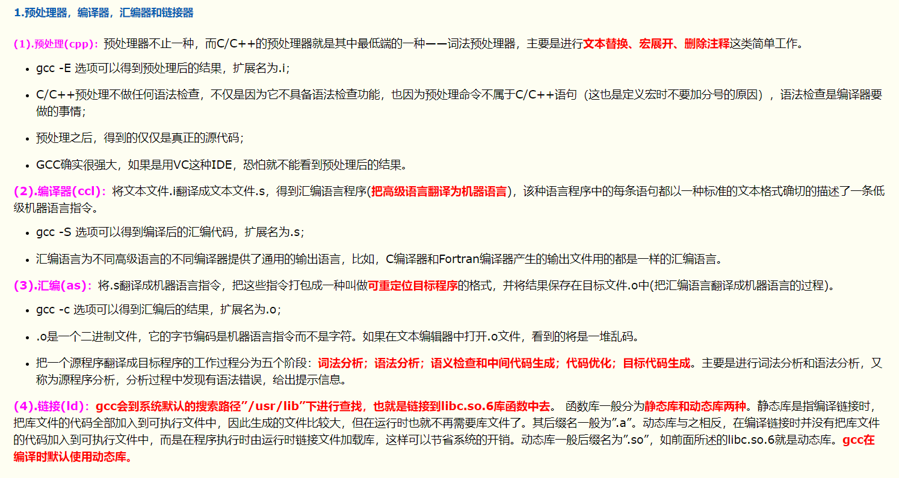
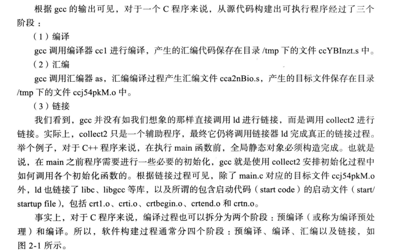
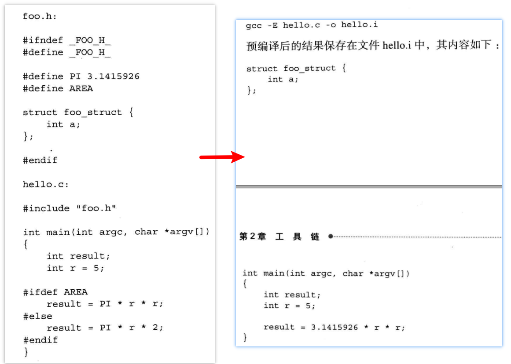
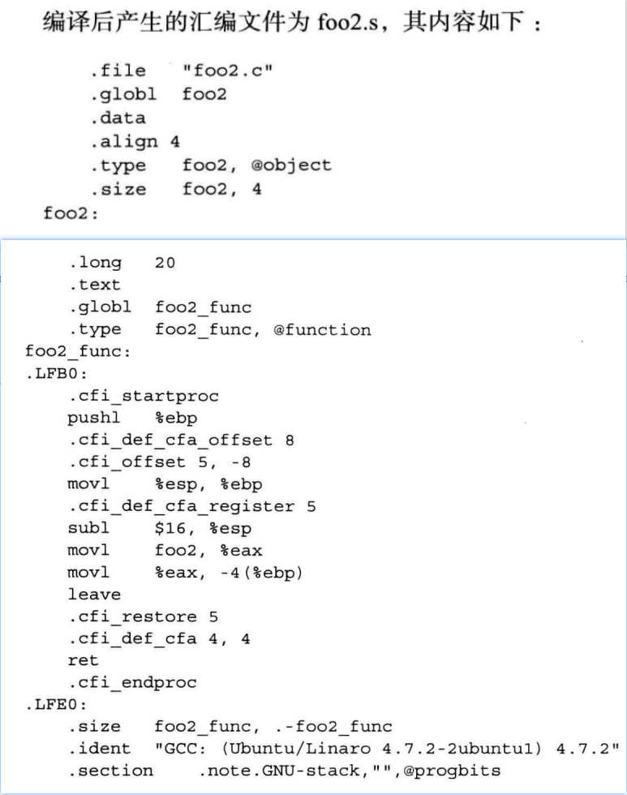
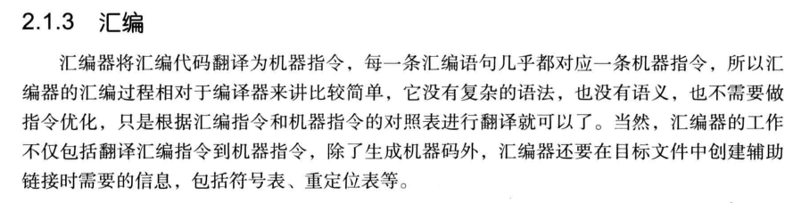
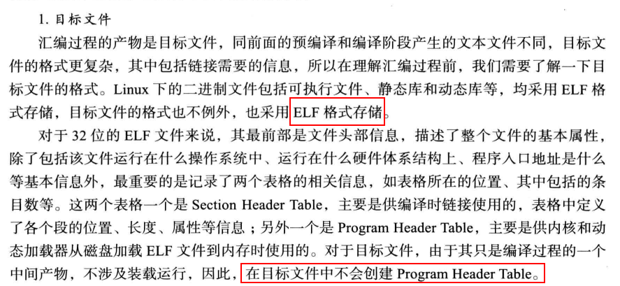
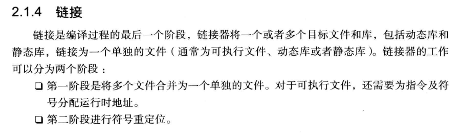
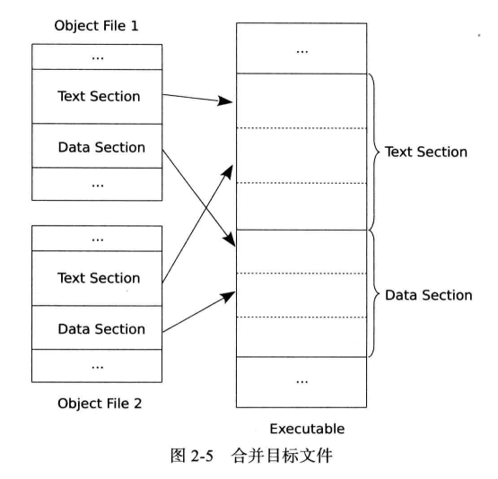

<!-- MDTOC maxdepth:6 firsth1:1 numbering:0 flatten:0 bullets:1 updateOnSave:1 -->

- [编译过程](#编译过程)   
   - [预编译](#预编译)   
   - [编译](#编译)   
   - [汇编](#汇编)   
   - [链接](#链接)   
   - [参考博客](#参考博客)   

<!-- /MDTOC -->
# 编译过程

* 编译其实最终不是gcc完成的，gcc迷惑了我很多年才知道。其实gcc只是一个驱动程序。在整个编译过程中gcc就像一个导演一样，编译过程的每一个环节由具体的组件负责，如**编译过程由cc1负责**，**汇编过程由as负责**，**链接过程由ld负责**。
* 通过**gcc -v**选择可以看到gcc调用其它设备的完整过程

```
root@lfs:/vita/tmp# gcc -v main.c
使用内建 specs。
COLLECT_GCC=gcc
COLLECT_LTO_WRAPPER=/usr/lib/gcc/i686-linux-gnu/4.7/lto-wrapper
目标：i686-linux-gnu
配置为：../src/configure -v --with-pkgversion='Ubuntu/Linaro 4.7.2-2ubuntu1' --with-bugurl=file:///usr/share/doc/gcc-4.7/README.Bugs --enable-languages=c,c++,go,fortran,objc,obj-c++ --prefix=/usr --program-suffix=-4.7 --enable-shared --enable-linker-build-id --with-system-zlib --libexecdir=/usr/lib --without-included-gettext --enable-threads=posix --with-gxx-include-dir=/usr/include/c++/4.7 --libdir=/usr/lib --enable-nls --with-sysroot=/ --enable-clocale=gnu --enable-libstdcxx-debug --enable-libstdcxx-time=yes --enable-gnu-unique-object --enable-plugin --enable-objc-gc --enable-targets=all --disable-werror --with-arch-32=i686 --with-tune=generic --enable-checking=release --build=i686-linux-gnu --host=i686-linux-gnu --target=i686-linux-gnu
线程模型：posix
gcc 版本 4.7.2 (Ubuntu/Linaro 4.7.2-2ubuntu1)
COLLECT_GCC_OPTIONS='-v' '-mtune=generic' '-march=i686'

 /usr/lib/gcc/i686-linux-gnu/4.7/cc1
 	-quiet
 	-v -imultiarch i386-linux-gnu main.c
 	-quiet -dumpbase main.c -mtune=generic -march=i686
 	-auxbase main -version -fstack-protector -o /tmp/ccZiUlyU.s

GNU C (Ubuntu/Linaro 4.7.2-2ubuntu1) 版本 4.7.2 (i686-linux-gnu)
	由 GNU C 版本 4.7.2 编译， GMP 版本 5.0.2，MPFR 版本 3.1.0-p3，MPC 版本 0.9
GGC 准则：--param ggc-min-expand=100 --param ggc-min-heapsize=131072
忽略不存在的目录“/usr/local/include/i386-linux-gnu”
忽略不存在的目录“/usr/lib/gcc/i686-linux-gnu/4.7/../../../../i686-linux-gnu/include”
#include "..." 搜索从这里开始：
#include <...> 搜索从这里开始：
 /usr/lib/gcc/i686-linux-gnu/4.7/include
 /usr/local/include
 /usr/lib/gcc/i686-linux-gnu/4.7/include-fixed
 /usr/include/i386-linux-gnu
 /usr/include
搜索列表结束。
GNU C (Ubuntu/Linaro 4.7.2-2ubuntu1) 版本 4.7.2 (i686-linux-gnu)
	由 GNU C 版本 4.7.2 编译， GMP 版本 5.0.2，MPFR 版本 3.1.0-p3，MPC 版本 0.9
GGC 准则：--param ggc-min-expand=100 --param ggc-min-heapsize=131072
Compiler executable checksum: a80a8d5d70f6ac2a366881f8103456bd
COLLECT_GCC_OPTIONS='-v' '-mtune=generic' '-march=i686'

 as -v --32 -o /tmp/ccJ1nRjg.o /tmp/ccZiUlyU.s

GNU汇编版本 2.22.90 (i686-linux-gnu) 使用BFD版本 (GNU Binutils for Ubuntu) 2.22.90.20120924
COMPILER_PATH=/usr/lib/gcc/i686-linux-gnu/4.7/:/usr/lib/gcc/i686-linux-gnu/4.7/:/usr/lib/gcc/i686-linux-gnu/:/usr/lib/gcc/i686-linux-gnu/4.7/:/usr/lib/gcc/i686-linux-gnu/
LIBRARY_PATH=/usr/lib/gcc/i686-linux-gnu/4.7/:/usr/lib/gcc/i686-linux-gnu/4.7/../../../i386-linux-gnu/:/usr/lib/gcc/i686-linux-gnu/4.7/../../../../lib/:/lib/i386-linux-gnu/:/lib/../lib/:/usr/lib/i386-linux-gnu/:/usr/lib/../lib/:/usr/lib/gcc/i686-linux-gnu/4.7/../../../:/lib/:/usr/lib/
COLLECT_GCC_OPTIONS='-v' '-mtune=generic' '-march=i686'

 /usr/lib/gcc/i686-linux-gnu/4.7/collect2
 	--sysroot=/   	--build-id
 	--no-add-needed 	 	--as-needed
 	--eh-frame-hdr 	 	-m elf_i386
 	--hash-style=gnu
 	-dynamic-linker /lib/ld-linux.so.2
 	-z relro /usr/lib/gcc/i686-linux-gnu/4.7/../../../i386-linux-gnu/crt1.o /usr/lib/gcc/i686-linux-gnu/4.7/../../../i386-linux-gnu/crti.o /usr/lib/gcc/i686-linux-gnu/4.7/crtbegin.o
 	-L/usr/lib/gcc/i686-linux-gnu/4.7
 	-L/usr/lib/gcc/i686-linux-gnu/4.7/../../../i386-linux-gnu
 	-L/usr/lib/gcc/i686-linux-gnu/4.7/../../../../lib
 	-L/lib/i386-linux-gnu
 	-L/lib/../lib
 	-L/usr/lib/i386-linux-gnu
 	-L/usr/lib/../lib
 	-L/usr/lib/gcc/i686-linux-gnu/4.7/../../.. /tmp/ccJ1nRjg.o
 	-lgcc --as-needed -lgcc_s --no-as-needed
 	-lc -lgcc --as-needed
 	-lgcc_s --no-as-needed /usr/lib/gcc/i686-linux-gnu/4.7/crtend.o /usr/lib/gcc/i686-linux-gnu/4.7/../../../i386-linux-gnu/crtn.o

```

* 根据gcc详细输出可以看到完整编译的几个过程
  * 编译
    * 调用cc1程序进行编译，输出**/tmp/ccZiUlyU.s**汇编文件
  * 汇编
    * 调用as程序进行汇编编译，输出**tmp/ccJ1nRjg.o**目标文件
  * 链接
    * 并没有直接调用ld程序，而是调用collect2 程序，但collect2 最终还是会调用ld。
    * **collect2** 程序仅仅起到辅助作用。gcc调用collect2 安排初始化过程中如何调用各个初始化函数。典型的C++程序，在执行main函数前，全局静态对象必须构造完成。也就是说在执行main函数之前需要进行一系列必要的初始化。
    * 链接除了**tmp/ccJ1nRjg.o**之外，还链接了很多库crtend.o、crtn.o、crt1.o 、crti.o、crtbegin.o
* 事实上编译过程也可以拆分成两个阶段
  * 预编译，也叫**编译预处理**
    * 也是使用cc1程序进行处理的
  * 编译
* 完整的讲软件构建过程分成四个阶段：预处理->编译->汇编->链接






## 预编译


```
root@lfs:/vita/tmp# gcc -E main.c -o main.i -v
使用内建 specs。
COLLECT_GCC=gcc
目标：i686-linux-gnu
配置为：../src/configure -v --with-pkgversion='Ubuntu/Linaro 4.7.2-2ubuntu1' --with-bugurl=file:///usr/share/doc/gcc-4.7/README.Bugs --enable-languages=c,c++,go,fortran,objc,obj-c++ --prefix=/usr --program-suffix=-4.7 --enable-shared --enable-linker-build-id --with-system-zlib --libexecdir=/usr/lib --without-included-gettext --enable-threads=posix --with-gxx-include-dir=/usr/include/c++/4.7 --libdir=/usr/lib --enable-nls --with-sysroot=/ --enable-clocale=gnu --enable-libstdcxx-debug --enable-libstdcxx-time=yes --enable-gnu-unique-object --enable-plugin --enable-objc-gc --enable-targets=all --disable-werror --with-arch-32=i686 --with-tune=generic --enable-checking=release --build=i686-linux-gnu --host=i686-linux-gnu --target=i686-linux-gnu
线程模型：posix

gcc 版本 4.7.2 (Ubuntu/Linaro 4.7.2-2ubuntu1)
COLLECT_GCC_OPTIONS='-E' '-o' 'main.i' '-v' '-mtune=generic' '-march=i686'

 /usr/lib/gcc/i686-linux-gnu/4.7/cc1
	-E -quiet -v -imultiarch i386-linux-gnu main.c
	-o main.i -mtune=generic -march=i686 -fstack-protector

忽略不存在的目录“/usr/local/include/i386-linux-gnu”
忽略不存在的目录“/usr/lib/gcc/i686-linux-gnu/4.7/../../../../i686-linux-gnu/include”
#include "..." 搜索从这里开始：
#include <...> 搜索从这里开始：
 /usr/lib/gcc/i686-linux-gnu/4.7/include
 /usr/local/include
 /usr/lib/gcc/i686-linux-gnu/4.7/include-fixed
 /usr/include/i386-linux-gnu
 /usr/include
搜索列表结束。
COMPILER_PATH=/usr/lib/gcc/i686-linux-gnu/4.7/:/usr/lib/gcc/i686-linux-gnu/4.7/:/usr/lib/gcc/i686-linux-gnu/:/usr/lib/gcc/i686-linux-gnu/4.7/:/usr/lib/gcc/i686-linux-gnu/
LIBRARY_PATH=/usr/lib/gcc/i686-linux-gnu/4.7/:/usr/lib/gcc/i686-linux-gnu/4.7/../../../i386-linux-gnu/:/usr/lib/gcc/i686-linux-gnu/4.7/../../../../lib/:/lib/i386-linux-gnu/:/lib/../lib/:/usr/lib/i386-linux-gnu/:/usr/lib/../lib/:/usr/lib/gcc/i686-linux-gnu/4.7/../../../:/lib/:/usr/lib/
COLLECT_GCC_OPTIONS='-E' '-o' 'main.i' '-v' '-mtune=generic' '-march=i686'
root@lfs:/vita/tmp#
```




## 编译




大部分是伪指令，也就是辅助代码执行的指令，辅助生成特定的汇编序列。最终起作用的汇编指令其实不多，但也比高级语言多了去了


函数调用过程，在汇编层面就必须包括入栈和出栈操作，来保持函数的堆栈平衡。以此隔离函数间作用范围。


## 汇编

* 书上这块讲的极度负责，因此我极度不建议你认真看，没有基础的容易奔溃，就好比练连城诀一般
* 暂且知道概念就行
* 不过，你是否能成为大师，就在于这块能否掌握。当我没说






## 链接

* 书上这块讲的极度负责，因此我极度不建议你认真看，没有基础的容易奔溃，就好比练连城诀一般
* 暂且知道概念就行
* 不过，你是否能成为大师，就在于这块能否掌握。当我没说







* 静态链接无非是把静态库也高进程序内部，动态链接就是搞个链接，要用到的时候随着随着链接去找对应的库，然而不是所有时候都能找到。。
* 静态链接依赖小很多，动态链接依赖问题比较麻烦

## 参考博客

<https://www.cnblogs.com/maomaohhmm/archive/2012/10/28/2743903.html>
