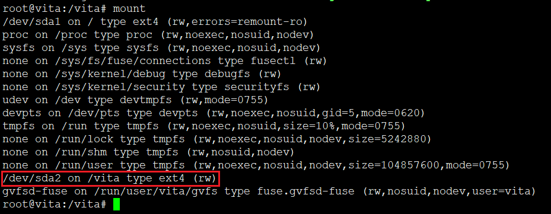
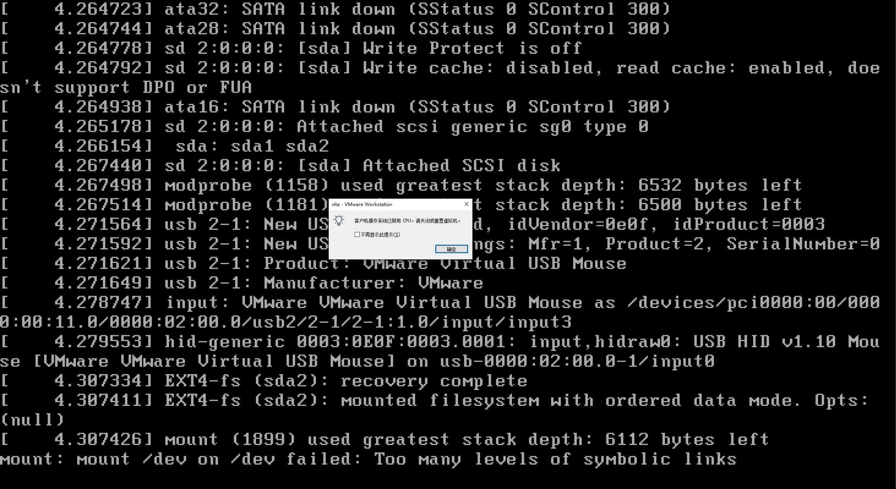
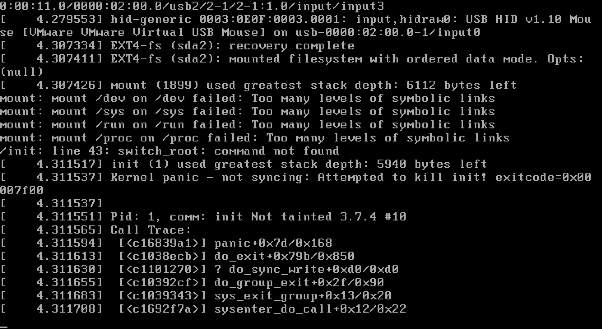
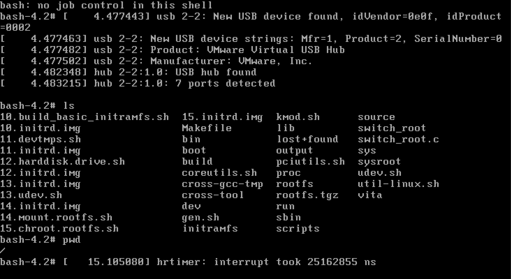

# 14. 切换到根文件系统

## 打字员switch_root.c

Makefile

```
switch_root : switch_root.c

clean:
	rm -rf *.o
	rm -rf switch_root
```

```
#include<errno.h>
#include<dirent.h>
#include<sys/stat.h>
#include<stdio.h>
#include<stdlib.h>
#include<sys/mount.h>
#include<fcntl.h>
#include<unistd.h>

int delet_dir(char *directory);

void delete(char *what)
{
	if(unlink(what)){
		if (errno ==EISDIR){
			if (!delete_dir(what))rmdir(what);		
		}
	}
}

int delete_dir(char *directory)
{
	DIR *dir;
	struct dirent *d;
	struct stat st1,st2;
	char path[PATH_MAX];
	if(lstat(directory,&st1))return errno;
	if(!(dir = opendir(directory)))return errno;
	while((d = readdir(dir))){
		if(d->d_name[0] == '.' && (d->d_name[1] == '\0' || (d->d_name[1] == '.' && d->d_name[2] == '\0') ))continue;
		sprintf(path,"%s/%s",directory,d->d_name);
		if(st2.st_dev != st1.st_dev)continue;

		delete(path);
	}
	closedir(dir);
	return 0;
}

int main(int argc,char*argv[])
{
	int console_fd;
	chdir(argv[1]);
	delete_dir("/");
	mount(".","/",NULL,MS_MOVE,NULL);

	chroot(".");
	chdir("/");

	console_fd = open("/dev/console",O_RDWR);
	dup2(console_fd,0);
	dup2(console_fd,1);
	dup2(console_fd,2);
	close(console_fd);

	execlp(argv[2],argv[2],NULL);
	return 0;

}

```

编译生成switch_root二进制应用



我使用sda盘第二个分区作为根分区，拷贝switch_root到initramfs中，在根分区创建必要的目录

```
[ ! -e /vita/sbin ] && mkdir /vita/sbin

cat > /vita/sbin/init << EOF
#!/bin/bash
echo "Now you are in sda2 rootfs"
exec /bin/bash
EOF

chmod a+x /vita/sbin/init


[ ! -e /vita/sys ] && mkdir /vita/sys
[ ! -e /vita/proc ] && mkdir /vita/proc
[ ! -e /vita/dev ] && mkdir /vita/dev
[ ! -e /vita/run ] && mkdir /vita/run

[ ! -e /vita/switch_root.c ] && make
[ -e /vita/switch_root ] && cp /vita/switch_root /vita/initramfs/bin/

cp /vita/sysroot/usr/bin/cat /vita/bin/
cp /vita/sysroot/usr/bin/ls /vita/bin/

```

##  配置启动项

```
menuentry 'vita-15'  {
        set root='(hd0,2)'
        linux   /boot/15.bzImage root=/dev/sda2 rw
	initrd /boot/15.initrd.img
}
```

## 重启进入系统





一开始报错，因为脚本中EOF写入文件，对$字符必须要转移，不转移变量无法被替换。就变成根分区自己挂载自己就报错了。

