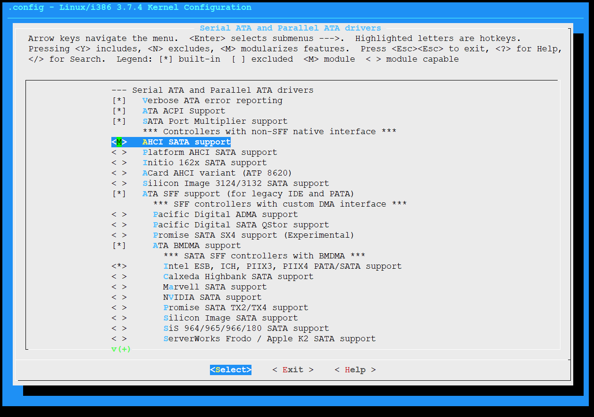
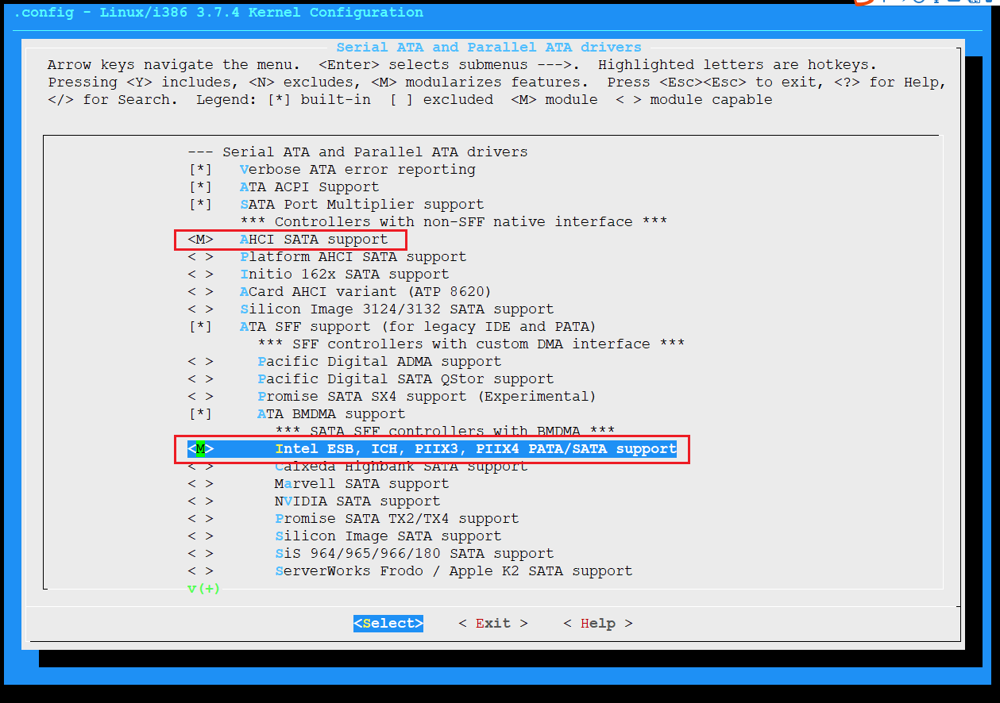
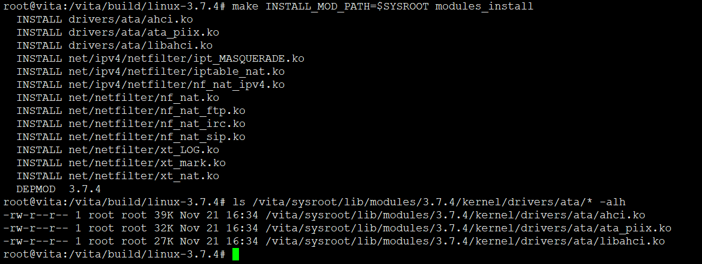
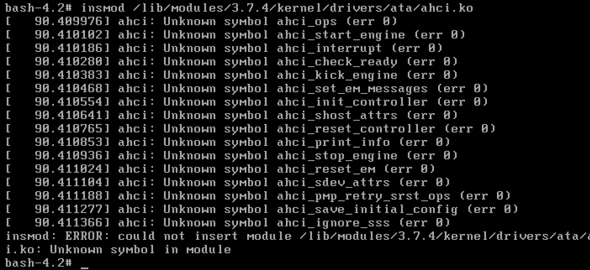
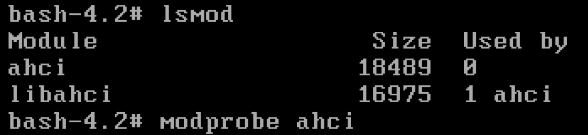
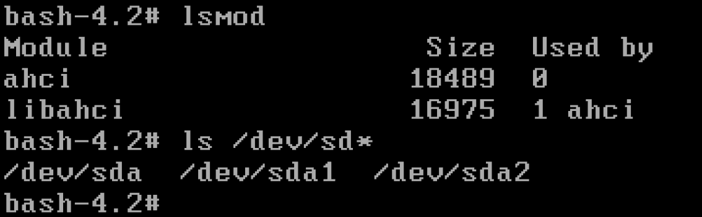

# 11. 将硬盘控制器配置为模块

## 配置内核参数






```shell
make bzImage && make modules
make INSTALL_MOD_PATH=$SYSROOT modules_install
ls /vita/sysroot/lib/modules/3.7.4/kernel/
```



拷贝内核模块到initramfs中

```
mkdir -p /vita/initramfs/lib/modules/3.7.4
cp  -drf  /vita/sysroot/lib/modules/3.7.4 /vita/initramfs/lib/modules/
```

## 安装模块管理工具




为了能够使用modprobe命令，需要挂载sys、proc





