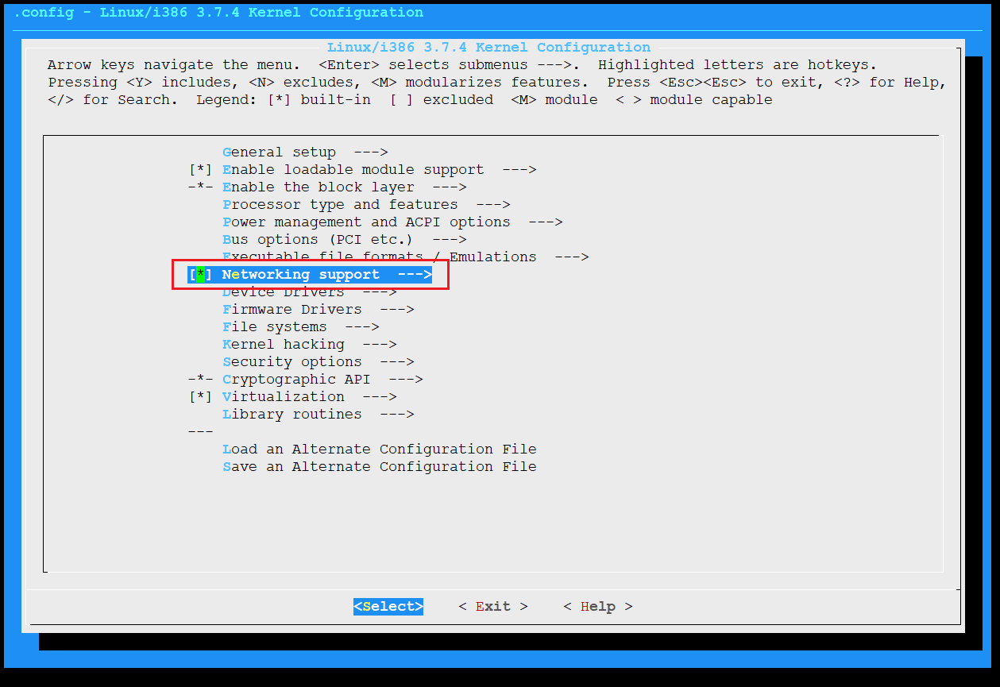
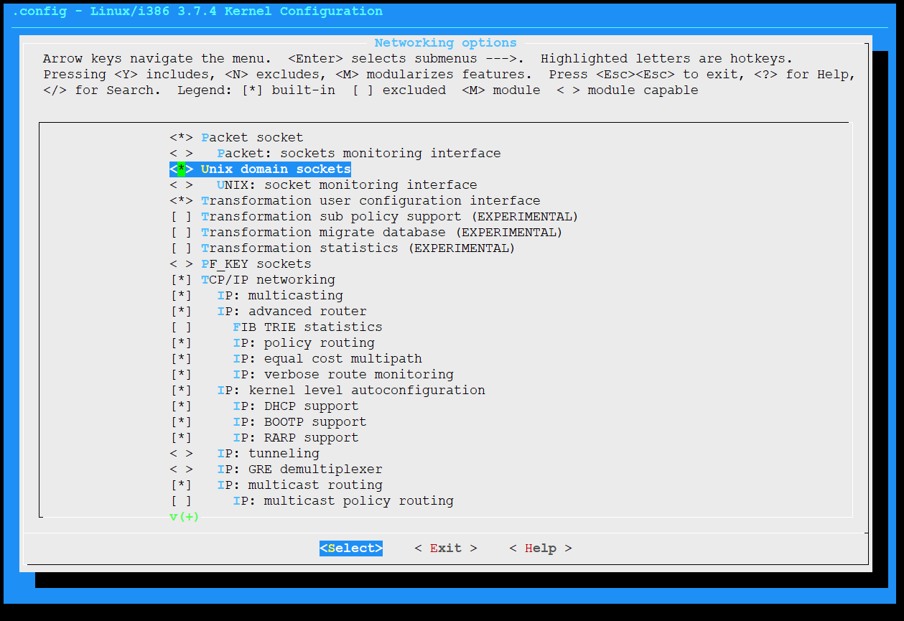
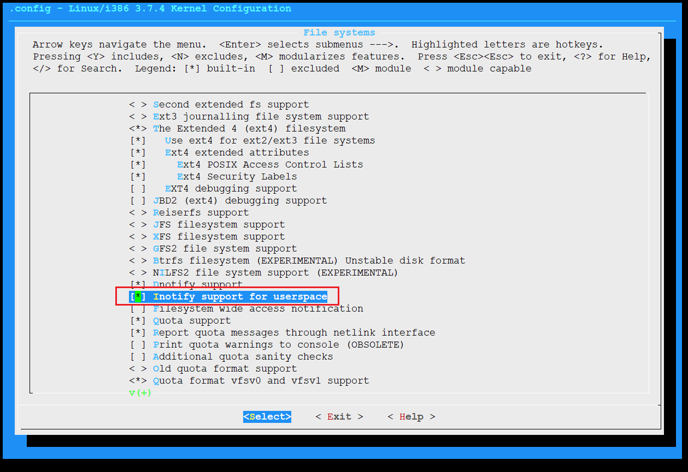
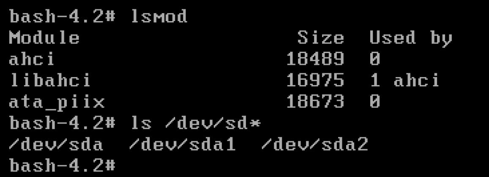

# 13. 自动加载硬盘控制器驱动

## 配置内核








```
make bzImage && make modules
make INSTALL_MOD_PATH=$SYSROOT modules_install
ls /vita/sysroot/lib/modules/3.7.4/kernel/
mkdir -p /vita/initramfs/lib/modules/3.7.4
cp  -drf  /vita/sysroot/lib/modules/3.7.4 /vita/initramfs/lib/modules/
```

##  安装udev


```shell
#!/bin/bash

set -xe

cd build
tar -xvf ../source/udev-173.tar.bz2
cd udev-173
./configure --prefix=/usr \
	--sysconfdir=/etc \
	--sbindir=/sbin \
	--libexecdir=/lib/udev \
	--disable-hwdb \
	--disable-introspection \
	--disable-keymap \
	--disable-gudev

make && make install

echo "ok"
exit 0

```

安装完成拷贝到initramfs中

```
ldd /vita/sysroot/sbin/udevd
ldd /vita/sysroot/sbin/udevadm

mkdir /vita/initramfs/bin -p
cp /vita/sysroot/sbin/udevd /vita/initramfs/bin/
cp /vita/sysroot/sbin/udevadm /vita/initramfs/bin/
mkdir -p /vita/initramfs/lib/udev/rules.d
cp /vita/sysroot/lib/udev/rules.d/80-drivers.rules /vita/initramfs/lib/udev/rules.d/
ls -alh /vita/initramfs/lib/udev/rules.d/
```


## 安装pciutils

```shell
#!/bin/bash

set -xe

cd build
tar -xvf ../source/pciutils-3.1.10.tar.xz
cd pciutils-3.1.10
make PREFIX=/usr \
	ZLIB=no \
	SHARED=yes \
	PCI_COMPRESSED_IDS=0 \
	all

make PREFIX=/usr \
	ZLIB=no \
	SHARED=yes \
	PCI_COMPRESSED_IDS=0 \
	install

echo "ok"
exit 0

```

安装完成拷贝到initramfs中

```
ldd /vita/sysroot/usr/sbin/lspci
ldd /vita/sysroot/usr/lib/libpci.so.3
ldd /vita/sysroot/lib/libresolv.so.2

cp /vita/sysroot/usr/sbin/lspci /vita/initramfs/bin/
cp -d /vita/sysroot/usr/lib/libpci* /vita/initramfs/lib/
cp -d /vita/sysroot/lib/libresolv* /vita/initramfs/lib/


```

## 拷贝cat命令pci.ids硬件厂家信息（pci数据库）

```
mkdir -p /vita/initramfs/usr/share
cp /vita/sysroot/usr/share/pci.ids /vita/initramfs/usr/share

ldd /vita/sysroot/usr/bin/cat
cp /vita/sysroot/usr/bin/cat /vita/initramfs/bin/
```

## 配置启动脚本


```
#!/bin/bash
echo "Hello Linux!"
echo "Hello Linux!"
echo "Hello Linux!"
echo "Hello Linux!"

export PATH=/usr/sbin:/usr/bin:/sbin:/bin
mount -n -t proc proc /proc
mount -n -t sysfs sysfs /sys
mount -n -t devtmpfs udev /dev

mount -n -t ramfs ramfs /run
udevd --daemon
udevadm trigger --action=add
udevadm settle


# must before exec
exec /bin/bash
```

## 重启进入系统

能够正常加载硬件驱动，硬盘控制器正常加载

