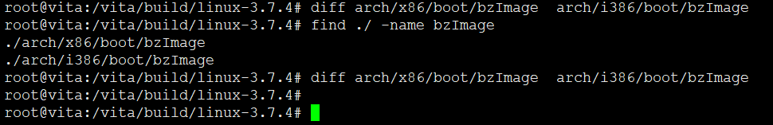
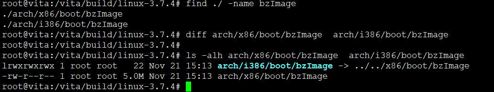
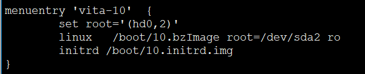
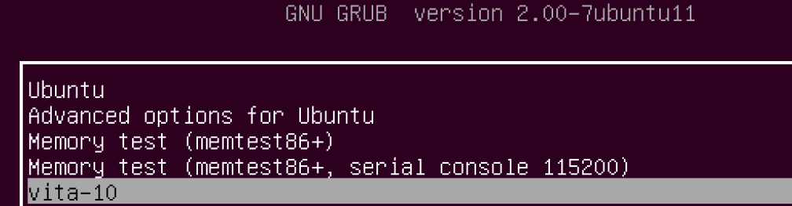
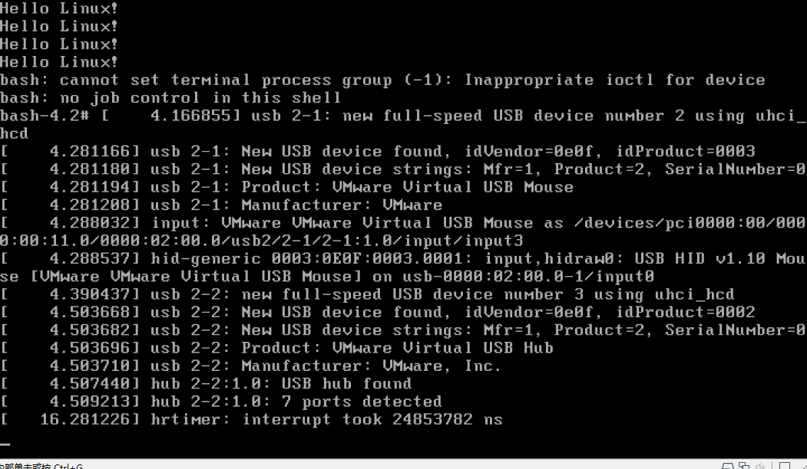
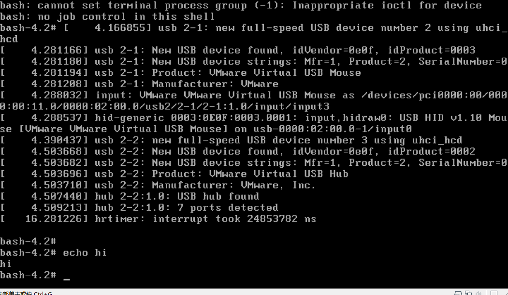
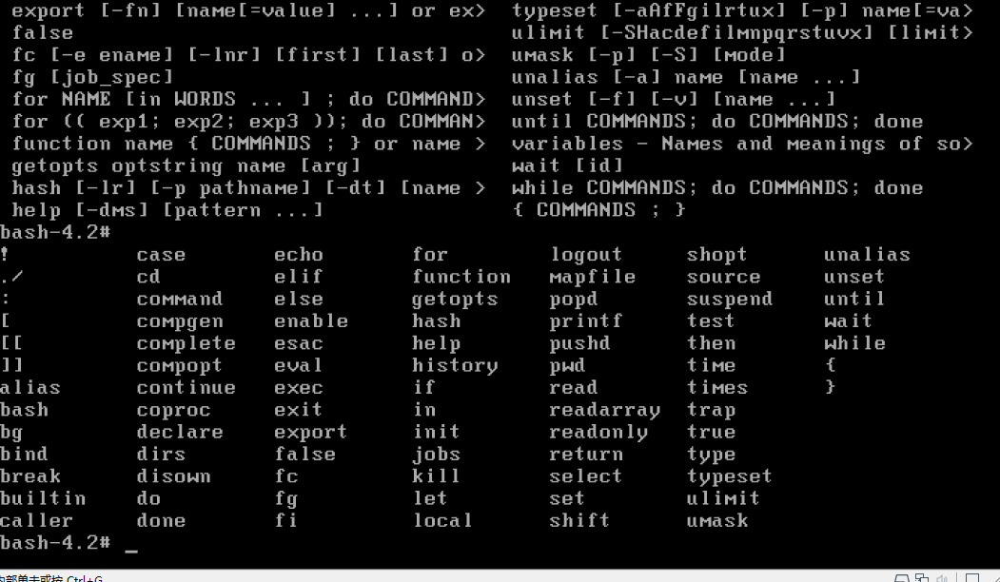
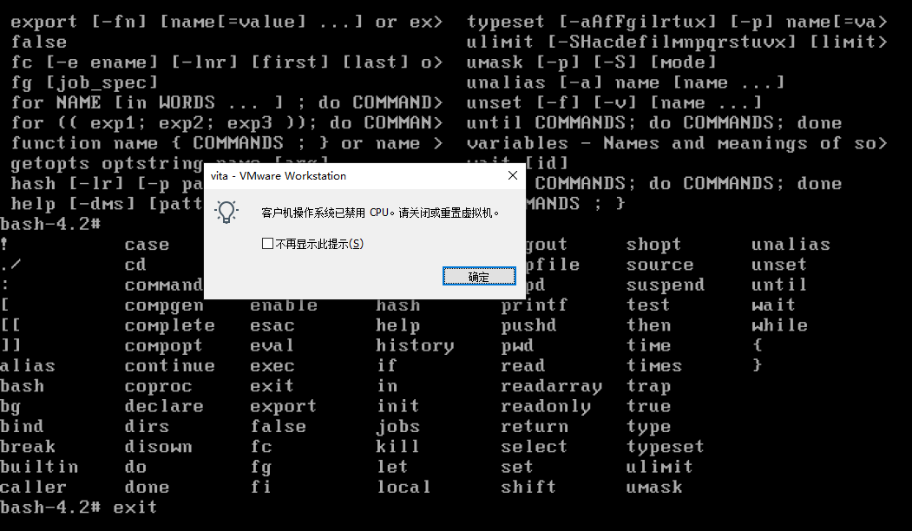
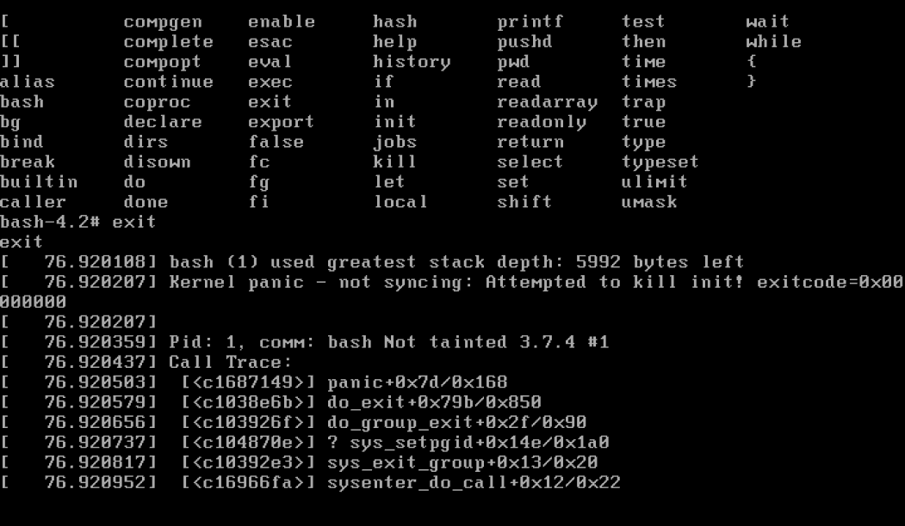

# 10. 配置内核支持并构建基本的initramfs

## 配置内核支持


* 这里仅仅开启内核支持，但是没有把initramfs集成到内核中

```
make bzImage -j8
```




拷贝内核到启动分区

```
cp arch/x86/boot/bzImage /boot/
```



## 构建基本initramfs

```shell
#!/bin/bash

set -xe

[ -e initramfs ] && rm -rf initramfs
mkdir initramfs && cd initramfs

cat > init << EOF
#!/bin/bash
echo "Hello Linux!"
echo "Hello Linux!"
echo "Hello Linux!"
echo "Hello Linux!"
exec /bin/bash
EOF

chmod a+x init

mkdir bin
cp ../sysroot/bin/bash bin/
ldd bin/bash

mkdir lib
cp -d /vita/sysroot/lib/libdl* lib/
cp /vita/sysroot/lib/libc-2.15.so lib/
cp -d /vita/sysroot/lib/libc.so.6 lib/
cp /vita/cross-tool/i686-none-linux-gnu/lib/libgcc_s.so.1 lib/
cp -d /vita/sysroot/lib/ld-* lib/

chown -R root:root .

ldd lib/libdl.so.1
ldd lib/libc.so.6
ldd lib/ld-linux.so.2
ldd lib/libgcc_s.so.1

tree lib

find . | cpio -o -H newc |gzip -9 > /vita/10.initrd.img
cp /vita/10.initrd.img /vita/boot

```


## 修改grub



## 重启系统进入测试








成功进入bash，但是只能执行bash内置命令



如果退出bash会怎样？






---
