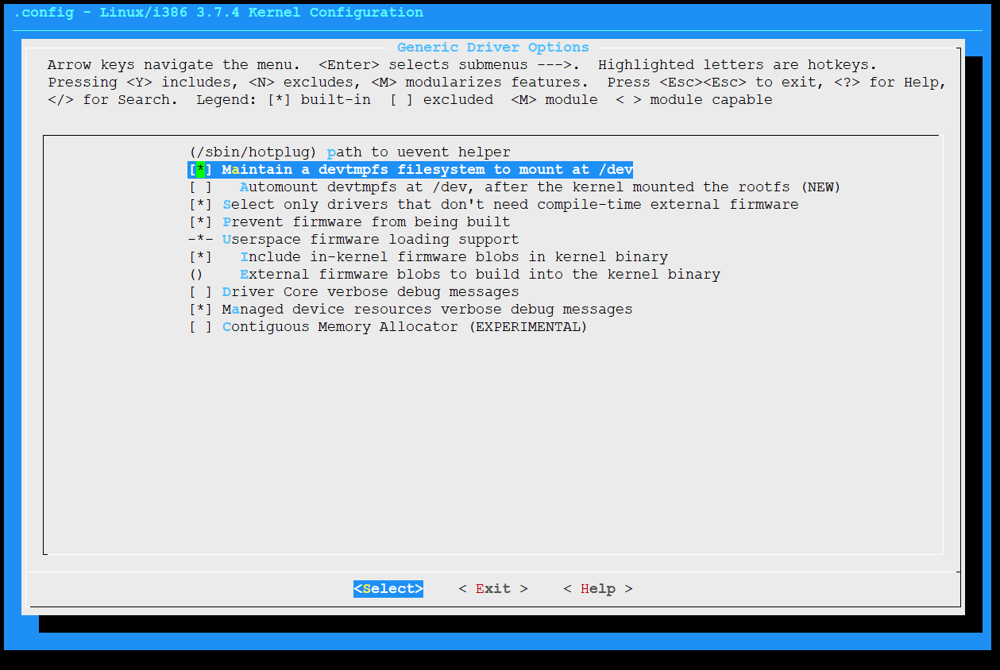
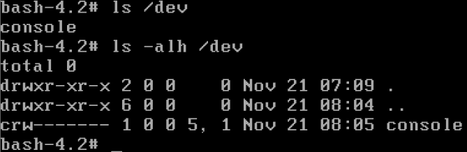
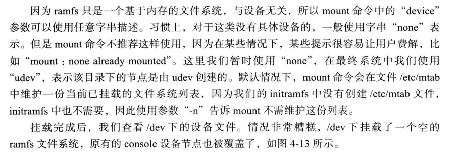
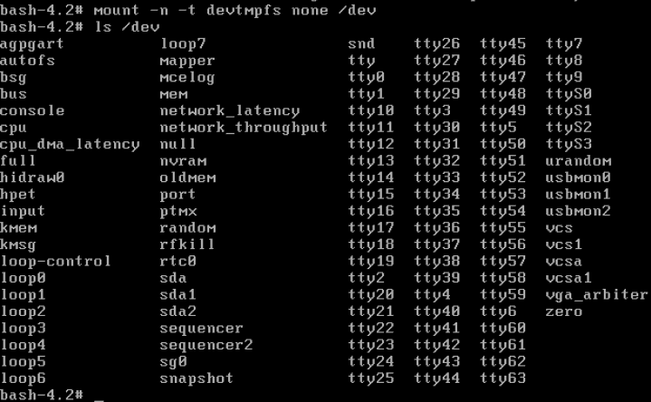
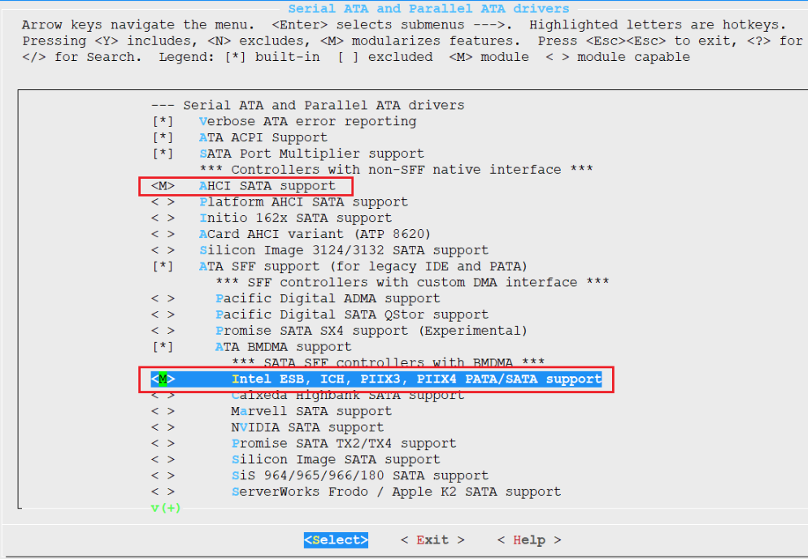
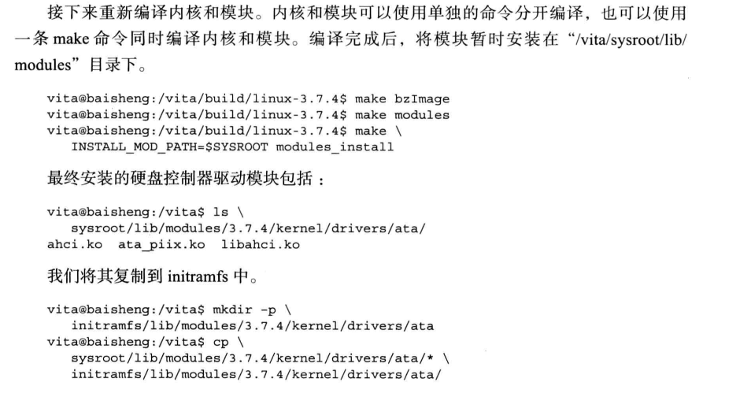
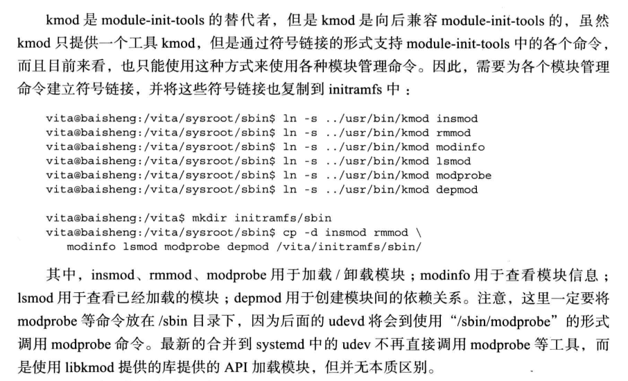
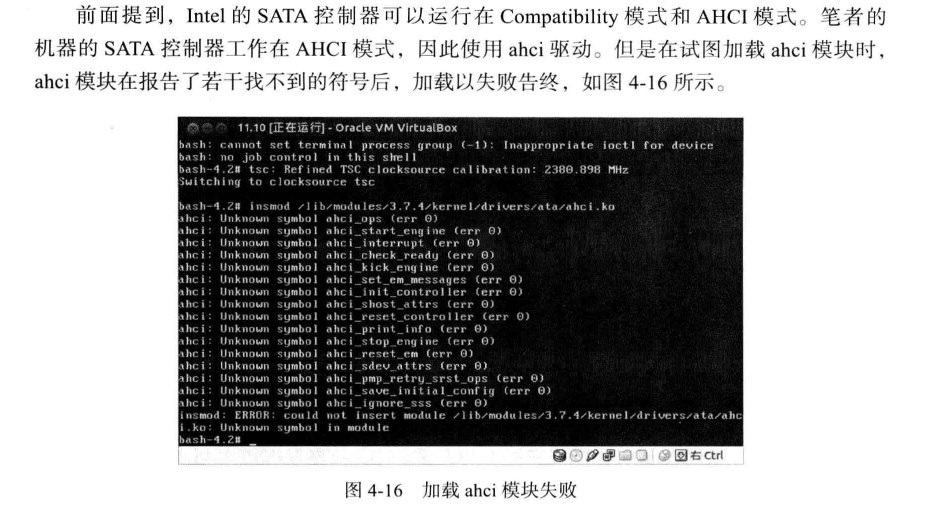
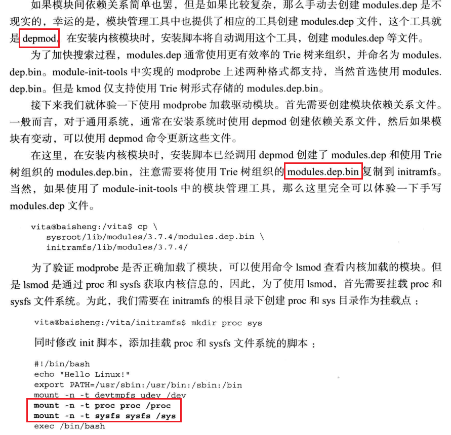

# 将硬盘驱动编译为模块

**initramfs的重要作用之一就是允许内核将保存根文件系统的存储设备驱动不再编译进内核，当然其他驱动也可以如此**


## 配置devtmpfs


* 内核引导的时候，devtmpfs将所有注册的设备在devtmpfs中建立相应的设备文件，但是此时devtmpfs不一定挂载，这个挂载需要启动过程中触发
* 且在udev之前已经存在于内存中，我们只需要内核启动过程中挂载devtmpfs即可
* devtmpfs其实就是tmpfs


## 编译coreutils

ls命令不是bash内置命令，需要编译coreutils

```
#!/bin/bash

set -xe
cd build

tar -xvf ../source/coreutils-8.20.tar.xz
cd coreutils-8.20/
#./configure --prefix=/usr
./configure --prefix=/usr FORCE_UNSAFE_CONFIGURE=1

ldd /vita/sysroot/usr/bin/ls
ldd /vita/sysroot/lib/librt.so.1
ldd /vita/sysroot/lib/libpthread.so.0

cp /vita/sysroot/usr/bin/ls /vita/initramfs/bin/
cp -d /vita/sysroot/lib/librt* /vita/initramfs/lib/
cp -d /vita/sysroot/lib/libpthread* /vita/initramfs/lib
```

## 编译util-linux

moutn命令由util-linux包提供

```
#!/bin/bash

set -xe

cd build

tar -xvf ../source/util-linux-2.22.tar.xz
cd util-linux-2.22
./configure --prefix=/usr \
	--disable-use-tty-group \
	--disable-login \
	--disable-sulogin \
	--disable-su \
	--without-ncurses

make && make install

#find  /sysroot/ -name "*.la" -exec rm -f '{}' \;

ldd /vita/sysroot/bin/mount
ldd /vita/sysroot/lib/libmount.so.1
ldd /vita/sysroot/lib/libblkid.so.1
ldd /vita/sysroot/lib/libuuid.so.1


cp /vita/sysroot/bin/mount /vita/initramfs/bin/
cp -d /vita/sysroot/lib/libmount.so.1 /vita/initramfs/lib/
cp -d /vita/sysroot/lib/libblkid.so.1 /vita/initramfs/lib/
cp -d /vita/sysroot/lib/libuuid.so.1 /vita/initramfs/lib/
```

## 配置内核支持devtmps








挂载devtmpfs

```shell
mount -n -t devtmpfs none /dev
```




## 将硬盘控制器驱动配置为模块



将SATA磁盘驱动配置为模块，编译生成mod内核模块



此时，内核无法识别硬盘，无法切换rootfs，但是仍然可以访问initrd，initrd其实也可以当成完整的rootfs，这个rootfs只存在于内存中，有一个专业名词叫Live OS。现有的U盘系统，也是Live OS。

### kmod内核模块管理工具

常用的insmod、rmmod是kmod管理工具的一部分





* 模块之间是有依赖关系的
* kmod的关键就是内核模块管理



## 完整代码


```shell
#!/bin/bash

set -xe

[ -e initramfs ] && rm -rf initramfs
mkdir initramfs && cd initramfs

mkdir proc sys sbin mnt root || echo 'create dir ok'
cat > init << EOF
#!/bin/bash
echo "Hello Linux!"
echo "Hello Linux!"
echo "Hello Linux!"
echo "Hello Linux!"

export PATH=/usr/sbin:/usr/bin:/sbin:/bin
mount -n -t proc proc /proc
mount -n -t sysfs sysfs /sys
mount -n -t devtmpfs udev /dev
# must before exec


exec /bin/bash
EOF

chmod a+x init

mkdir bin
cp ../sysroot/bin/bash bin/
ldd bin/bash

mkdir lib
cp -d /vita/sysroot/lib/libdl* lib/
cp /vita/sysroot/lib/libc-2.15.so lib/
cp -d /vita/sysroot/lib/libc.so.6 lib/
cp /vita/cross-tool/i686-none-linux-gnu/lib/libgcc_s.so.1 lib/
cp -d /vita/sysroot/lib/ld-* lib/

ldd lib/libdl.so.1
ldd lib/libc.so.6
ldd lib/ld-linux.so.2
ldd lib/libgcc_s.so.1


ldd /vita/sysroot/bin/mount
ldd /vita/sysroot/lib/libmount.so.1
ldd /vita/sysroot/lib/libblkid.so.1
ldd /vita/sysroot/lib/libuuid.so.1


cp /vita/sysroot/bin/mount /vita/initramfs/bin/
cp -d /vita/sysroot/lib/libmount.so.* /vita/initramfs/lib/
cp -d /vita/sysroot/lib/libblkid.so.* /vita/initramfs/lib/
cp -d /vita/sysroot/lib/libuuid.so.* /vita/initramfs/lib/

ldd /vita/sysroot/usr/bin/ls
ldd /vita/sysroot/lib/librt.so.1
ldd /vita/sysroot/lib/libpthread.so.0

cp /vita/sysroot/usr/bin/ls /vita/initramfs/bin/
cp -d /vita/sysroot/lib/librt* /vita/initramfs/lib/
cp -d /vita/sysroot/lib/libpthread* /vita/initramfs/lib


mkdir -p /vita/initramfs/lib/modules/3.7.4/kernel/drivers/ata/
cp -drf /vita/sysroot/lib/modules/3.7.4 /vita/initramfs/lib/modules/
ls -alh /vita/initramfs/lib/modules/3.7.4/kernel/drivers/ata/

ldd /vita/sysroot/usr/bin/kmod
ldd /vita/sysroot/usr/lib/libkmod.so.2

mkdir /vita/initramfs/usr/bin -p
cp /vita/sysroot/usr/bin/kmod /vita/initramfs/usr/bin/
cp -d /vita/sysroot/usr/lib/libkmod* /vita/initramfs/lib/

mkdir /vita/sysroot/sbin -p
cd /vita/sysroot/sbin
ln -fs ../usr/bin/kmod insmod
ln -fs ../usr/bin/kmod rmmod
ln -fs ../usr/bin/kmod modinfo
ln -fs ../usr/bin/kmod lsmod
ln -fs ../usr/bin/kmod modprobe
ln -fs ../usr/bin/kmod depmod

mkdir -p /vita/initramfs/sbin
cp -d insmod rmmod modinfo lsmod modprobe depmod /vita/initramfs/sbin/

ls -alh /vita/initramfs/sbin/

cd /vita/initramfs
find . | cpio -o -H newc |gzip -9 > /vita/12.initrd.img
cp /vita/12.initrd.img /vita/boot/12.initrd.img

cp /vita/build/linux-3.7.4/arch/x86/boot/bzImage /vita/boot/12.bzImage
```
