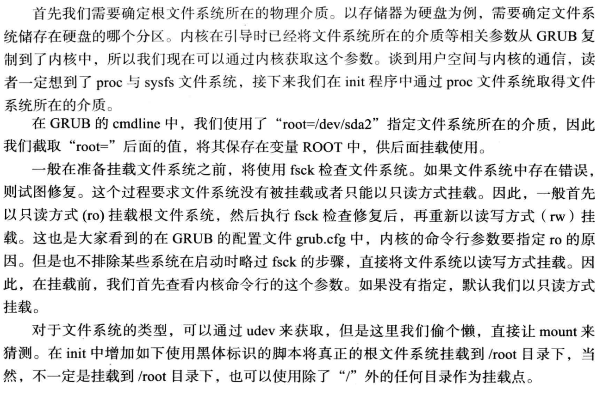
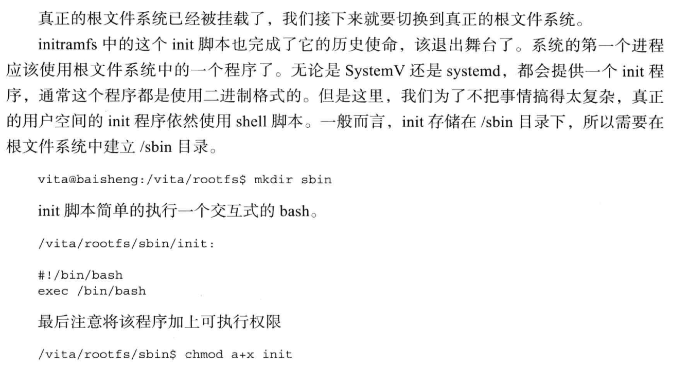
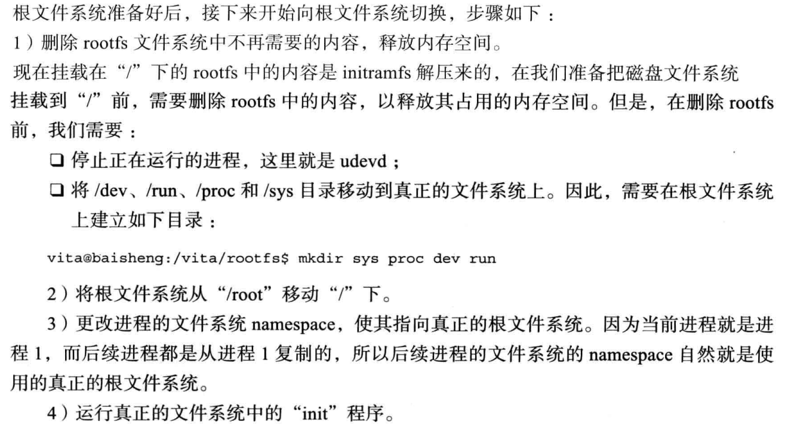
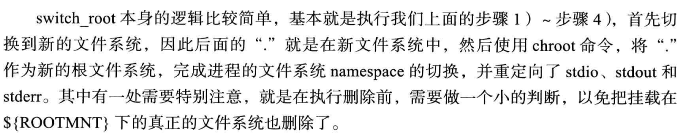

# 挂载并切换到根文件系统

## 挂在根文件系统



* 注意，ro参数作用的是root目标根文件系统，而不是initramfs
* ro限制只读挂载先，然后fsck检查文件系统，如果正常才重新以rw挂载
* 极少情况能遇见ro、rw的实质区别，不过如果启动见到磁盘要fsck的，那就是了


## 切换到根文件系统








* 这里的关键就是switch_root，为什么不用initramfs时候的rootfs呢？
  * 把initramfs清空，节约内存空间

## 完整代码

```
#!/bin/bash

set -xe

[ -e initramfs ] && rm -rf initramfs 
mkdir initramfs && cd initramfs

mkdir run proc sys sbin mnt root || echo 'create dir ok'
cat > init << EOF
#!/bin/bash
echo "Hello Linux!"
echo "Hello Linux!"
echo "Hello Linux!"
echo "Hello Linux!"

export PATH=/usr/sbin:/usr/bin:/sbin:/bin
export ROOTMNT=/root
export ROFLAG=-r
mount -n -t proc proc /proc
mount -n -t sysfs sysfs /sys
mount -n -t devtmpfs udev /dev

mount -n -t ramfs ramfs /run
udevd --daemon
udevadm trigger --action=add
udevadm settle

for x in \$(cat /proc/cmdline); do
	case \$x in
	root=*)
		ROOT=\${x#root=}
		;;
	ro)
		ROFLAG=-r
		;;
	rw)
		ROFLAG=-w
		;;
	esac
done
mount \${ROFLAG} \${ROOT} \${ROOTMNT}

# must before exec
#exec /bin/bash

udevadm control --exit
mount -n --move /dev \${ROOTMNT}/dev
mount -n --move /sys \${ROOTMNT}/sys
mount -n --move /run \${ROOTMNT}/run
mount -n --move /proc \${ROOTMNT}/proc

switch_root \${ROOTMNT} /sbin/init
EOF

chmod a+x init

mkdir bin
cp ../sysroot/bin/bash bin/
ldd bin/bash

mkdir lib
cp -d /vita/sysroot/lib/libdl* lib/
cp /vita/sysroot/lib/libc-2.15.so lib/
cp -d /vita/sysroot/lib/libc.so.6 lib/
cp /vita/cross-tool/i686-none-linux-gnu/lib/libgcc_s.so.1 lib/
cp -d /vita/sysroot/lib/ld-* lib/

ldd lib/libdl.so.1
ldd lib/libc.so.6
ldd lib/ld-linux.so.2
ldd lib/libgcc_s.so.1


ldd /vita/sysroot/bin/mount
ldd /vita/sysroot/lib/libmount.so.1
ldd /vita/sysroot/lib/libblkid.so.1
ldd /vita/sysroot/lib/libuuid.so.1


cp /vita/sysroot/bin/mount /vita/initramfs/bin/
cp -d /vita/sysroot/lib/libmount.so.* /vita/initramfs/lib/
cp -d /vita/sysroot/lib/libblkid.so.* /vita/initramfs/lib/
cp -d /vita/sysroot/lib/libuuid.so.* /vita/initramfs/lib/

ldd /vita/sysroot/usr/bin/ls
ldd /vita/sysroot/lib/librt.so.1
ldd /vita/sysroot/lib/libpthread.so.0

cp /vita/sysroot/usr/bin/ls /vita/initramfs/bin/
cp -d /vita/sysroot/lib/librt* /vita/initramfs/lib/
cp -d /vita/sysroot/lib/libpthread* /vita/initramfs/lib


mkdir -p /vita/initramfs/lib/modules/3.7.4/kernel/drivers/ata/
cp -drf /vita/sysroot/lib/modules/3.7.4 /vita/initramfs/lib/modules/
ls -alh /vita/initramfs/lib/modules/3.7.4/kernel/drivers/ata/

ldd /vita/sysroot/usr/bin/kmod
ldd /vita/sysroot/usr/lib/libkmod.so.2

mkdir /vita/initramfs/usr/bin -p
cp /vita/sysroot/usr/bin/kmod /vita/initramfs/usr/bin/
cp -d /vita/sysroot/usr/lib/libkmod* /vita/initramfs/lib/

mkdir /vita/sysroot/sbin -p
cd /vita/sysroot/sbin
ln -fs ../usr/bin/kmod insmod
ln -fs ../usr/bin/kmod rmmod
ln -fs ../usr/bin/kmod modinfo
ln -fs ../usr/bin/kmod lsmod
ln -fs ../usr/bin/kmod modprobe
ln -fs ../usr/bin/kmod depmod

mkdir -p /vita/initramfs/sbin
cp -d insmod rmmod modinfo lsmod modprobe depmod /vita/initramfs/sbin/

ls -alh /vita/initramfs/sbin/


# 13
ldd /vita/sysroot/sbin/udevd
ldd /vita/sysroot/sbin/udevadm

mkdir /vita/initramfs/bin -p
cp /vita/sysroot/sbin/udevd /vita/initramfs/bin/
cp /vita/sysroot/sbin/udevadm /vita/initramfs/bin/
mkdir -p /vita/initramfs/lib/udev/rules.d
cp /vita/sysroot/lib/udev/rules.d/80-drivers.rules /vita/initramfs/lib/udev/rules.d/
ls -alh /vita/initramfs/lib/udev/rules.d/

ldd /vita/sysroot/usr/sbin/lspci
ldd /vita/sysroot/usr/lib/libpci.so.3
ldd /vita/sysroot/lib/libresolv.so.2

cp /vita/sysroot/usr/sbin/lspci /vita/initramfs/bin/
cp -d /vita/sysroot/usr/lib/libpci* /vita/initramfs/lib/
cp -d /vita/sysroot/lib/libresolv* /vita/initramfs/lib/

mkdir -p /vita/initramfs/usr/share
cp /vita/sysroot/usr/share/pci.ids /vita/initramfs/usr/share

ldd /vita/sysroot/usr/bin/cat
cp /vita/sysroot/usr/bin/cat /vita/initramfs/bin/

# 15
[ ! -e /vita/sbin ] && mkdir /vita/sbin

cat > /vita/sbin/init << EOF
#!/bin/bash
echo "Now you are in sda2 rootfs"
exec /bin/bash
EOF

chmod a+x /vita/sbin/init


[ ! -e /vita/sys ] && mkdir /vita/sys
[ ! -e /vita/proc ] && mkdir /vita/proc
[ ! -e /vita/dev ] && mkdir /vita/dev
[ ! -e /vita/run ] && mkdir /vita/run

[ ! -e /vita/switch_root.c ] && make
[ -e /vita/switch_root ] && cp /vita/switch_root /vita/initramfs/bin/

cp /vita/sysroot/usr/bin/cat /vita/bin/
cp /vita/sysroot/usr/bin/ls /vita/bin/


# pack
cd /vita/initramfs
find . | cpio -o -H newc |gzip -9 > /vita/15.initrd.img
cp /vita/15.initrd.img /vita/boot/15.initrd.img

cp /vita/build/linux-3.7.4/arch/x86/boot/bzImage /vita/boot/15.bzImage
```

switch_root.c

```
#include<errno.h>
#include<dirent.h>
#include<sys/stat.h>
#include<stdio.h>
#include<stdlib.h>
#include<sys/mount.h>
#include<fcntl.h>
#include<unistd.h>

int delet_dir(char *directory);

void delete(char *what)
{
	if(unlink(what)){
		if (errno ==EISDIR){
			if (!delete_dir(what))rmdir(what);		
		}
	}
}

int delete_dir(char *directory)
{
	DIR *dir;
	struct dirent *d;
	struct stat st1,st2;
	char path[PATH_MAX];
	if(lstat(directory,&st1))return errno;
	if(!(dir = opendir(directory)))return errno;
	while((d = readdir(dir))){
		if(d->d_name[0] == '.' && (d->d_name[1] == '\0' || (d->d_name[1] == '.' && d->d_name[2] == '\0') ))continue;
		sprintf(path,"%s/%s",directory,d->d_name);
		if(st2.st_dev != st1.st_dev)continue;

		delete(path);
	}
	closedir(dir);
	return 0;
}

int main(int argc,char*argv[])
{
	int console_fd;
	chdir(argv[1]);
	delete_dir("/");
	mount(".","/",NULL,MS_MOVE,NULL);
	
	chroot(".");
	chdir("/");
	
    /* open /dev/console */
	console_fd = open("/dev/console",O_RDWR);
	dup2(console_fd,0);
	dup2(console_fd,1);
	dup2(console_fd,2);
	close(console_fd);
	
	execlp(argv[2],argv[2],NULL);
	return 0;

}
```

