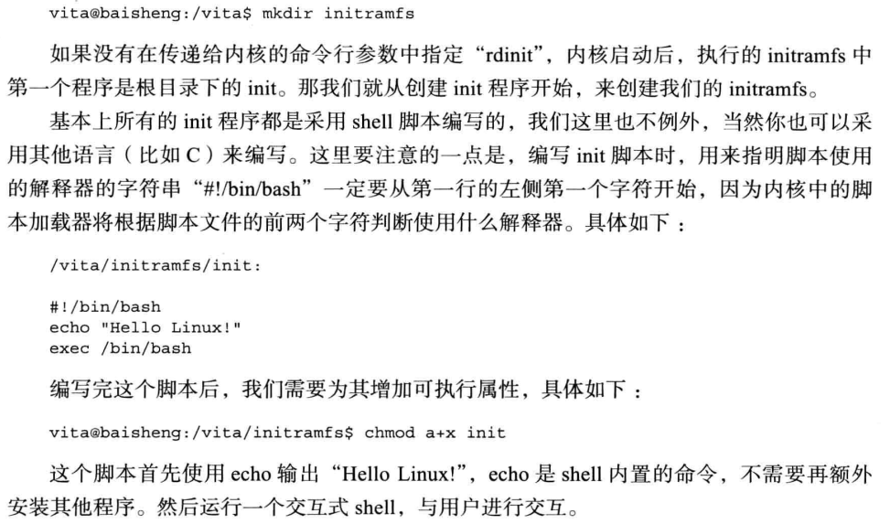
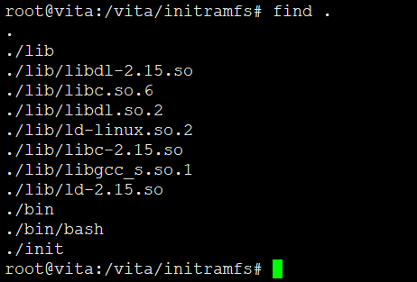

# 构建基本initramfs



* 现在init已经不再是shell脚本了，软链接到systemd，systemd是ELF格式
* 这节其实没啥，按规矩来，一步一步走。无非就是构建initramfs，固定的init入口，关键就是解决依赖，没了


划重点


## 为什么要保证Pid为1？


* 当计算机开机的时候，内核(kernel)只建立了一个init进程。Linux内核并不提供直接建立新进程的系统调用。剩下的所有进程都是init进程通过fork机制建立的。
* 新的进程要通过老的进程复制自身得到，这就是fork。fork是一个系统调用。进程存活于内存中。每个进程都在内存中分配有属于自己的一片空间 (address space)。
* 当进程fork的时候，Linux在内存中开辟出一片新的内存空间给新的进程，并将老的进程空间中的内容复制到新的空间中，此后两个进程同时运行。
* 老进程成为新进程的父进程(parent process)，而相应的，新进程就是老的进程的子进程(child process)。
* 一个进程除了有一个PID之外，还会有一个PPID(parent PID)来存储的父进程PID。如果我们循着PPID不断向上追溯的话，总会发现其源头是init进程。所以说，**所有的进程也构成一个以init为根的树状结构。**
* Linux下有3个特殊的进程，**idle进程(PID = 0), init进程(PID = 1)和kthreadd(PID = 2)**
  - idle进程由系统自动创建, 运行在内核态
    - **idle进程其pid=0，其前身是系统创建的第一个进程，也是唯一一个没有通过fork或者kernel_thread产生的进程。**完成加载系统后，演变为进程调度、交换。
  - **init进程由idle通过kernel_thread创建，在内核空间完成初始化后, 加载init程序, 并最终用户空间**
    - 由0进程创建，完成系统的初始化. 是系统中所有其它用户进程的祖先进程
    - Linux中的所有进程都是有init进程创建并运行的。首先Linux内核启动，然后在用户空间中启动init进程，再启动其他系统进程。在系统启动完成完成后，init将变为守护进程监视系统其他进程。
  - **kthreadd进程由idle通过kernel_thread创建，并始终运行在内核空间, 负责所有内核线程的调度和管理**
    - 它的任务就是管理和调度其他内核线程kernel_thread, 会循环执行一个kthread的函数，该函数的作用就是运行kthread_create_list全局链表中维护的kthread, 当我们调用kernel_thread创建的内核线程会被加入到此链表中，因此所有的内核线程都是直接或者间接的以kthreadd为父进程

```
    |--fork--> init
idle
    |--fork--> kthread
```

* **0号进程是系统所有进程的先祖, 它的进程描述符init_task是内核静态创建的, 而它在进行初始化的时候, 通过kernel_thread的方式创建了两个内核线程，分别是kernel_init和kthreadd，其中kernel_init进程号为1**
* Linux系统中的init进程(pid=1)它是Linux内核开始建立起进程概念时第一个通过```kernel_thread```产生的进程，**其开始在内核态执行，然后通过一个系统调用，开始执行用户空间的/sbin/init程序，期间Linux内核也经历了从内核态到用户态的特权级转变，/sbin/init极有可能产生出了shell，然后所有的用户进程都有该进程派生出来**
* 一开始内核，加载ramfs中的init，然后跳转到最终的根分区，为了保证init始终是PID1且为最终跟分区的/sbin/init，那么就要用exec，exec就是用新程序替换自己保持pid不变

## 如何从内核切换到用户态？

* 在```sys_execve```系统调用中完成内核态到用户态的转移
* kthread 不需要切换，但是init必须要切换到用户态

0号进程创建1号进程的方式如下
```
kernel_thread(kernel_init, NULL, CLONE_FS);
```
* 1号进程的执行函数就是kernel_init, 这个函数被定义init/main.c中
* kernel_init函数将完成设备驱动程序的初始化，并调用init_post函数启动用户空间的init进程。
* 由0号进程创建1号进程（内核态），1号内核线程负责执行内核的部分初始化工作及进行系统配置，并创建若干个用于高速缓存和虚拟主存管理的内核线程。

## 脚本

```
mkdir initramfs

vi /vita/initramfs/initramfs

#!/bin/bash

echo "Hello Linux!"
exec /bin/bash

chmod a+x init

cd /vita/initramfs/

mkdir bin
cp ../sysroot/bin/bash bin/
ldd bin/bash

mkdir lib
cp -d /vita/sysroot/lib/libdl* lib/
cp /vita/sysroot/lib/libc-2.15.so lib/
cp -d /vita/sysroot/lib/libc.so.6 lib/
cp /vita/cross-tool/i686-none-linux-gnu/lib/libgcc_s.so.1 lib/
cp -d /vita/sysroot/lib/ld-* lib/

ldd lib/libdl.so.1
ldd lib/libc.so.6
ldd lib/ld-linux.so.2
ldd lib/libgcc_s.so.1

find . | cpio -o -H newc |gzip -9 > /vita/sysroot/boot/initrd.img
cp /vita/sysroot/boot/initrd.img /vita/boot

menuentry 'vita'{
  set root='hd0,msdos2'
  linux /boot/bzImage root=/dev/sda2 ro
  initrd /boot/initrd.img
}


```




---

PS:


这，我能咋办。。。
