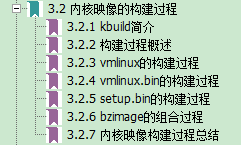
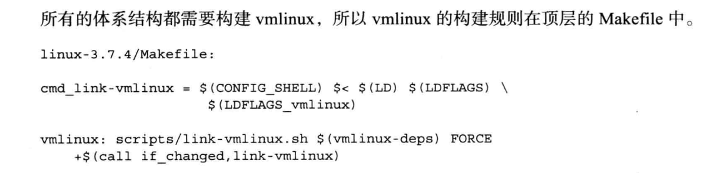
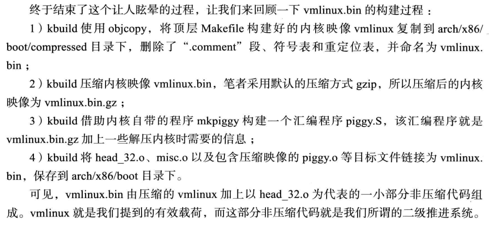
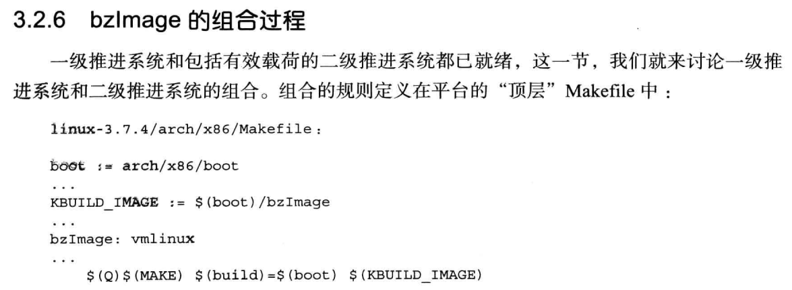
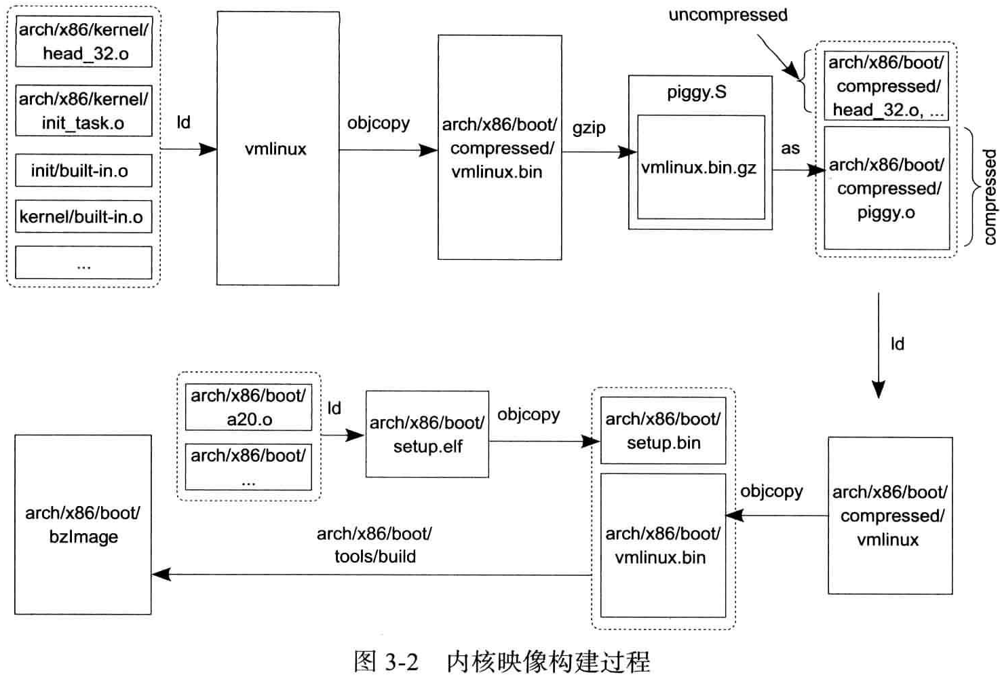

<!-- MDTOC maxdepth:6 firsth1:1 numbering:0 flatten:0 bullets:1 updateOnSave:1 -->

- [内核映像构建过程](#内核映像构建过程)   
   - [kbuild简介](#kbuild简介)   
      - [configuration Symbols](#configuration-symbols)   
      - [Kconfig Files](#kconfig-files)   
      - [.config file](#config-file)   
      - [Makefiles](#makefiles)   
   - [构建过程概述](#构建过程概述)   
      - [vmlinux的构建过程](#vmlinux的构建过程)   
      - [vmlinux.bin的构建过程](#vmlinuxbin的构建过程)   
      - [setup.bin的构建过程](#setupbin的构建过程)   
      - [bzImage的组合过程](#bzimage的组合过程)   
   - [内核映像构建过程总结](#内核映像构建过程总结)   
   - [参考](#参考)   

<!-- /MDTOC -->
# 内核映像构建过程

---

## kbuild简介

Linux是一个 ** mono类型、宏内核、大内核** 的内核，所有的内核代码都位于内核空间。但是Linux也能够加载内核模块，在内核运行期间可以增加内核代码。所以在内核编译的时候就需要决定哪些东西需要编译进内核，哪些需要编译成模块。这就需要一个系统来管理了，这就是kbuild。

kbuild主要包括如下四个部分：

* config symbols:编译选项，用来决定代码的条件编译以及决定哪些编译进内核，哪些编译成模块。
* Kconfig files:定义每一个config symbol的属性，比如其类型，描述和依赖等。程序需要使用Kconfig file生成一个菜单，比如make menuconfig生成的数据就是读取这个文件来生成的。每个功能模块会有Kconfig配置文件，模块描述及相关选项。
* .config file:存储每一个config symbol选择的值。可以手动修改或者使用make工具生成。
* Makefile:这个就是普通的make工具了，用于指导源文件生成目标文件的过程，内核啊，内核模块啊。
下面对这四个部分进行详细介绍。

### configuration Symbols

configuration Symbols用来决定哪些特性或者模块将会被编译进内核。最常见的是两种编译选项，boolean和tristate，其不同之处只是可以取的值不同。

* boolean symbols可以取两种值:true/false，就是开关。
* tristate可以取三种值，yes/no/module。

内核中的很多选项都需要一个开关，而不是module，比如对SMP或者preemption的支持，必须要在内核编译时候就决定好，这个时候就用boolean config symbol就行了。很多设备驱动可以在之后加入内核，这个时候使用tristate config symbol，决定是编译进内核呢，还是模块，还是压根就不编译。

其他config symbol包括strings和hex，但是这些不常用，此处从略。

### Kconfig Files

configuration symbols是定义在Kconfig file中的，每一个Kconfig file可以描述任意数量的symbols，也可以使用include包含其他Kconfig file。内核编译工具如，make menuconfig读取这些文件生成一个树形结构。内核中的每一个目录都有一个Kconfig，并且它们包含自己子目录的Kconfig file，内核根目录树下面有一个Kconfig。

**menuconfig/gconfig就从根目录下的Kconfig开始，递归读取。**

### .config file
所有的config symbol值都保存在.config文件中，每一次执行meuconfig都会讲变化写入该文件。.config是一个文本文件，所以可以直接手动修改。.config每一行都会表示一个config symbol的值，如果没有选就会注释掉。

### Makefiles
Makefiles用来编译内核和模块，与Kconfig类似，每一个子目录都会有一个Makefile文件， 用来编译其下的文件。整个编译过程也是递归的，上一层的Makefile下降到子目录中， 然后编译。

* 书上这块，感觉没讲明白kbuild的作用。。至少白痴听不懂，如同嚼蜡的一节
* 其实Kbuild就是make那一套的扩展而已，就是make

## 构建过程概述

### vmlinux的构建过程

### vmlinux.bin的构建过程

### setup.bin的构建过程

### bzImage的组合过程

* 程序build将setup.bin和vmlinux.bin简单的链接为bzImage

## 内核映像构建过程总结

## 参考

* <https://terenceli.github.io/%E6%8A%80%E6%9C%AF/2017/03/29/kbuild-introduction>

---
