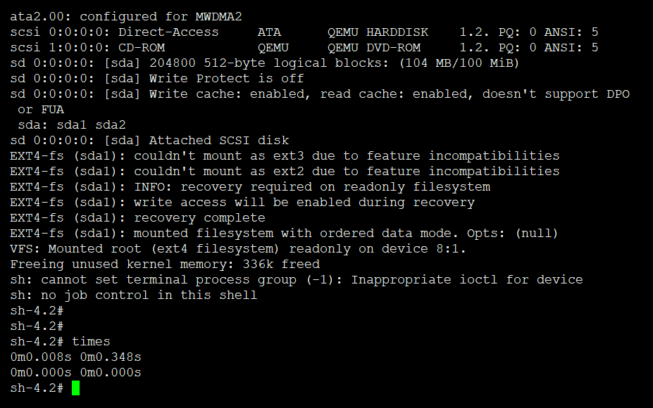
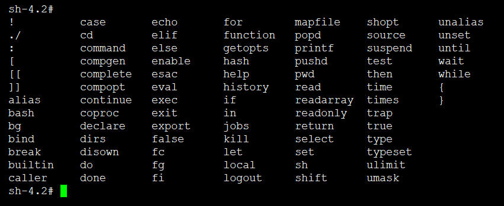

# 9. 构建基本根文件系统

## mk-linuxconfig3.sh脚本

```
#!/bin/bash

set -e
source functions
source crosscompiler

if [ `whoami` != "root" ]; then
        echoblue "Need root privilege!"
        exec su - "root" -c "cd ${WORKDIR} && bash $0 "
	echogreen "### run in root"
fi

function linuxconfig3(){
	cd /vita/build

	echogreen "### clean old linux-3.7.4"
	test -d /vita/build/linux-3.7.4 && /bin/rm -rf linux-3.7.4

	echogreen "### unpack linux-3.7.4.tar.xz"
	tar -xf ../source/linux-3.7.4.tar.xz

	cd linux-3.7.4
	echogreen "### config crosscompiler"
	sed -i  's#ARCH		?= $(SUBARCH)#ARCH ?= i386#g'   Makefile
	sed -i  's#CROSS_COMPILE	?= $(CONFIG_CROSS_COMPILE:"%"=%)#CROSS_COMPILE   ?= i686-none-linux-gnu-#g'  Makefile

	grep "^ARCH" Makefile | grep i386
	grep "^CROSS_COMPILE" Makefile | grep i686-none-linux-gnu-

	echogreen "### cp /vita/scripts/linuxconfig3 .config"
	cp /vita/scripts/linuxconfig3 .config

	echogreen "### make bzImage"
	make bzImage ${SPEEDUP}  2>&1 | tee log.make.bzImage


	cd /vita/build
	echogreen "### clean old bash-4.2"
	test -d /vita/build/bash-4.2 && /bin/rm -rf bash-4.2

	echogreen "### unpack bash-4.2.tar.gz"
	tar -xf ../source/bash-4.2.tar.gz

	cd bash-4.2
	./configure --prefix=/usr --bindir=/bin \
		--without-bash-malloc 2>&1 | tee log.configure.bash

	make ${SPEEDUP}  2>&1 | tee log.make.bash
	make install DESTDIR=${SYSROOT}  2>&1 | tee log.makeinstall.bash

	echogreen "### gen ldd"
	cat > /vita/cross-tool/bin/ldd << EOF
#!/bin/bash

LIBDIR="\${SYSROOT}/lib \${SYSROOT}/usr/lib
        \${CROSS_TOOL}/\${TARGET}/lib"

find() {
        for d in \$LIBDIR;do
                found=""
                if [ -f "\${d}/\$1" ]; then
                    found="\${d}/\$1"
                    break
                fi
        done

        if [ -n "\$found" ];then
                printf "%8s%s => %s\n" "" \$1 \$found
        else
                printf "%8s%s => (not found)\n" "" \$1
        fi
}

readelf -d \$1  | grep NEEDED \
   | sed -r -e 's/.*Shared library:[ ]+\[(.*)\]/\1/;' \
   | while read lib ;do find \$lib ; done

EOF
	chmod a+x /vita/cross-tool/bin/ldd


}


function genImage(){

	test -d /vita/output/mk-linuxconfig3 || mkdir /vita/output/mk-linuxconfig3 -p
	cd /vita/output/mk-linuxconfig3

	echogreen "### gen disk.img, 50MB size"
	dd if=/dev/zero of=./disk.img bs=1M count=100

	echo "n
p
1

100000
n
p
2


w
" | fdisk disk.img

	FREELOOP=`losetup -f`
	echogreen "### losetup ${FREELOOP}"
	losetup ${FREELOOP} disk.img
	kpartx -av ${FREELOOP}

	test -d mnt || mkdir mnt
	for MAPPER in `ls /dev/mapper/"${FREELOOP##*/}"*`;do
		echogreen "### format ${MAPPER} to ext4 fs"
		mkfs.ext4 ${MAPPER} &> /dev/null
		test -d mnt/`basename ${MAPPER}` || mkdir mnt/`basename ${MAPPER}`
		mount ${MAPPER}  mnt/`basename ${MAPPER}`
	done
	sync

	cd mnt/"${FREELOOP##*/}p1"

	mkdir dev proc run etc root sys boot lib bin
	cp /vita/build/linux-3.7.4/arch/x86/boot/bzImage .
	cp -d /vita/sysroot/lib/* lib/
	cp -d /vita/cross-tool/i686-none-linux-gnu/lib/lib*.so.*[0-9] lib/


	grub-install --root-directory=`pwd` ${FREELOOP} 2> /dev/null || echogreen "grub install!"

	echogreen "### add grub.cfg"
	cat > boot/grub/grub.cfg << EOF
set timeout=5
set default=0
menuentry "vita" {
	set root='(hd0,msdos1)'
	linux /bzImage root=/dev/sda1 ro
}

menuentry 'Reboot' {
    reboot
}

menuentry 'Shutdown' {
    halt
}
EOF
	sync

	cp /vita/sysroot/bin/bash bin/
	cd bin/
	ln -svf bash sh
	cd ../
	echogreen "### ldd bin/bash"
	which ldd
        ldd bin/bash
	echogreen "### strip lib/ bin/"
	i686-none-linux-gnu-strip lib/* bin/*

	echogreen "### run qemu"
	cd ../../
	sync
	### qemu running

	if [ -e /dev/kvm ];then
		qemu-system-x86_64 -m 512M -drive format=raw,file=disk.img  \
		-enable-kvm \
		-display curses
	else
		qemu-system-x86_64 -m 512M -drive format=raw,file=disk.img  \
		-display curses
	fi

	echogreen "### clean mount,free loop mapper"
	for MAPPER in `ls /dev/mapper/"${FREELOOP##*/}"*`;do
		echogreen "### umount ${MAPPER} to ext4 fs"
		umount  mnt/`basename ${MAPPER}`
	done

	sync
	kpartx -dv ${FREELOOP}
	losetup -dv ${FREELOOP}

}

linuxconfig3
genImage
```


## 实验结果





---
