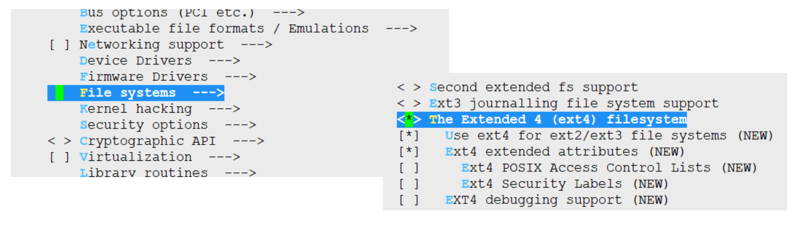
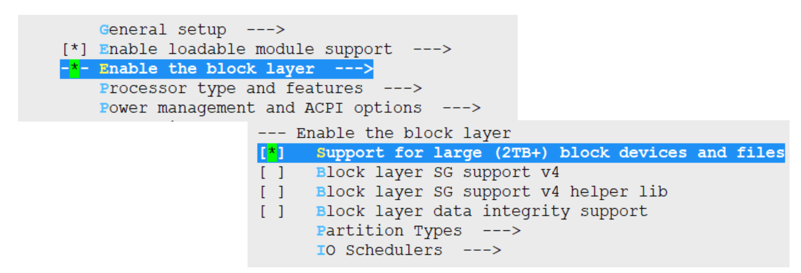
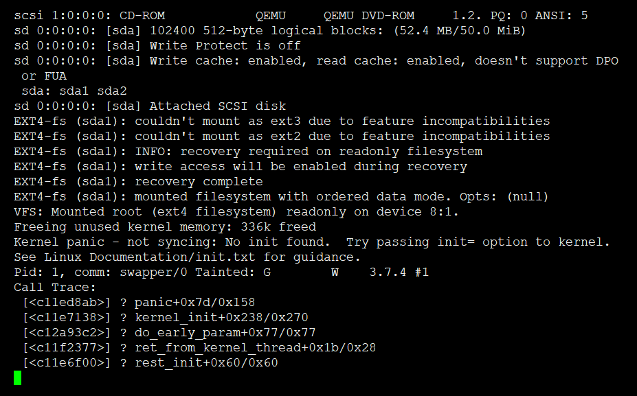

# 8. 编译并配置内核支持EXT4和ELF

## 生成.config文件






## mk-linuxconfig2.sh脚本

```
#!/bin/bash

set -e
source functions
source crosscompiler

if [ `whoami` != "root" ]; then
        echoblue "Need root privilege!"
        exec su - "root" -c "cd ${WORKDIR} && bash $0 "
	echogreen "### run in root"
fi

function linuxconfig2(){
	cd /vita/build

	echogreen "### clean old linux-3.7.4"
	test -d /vita/build/linux-3.7.4 && /bin/rm -rf linux-3.7.4

	echogreen "### unpack linux-3.7.4.tar.xz"
	tar -xf ../source/linux-3.7.4.tar.xz

	cd linux-3.7.4
	echogreen "### config crosscompiler"
	sed -i  's#ARCH		?= $(SUBARCH)#ARCH ?= i386#g'   Makefile
	sed -i  's#CROSS_COMPILE	?= $(CONFIG_CROSS_COMPILE:"%"=%)#CROSS_COMPILE   ?= i686-none-linux-gnu-#g'  Makefile

	grep "^ARCH" Makefile | grep i386
	grep "^CROSS_COMPILE" Makefile | grep i686-none-linux-gnu-

	echogreen "### cp /vita/scripts/linuxconfig2 .config"
	cp /vita/scripts/linuxconfig2 .config

	echogreen "### make bzImage"
	make bzImage ${SPEEDUP}  2>&1 | tee log.make.bzImage

}

function genImage(){

	test -d /vita/output/mk-linuxconfig2 || mkdir /vita/output/mk-linuxconfig2 -p
	cd /vita/output/mk-linuxconfig2

	echogreen "### gen disk.img, 50MB size"
	dd if=/dev/zero of=./disk.img bs=1M count=50

	echo "n
p
1

50000
n
p
2


w
" | fdisk disk.img

	FREELOOP=`losetup -f`
	echogreen "### losetup ${FREELOOP}"
	losetup ${FREELOOP} disk.img
	kpartx -av ${FREELOOP}

	test -d mnt || mkdir mnt
	for MAPPER in `ls /dev/mapper/"${FREELOOP##*/}"*`;do
		echogreen "### format ${MAPPER} to ext4 fs"
		mkfs.ext4 ${MAPPER} &> /dev/null
		test -d mnt/`basename ${MAPPER}` || mkdir mnt/`basename ${MAPPER}`
		mount ${MAPPER}  mnt/`basename ${MAPPER}`
	done
	sync

	cd mnt/"${FREELOOP##*/}p1"

	mkdir dev proc run etc root sys boot
	cp /vita/build/linux-3.7.4/arch/x86/boot/bzImage .

	grub-install --root-directory=`pwd` ${FREELOOP} 2> /dev/null || echogreen "grub install!"

	echogreen "### add grub.cfg"
	cat > boot/grub/grub.cfg << EOF
set timeout=5
set default=0
menuentry "vita" {
	set root='(hd0,msdos1)'
	linux /bzImage root=/dev/sda1 ro
}

menuentry 'Reboot' {
    reboot
}

menuentry 'Shutdown' {
    halt
}
EOF
	sync
	cd ../../
	sync
	### qemu running

	if [ -e /dev/kvm ];then
		qemu-system-x86_64 -m 512M -drive format=raw,file=disk.img  \
		-enable-kvm \
		-display curses
	else
		qemu-system-x86_64 -m 512M -drive format=raw,file=disk.img  \
		-display curses
	fi

	echogreen "### clean mount,free loop mapper"
	for MAPPER in `ls /dev/mapper/"${FREELOOP##*/}"*`;do
		echogreen "### umount ${MAPPER} to ext4 fs"
		umount  mnt/`basename ${MAPPER}`
	done

	sync
	kpartx -dv ${FREELOOP}
	losetup -dv ${FREELOOP}

}

linuxconfig2
genImage
```


## 实验效果


