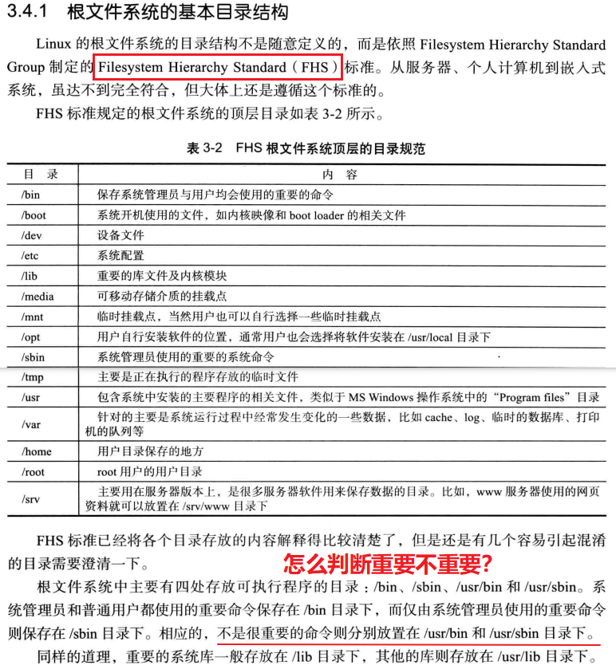
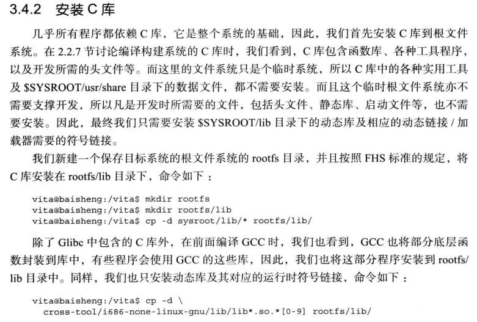
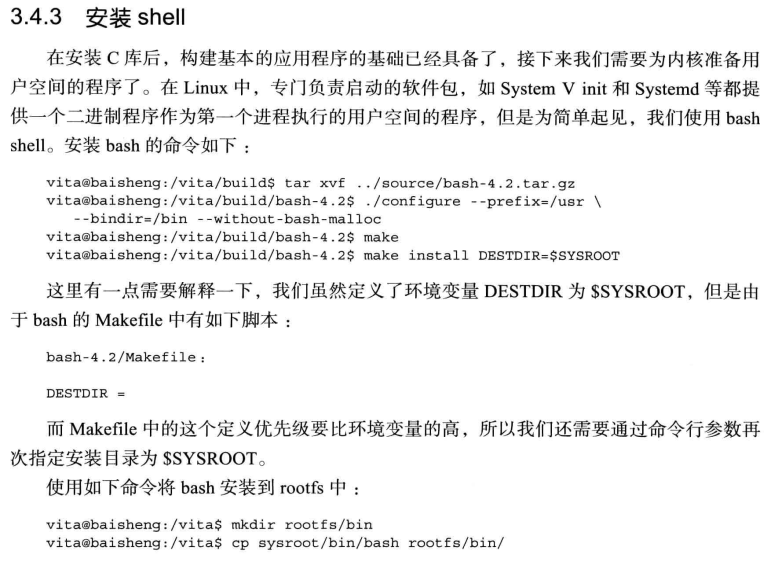

# 构建基本根文件系统

## 根文件系统的基本目录结构



## 安装C库




## 安装shell



除了安装而进程程序，其依赖库也必须安装，不然无法运行，所以才叫运行时库。没有就是跑不起来，总之

可以通过对应脚本来判断是安装好所有依赖库。其实就是通过readelf命令来获取ELF头部信息，然后到对应路径下找

```
#!/bin/bash

LIBDIR="${SYSROOT}/lib ${SYSROOT}/usr/lib
        ${CROSS_TOOL}/${TARGET}/lib"

find() {
        for d in $LIBDIR;do
		found=""
		if [ -f "${d}/$1" ]; then
		    found="${d}/$1"
		    break
		fi
	done

	if [ -n "$found" ];then
		printf "%8s%s => %s\n" "" $1 $found
	else
		printf "%8s%s => (not found)\n" "" $1
	fi
}

readelf -d $1  | grep NEEDED \
   | sed -r -e 's/.*Shared library:[ ]+\[(.*)\]/\1/;'\
   | while read lib ;do
	find $lib
     done

```


## 安装根文件系统到目标系统


## 本节相关脚本


```
function installclib()
{
	cd /vita
	test -d rootfs/lib || mkdir -p rootfs/lib

	/bin/cp -d sysroot/lib/* rootfs/lib/
	checkout log.cp.sysroot.lib

	/bin/cp -d cross-tool/i686-none-linux-gnu/lib/lib*.so.*[0-9] rootfs/lib/
	checkout log.cp.cross-tool
	echo  -e "\e[32m\e[1m ========== finish install c lib =============================  \e[0m"
}
function bashshell()
{
	cd /vita/build
	test -d bash-4.2 && /bin/rm -rf bash-4.2
	tar -xf ../source/bash-4.2.tar.gz
	checkout log.xf.bash
	cd bash-4.2

	./configure --prefix=/usr --bindir=/bin --without-bash-malloc 2>&1 | tee log.configure.bash
	checkout log.configure.bash

	make ${SPEEDUP} 2>&1 | tee log.make.bash
	checkout log.make.bash

	make install DESTDIR=${SYSROOT} 2>&1 |tee log.makeinstall.bash
	checkout log.makeinstall.bash

	test -d /vita/sysroot/bin && /bin/cat << \EOF > /vita/sysroot/bin/ldd
#!/bin/bash

LIBDIR="${SYSROOT}/lib ${SYSROOT}/usr/lib
        ${CROSS_TOOL}/${TARGET}/lib"

find() {
        for d in $LIBDIR;do
		found=""
		if [ -f "${d}/$1" ]; then
		    found="${d}/$1"
		    break
		fi
	done

	if [ -n "$found" ];then
		printf "%8s%s => %s\n" "" $1 $found
	else
		printf "%8s%s => (not found)\n" "" $1
	fi
}

readelf -d $1  | grep NEEDED \
   | sed -r -e 's/.*Shared library:[ ]+\[(.*)\]/\1/;'\
   | while read lib ;do
	find $lib
     done

EOF

	test -d /vita/rootfs/bin || mkdir /vita/rootfs/bin
	test -e /vita/rootfs/bin/bash || cp /vita/sysroot/bin/bash /vita/rootfs/bin/bash
	test -e /vita/rootfs/bin/sh || ln -sfv /vita/rootfs/bin/bash /vita/rootfs/bin/sh

	echo  -e "\e[32m\e[1m ========== finish bash shell =============================  \e[0m"
}

function buildrootfs()
{
	cd /vita
	i686-none-linux-gnu-strip rootfs/lib/* rootfs/bin/*
	cd /vita/rootfs && tar zcvf ../rootfs.tgz *
}

function main()
{
	basicenv
	#aptinstall
	#binutils
	#gcc
	#kernelheaders
	#glibc
	#fullcompiler
	#defineenv
	#pkgconfig
	#installclib
	bashshell
	buildrootfs
}

```

## 参考

* <http://www.voidcn.com/article/p-nmoirqsg-bdt.html>
