# 配置内核

## 交叉编译内核设置


* 通过环境变量指定使用交叉编译
* 两种方式，一种是命令执行的时候显示指定交叉编译器，一种是直接修改顶层Makefile

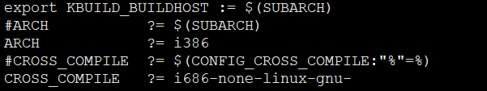

## 基本内核配置


.config 配置文件一定要有，且必须在内核顶层目录

* make oldconfig，从/boot分区找内核配置，其实就是找hosted系统的内核配置
* make menuconfig，图形化界面配置
* make ${ARCH}_config，内核提供对应平台的默认配置
* make allnoconfig，最小化配置


LFS一般都必须基于最小化配置


执行命令之后其实就在顶层目录生成一个.config配置文件，内容是酱紫的


boolean类似，字符串类型。下面依次配置一些内容

## 配置处理器


* x86一向都兼容，但是鼻祖intel在64位上傻逼了，被AMD抢走了64位（兼容32位）鼻祖称号，因为它不想继续兼容32位了
* 兼容，纯粹就是为了支持更多设备，但是性能确实很尴尬

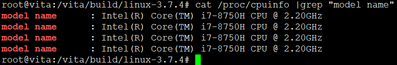


反正比较新的都选这个就对了

这一选项针对x86系列的CPU使用更多的常规优化。如果你在上面一项选的是i386、i586之类的才选这个通用x86支持,如果你的CPU能够在上述"Processor family"中找到就别选。除了对上面你选择的X86 CPU进行优化，它还对更多类型X86 CPU的进行优化。这将会使内核在其他的X86 CPU上运行得更好。这个选项提供了对X86系列CPU最大的兼容性，用来支持一些少见的x86构架的CPU。如果你的CPU能够在上面的列表中找到，就里就不用选了。


选中多核心支持


## 配置内核支持模块


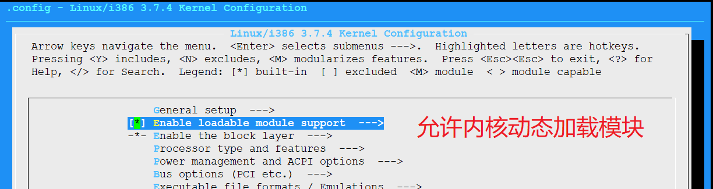

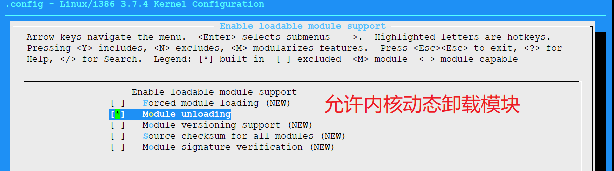


## 配置硬盘控制器驱动

硬盘驱动要考虑三方面

1.硬盘控制器接口
  * SATA使用PCI接口，挂在PCI总线
2. 与SCSI层关系
  * 在内河中SATA设备被实现为一个SCSI设备
3. 底层设备驱动


* 内核将SATA逻辑上分为两层


从内核配置选项上可以看出他们之间的依赖关系


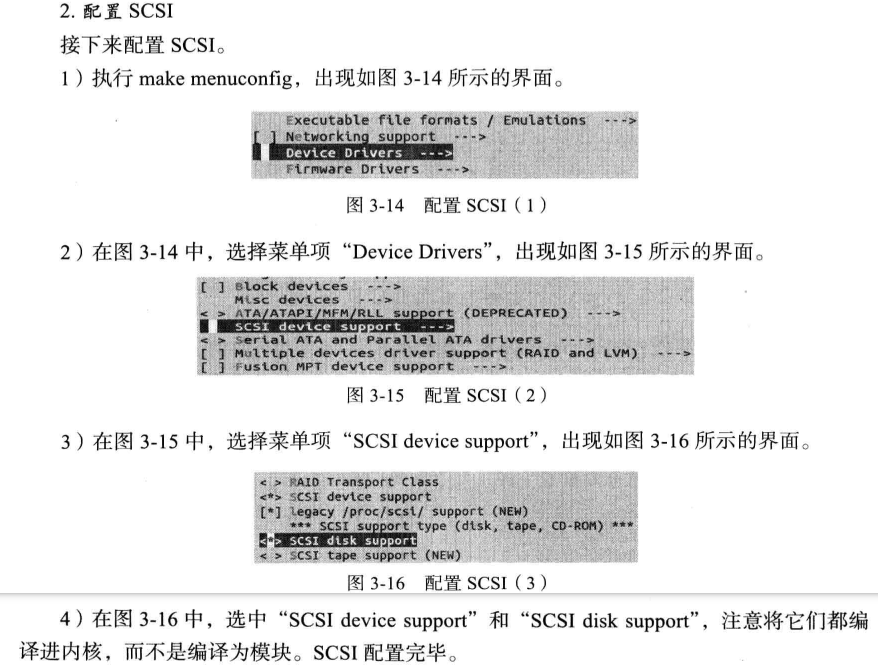


开启多线程编译


```
  LD      arch/x86/boot/compressed/vmlinux
  ZOFFSET arch/x86/boot/zoffset.h
  OBJCOPY arch/x86/boot/vmlinux.bin
  AS      arch/x86/boot/header.o
  LD      arch/x86/boot/setup.elf
  OBJCOPY arch/x86/boot/setup.bin
  BUILD   arch/x86/boot/bzImage
Setup is 15036 bytes (padded to 15360 bytes).
System is 1324 kB
CRC 6bfab967
Kernel: arch/x86/boot/bzImage is ready  (#1)
root@vita:/vita/build/linux-3.7.4# ls arch/x86/boot/b
bioscall.S  bioscall.o  bitops.h    boot.h      bzImage     
root@vita:/vita/build/linux-3.7.4# ls arch/x86/boot/bzImage -alh
-rw-r--r-- 1 root root 1.4M Sep 13 00:32 arch/x86/boot/bzImage
root@vita:/vita/build/linux-3.7.4# SPEEDUP=" -j ${CORES}"^C
root@vita:/vita/build/linux-3.7.4# file arch/x86/boot/bzImage
arch/x86/boot/bzImage: Linux kernel x86 boot executable bzImage, version 3.7.4 (root@vita) #1 SMP Fri Sep 13 00:32:37 CST 2019, RO-rootFS, swap_dev 0x1, Normal VGA
root@vita:/vita/build/linux-3.7.4#

```
### 测试新编译的内核


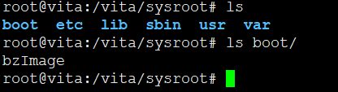

```
root@vita:/vita# cp /sysroot/boot/bzImage /boot/
```

拷贝到当前虚拟机的/boot分区下，修改启动项

首先让grub显示菜单项，修改/etc/default/grub注释掉GRUB_HIDDEN相关的条目

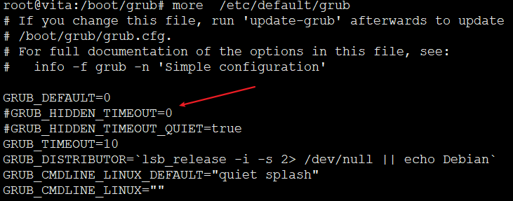

修改后保存，运行命令 update-grub即可更新/boot/grub/grub.conf

然后再修改/etc/grub/grub.conf，否则update-grub可能会删掉你添加的内容。

```
root@vita:/boot/grub# cat grub.cfg |grep vita -A4 -B2


menuentry "vita" {
	set root='(hd0,2)'
	linux /boot/bzImage root=/dev/sda2 ro
}

```


修改配置，重启之后就可以看到


然而


这种方式肯定不行滴。。书上骚操作老版本系统呢吧

正确做法

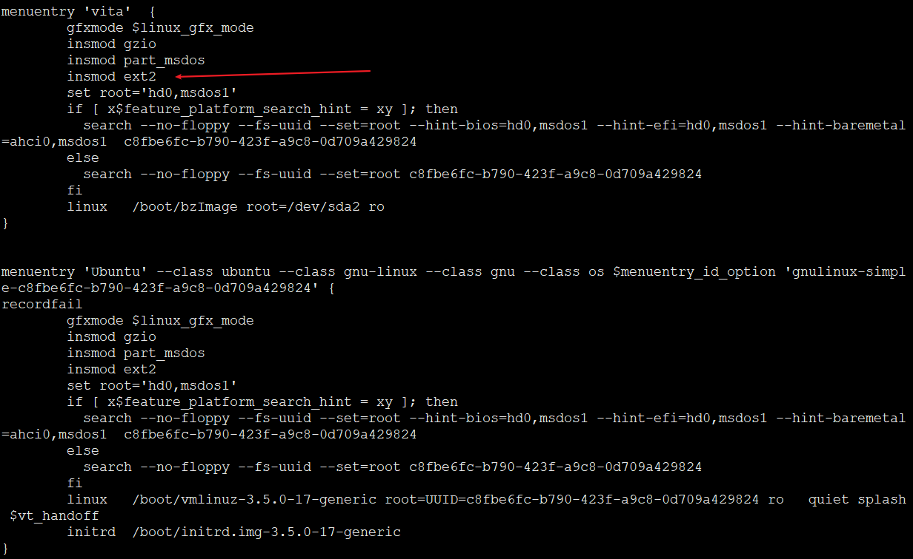

拷贝一份默认Ubuntu的启动项，修改一下，应为如果grub没有ext2驱动，boot分区都找不到，更别说引导

修改后重启，即可实现书上的效果。没有挂在rootfs

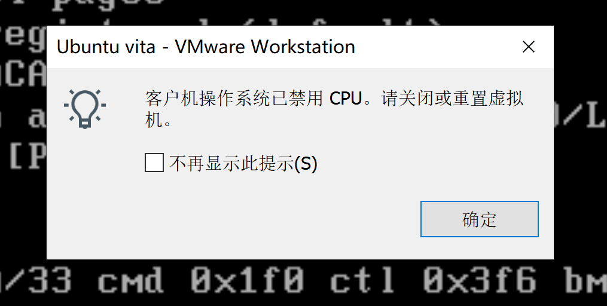

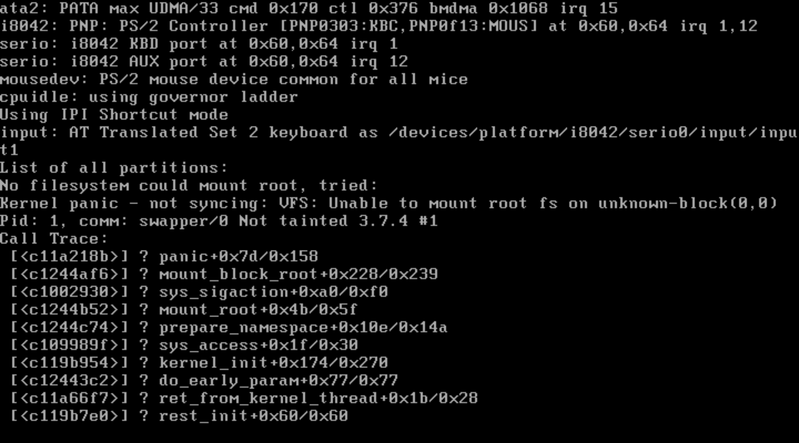

## 配置文件系统


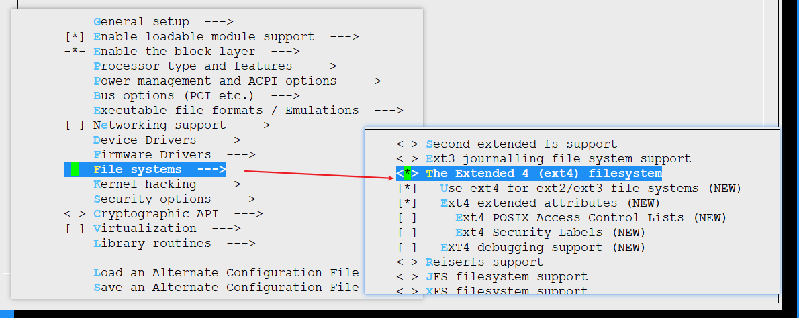

让内核支持ext4文件系统


启用2T+大容量支持


## 配置内核支持ELF文件格式


配置好后，重新编译内核，重新引导，还是老样子。因为没有解决根本原因。


为嘛我的还是显示不了？？因为漏了这个

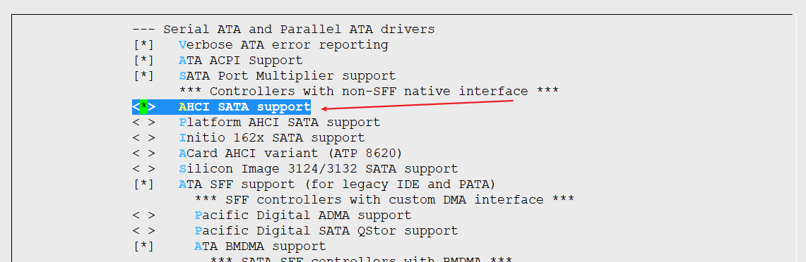

仍然不行，经过好久折腾。可能跟虚拟机默认使用的虚拟磁盘类型有关。


默认的SCSI硬盘，一直识别不了。

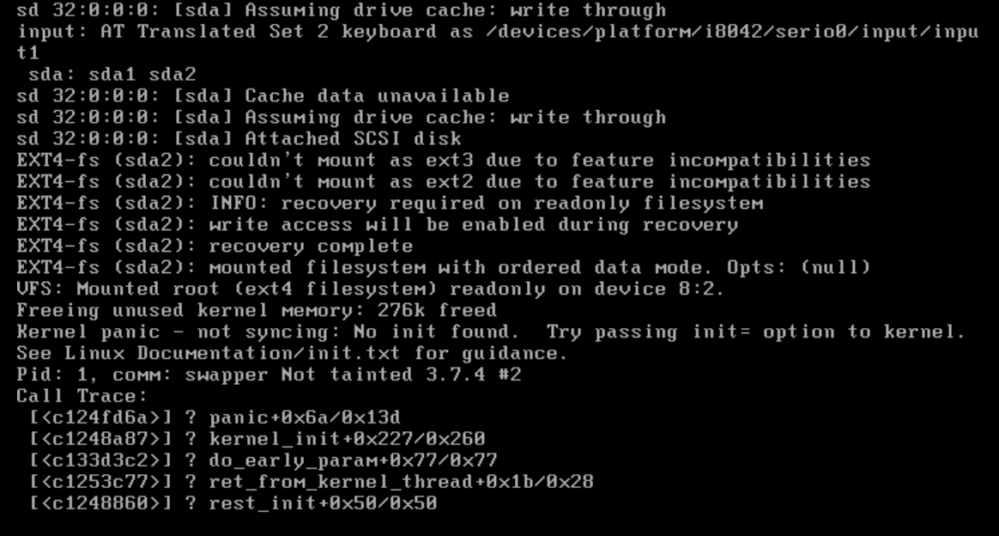

识别了硬盘，识别了分区，但是找不到init

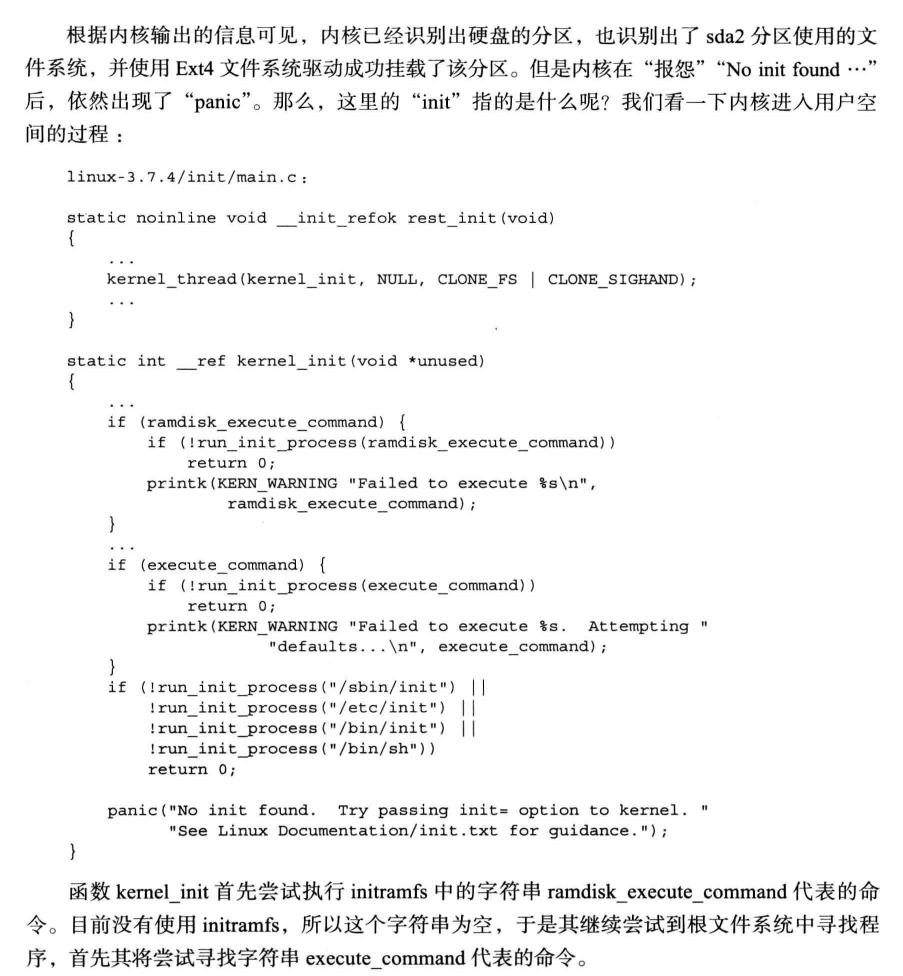


but，为嘛虚拟机能识别SATA，不识别SCSI

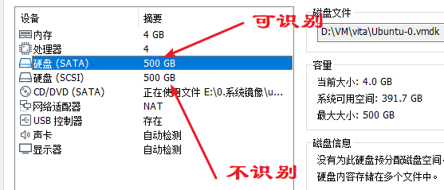

了解一下先


现在虚拟磁盘支持类型

* IDE
  - Integrated Drive Electronics（电子集成驱动器）
  - IDE硬盘的接口类型：ATA、Ultra ATA、DMA、Ultra DMA
  - IDE硬盘优点：价格低廉、兼容性强、性价比高。
  - IDE硬盘缺点：数据传输速度慢、线缆长度过短、连接设备少
* SCSI
  - Serial Advanced Technology Attachment（串行ATA）
  - 用在服务器上面比较多，速度快，稳定性很好，比较适合做磁盘阵列
  - 转速高达15000RPM
  - SCSI硬盘可支持多个设备，SCSI-2（Fast SCSI）最多可接7个SCSI设备
  - SCSI还允许在对一个设备传输数据的同时，另一个设备对其进行数据查找
  - SCSI占用CPU极低，在多任务系统中占有着明显的优势
  - SCSI设备还具有智能化，SCSI卡自己可对CPU指令进行排队，这样就提高了工作效率
  - 最快的SCSI总线有320MB/s的带宽
* SATA
  - Small Computer System Interface（小型计算机系统接口）
  - SATA的传输速度快
  - SATA硬盘还具有安装方便、容易散热、支持热插拔等诸多优点
* NVMe
  -  Non Volatile Memory express（非易失性内存主机控制器接口）

1. SCSI与ATA是硬盘的两大接口类型。长期以来，两者可以说互不侵犯，和睦共处，但如今，情况似乎有了变化。
2. 当串行化的潮流向PC架构涌入时，ATA突然有了脱胎换骨的改变，无论是物理特性还是逻辑功能，都较以往有了重大的突破。PATA至SATA的转变甚至也让高高在上的企业级人士刮目相看。尤其是万转SATA硬盘出现，使SATA vs.SCSI的话题再次成为了用户争论的焦点。
3. SATA其实是SCSI体系里抽取出的一部分，也就是说SCSI能兼容SATA，但SATA反过来就不行。
4. SCSI本质上还是为服务器准备的磁盘系统，它非常强调所有的控制可以由SCSI体系自己完成，不需要cpu控制，所以SCSI非常省资源，而SATA需要cpu介入控制传输过程。
4. 现在主流的是台式机用SATA，服务器用SAS，一些低端的服务器/工作站用企业级的SATA。

---

实测，书中kernel配置添加一些选项就可以支持SCSI

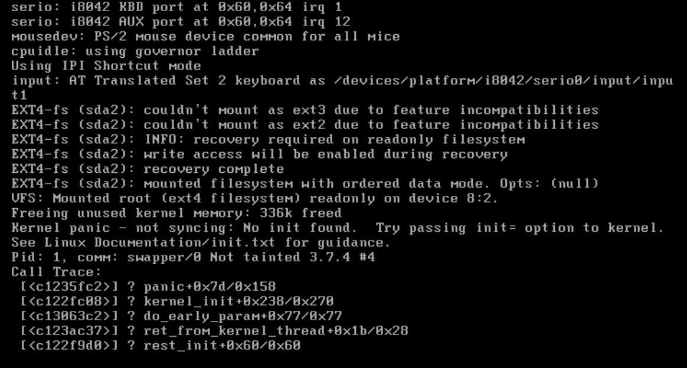


根本不需要支持IDE


启用SCSI的一些支持，cdrom也支持一下呗，因为有光盘会被检索到，就能判断SCSI支持了，之后还需要开启一些选项


谁能解释一下，为嘛开启MPT就搞起了？所以嘛，看书要论证，鬼知道作者说的对不对。最近跟我组长学了一句话。。。我信你个鬼~~略略略


但其实书上也没错，嘿嘿嘿。虚拟机推荐默认SCSI，书上用的SATA。。没毛病

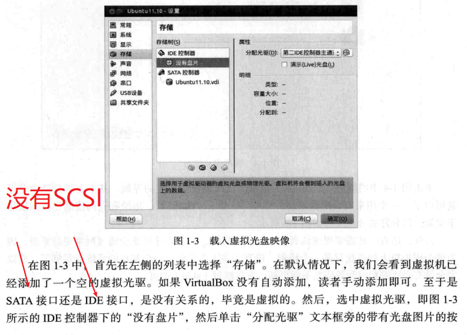

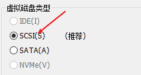


---


### 配置确认

不是我废话，我就想再确认一下


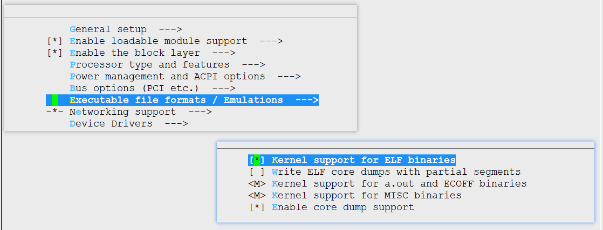

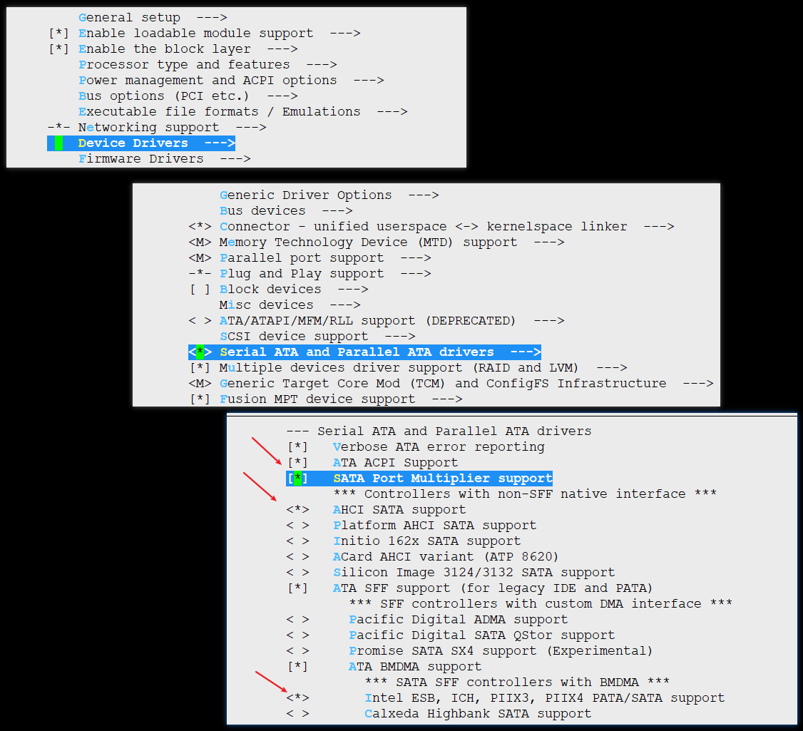


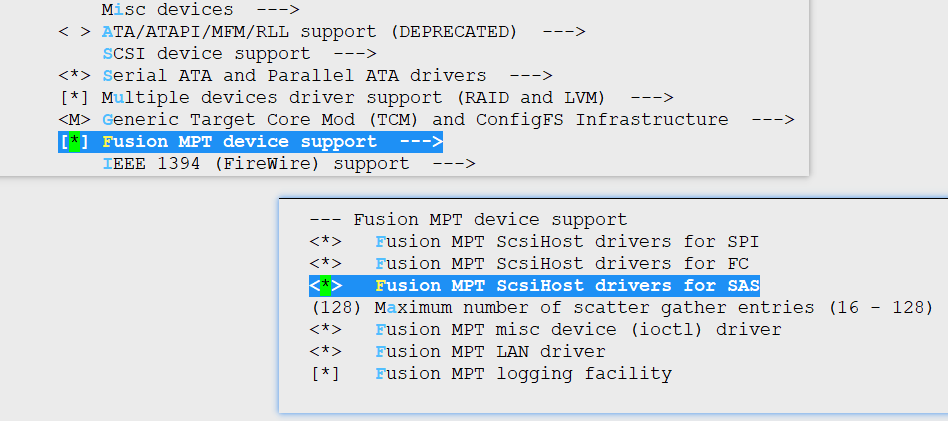

配置好，重启，识别，搞定

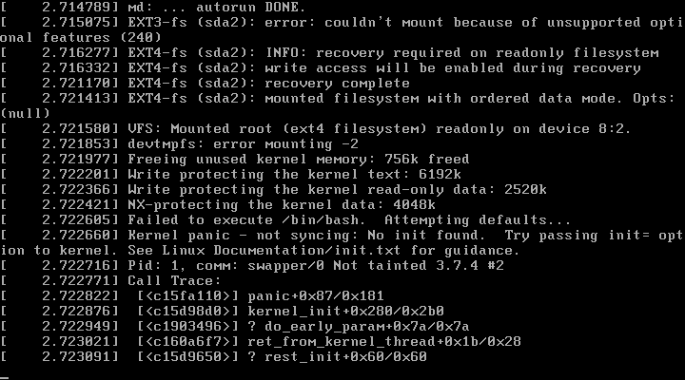 

---
