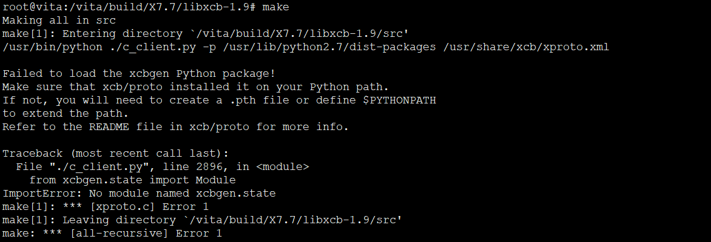
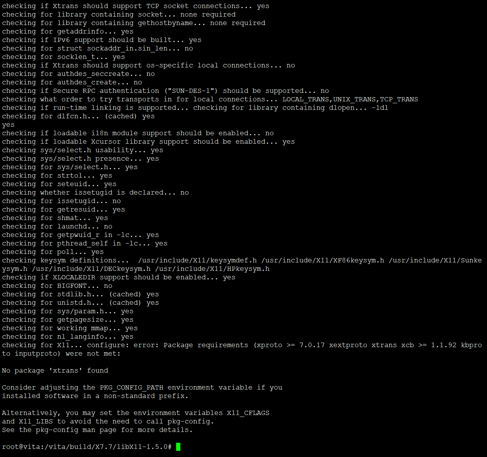
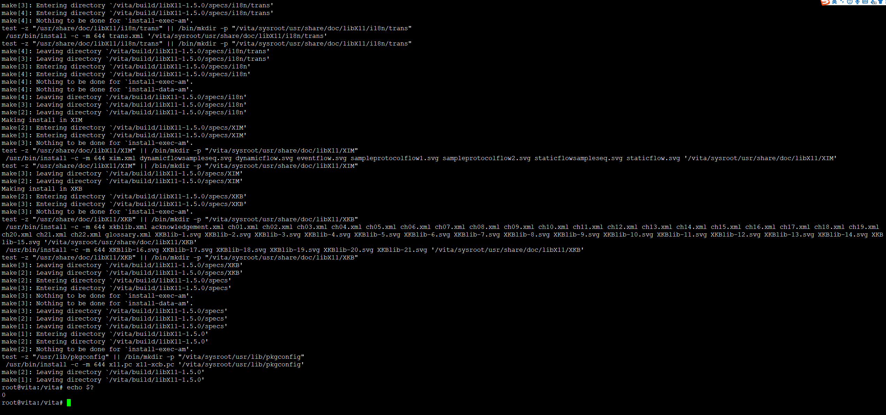

# 安装X窗口服务


## xcb安装问题





```
root@vita:/vita# cp /vita/sysroot/usr/lib/python2.7/dist-packages/xcbgen /usr/lib/python2.7/dist-packages/ -a

```

## X11安装问题

依赖xtrans，



```
#!/bin/bash

set -xe

cd build
tar -xvf ../source/X7.7/libX11-1.5.0.tar.bz2
export PKG_CONFIG_PATH="/vita/sysroot/usr/share/pkgconfig:$PKG_CONFIG_PATH:/usr/x11R7/lib:/lib/pkgconfig:/usr/lib/pkgconfig:/usr/x11R7/lib/pkgconfig:/usr/x11R7/share/pkgconfig"
cd libX11-1.5.0
./configure --prefix=/usr
make
make install
```

找不到这两个头文件，奇了怪了。。compo

```
cp /usr/include/X11/extensions/xf86bigfproto.h /vita/sysroot/usr/include/X11/extensions/
find ./ -name xf86bigfont.h
find /usr -name xf86bigfont.h
cp /usr/include/X11/extensions/xf86bigfont.h /vita/sysroot/usr/include/X11/extensions/
```



尴尬的作者偷懒。。没有给出详细过程。。。好难

```
#!/bin/bash

set -xe

cd build
tar -xvf ../source/X7.7/libX11-1.5.0.tar.bz2
export PKG_CONFIG_PATH="/vita/sysroot/usr/share/pkgconfig:$PKG_CONFIG_PATH:/usr/x11R7/lib:/lib/pkgconfig:/usr/lib/pkgconfig:/usr/x11R7/lib/pkgconfig:/usr/x11R7/share/pkgconfig"
cd libX11-1.5.0
./configure --prefix=/usr --with-sysroot=$SYSROOT
make
make install
```

