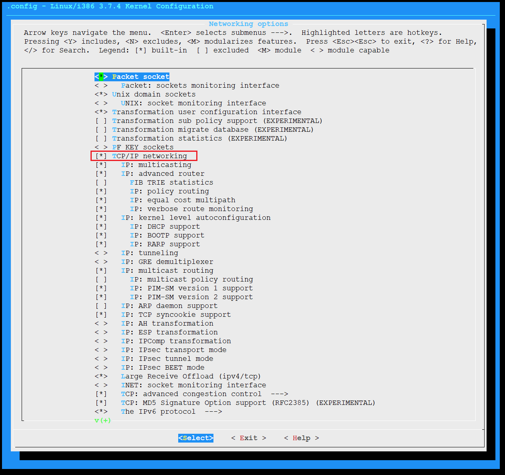
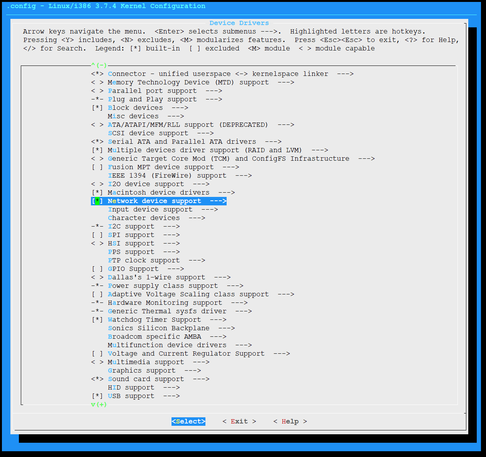
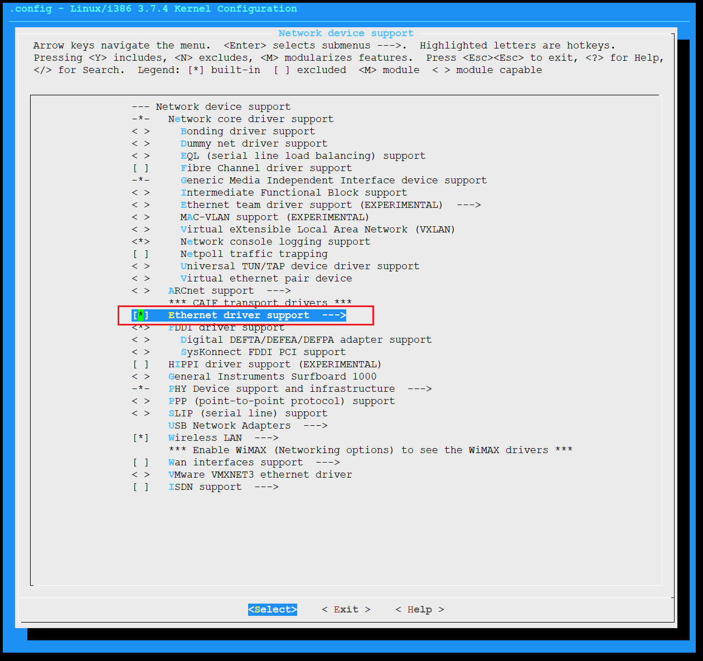
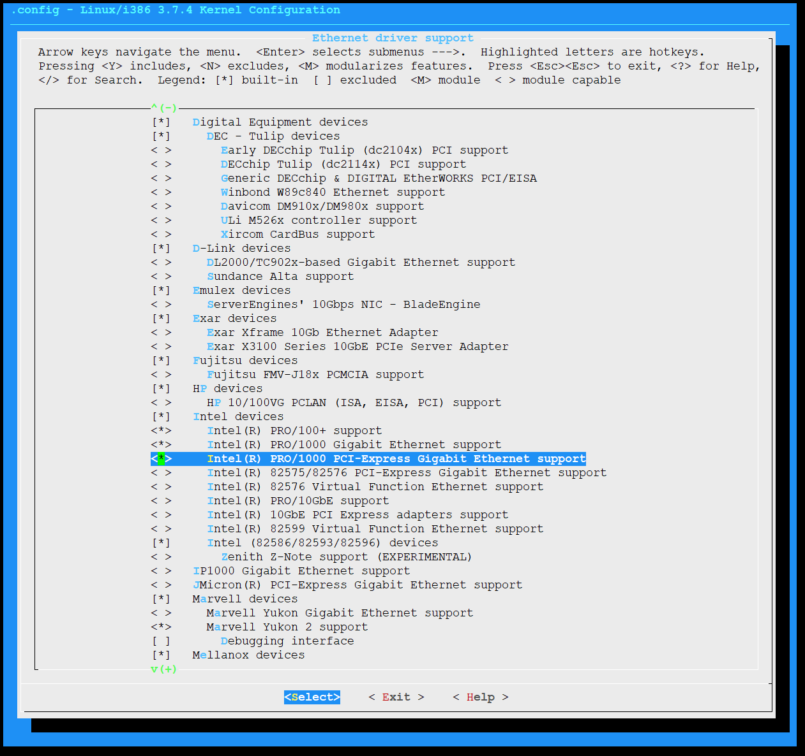
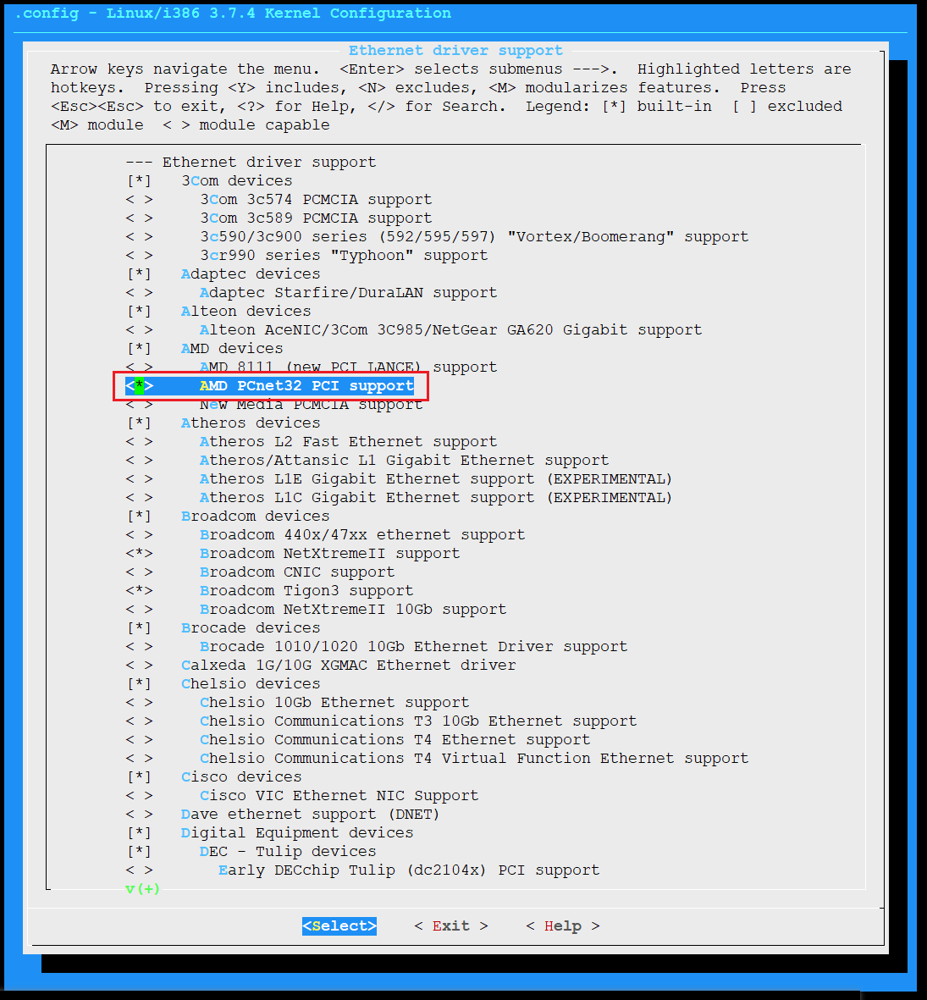
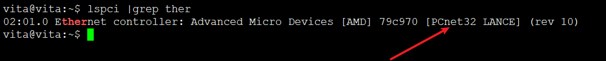

# 15. 挂载根文件可读并配置网络

## 配置并编译内核













```
make bzImage && make modules
make INSTALL_MOD_PATH=$SYSROOT modules_install
ls /vita/sysroot/lib/modules/3.7.4/kernel/

mkdir -p /vita/initramfs/lib/modules/3.7.4
cp  -drf  /vita/sysroot/lib/modules/3.7.4 /vita/initramfs/lib/modules/

mkdir -p /vita/lib/modules
cp  -drf  /vita/sysroot/lib/modules/3.7.4 /vita/lib/modules
```

```
IPV4_TARGETS=tracepath ping clockdiff rdisc arping tftpd rarpd
IPV6_TARGETS=tracepath6 traceroute6 ping6
TARGETS=$(IPV4_TARGETS) $(IPV6_TARGETS)

sed -i 's/IPV4_TARGETS=tracepath ping clockdiff rdisc arping tftpd rarpd/IPV4_TARGETS=ping/g' Makefile
sed -i 's/TARGETS=$(IPV4_TARGETS) $(IPV6_TARGETS)/TARGETS=$(IPV4_TARGETS)/g' Makefile
```

